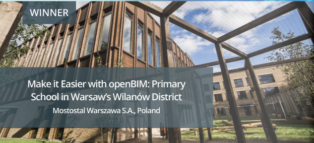
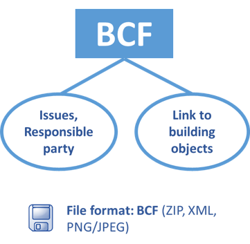
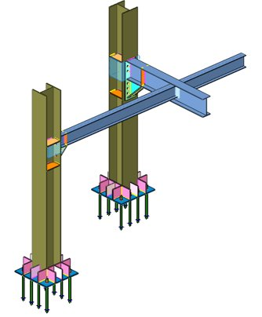

# Introduction to Building Information Modeling and Digitalization

# The project

The consortium

The background

The scope

The objectives

__Politehnica__  __ University Timisoara\, Romania__

Is a major provider of High Quality Education and Innovation in the region and on the whole Romanian and European level\, proved by all high\-level certifications\, by the quality of students and alumni\.

__Bauhaus University Weimar\, Germany__

Is internationally renowned for its research activities and outstanding scientific achievements\, with a strong focus in digital engineering \(modeling\, simulation and visualization\)\, based on constructive civil engineering designs\.

__University of Naples Federico II\, Italy__

Has more than 300 international agreements with prestigious Universities all around the world\, promoting interinstitutional

research and collaboration\, while maintaining excellence in all the fields of education and research\.

__University of Coimbra\, Portugal__

Has more than 700 years of experience in education\, training and research and is a world leading university in all study levels with the teaching activity strongly linked with research activities and with a strong focus on knowledge transfer to the business sector\.

__Technical University of Denmark\, Denmark__

Is proactively developing decision basis and technology in support of

sustainable developments\. With BIM integrated into several courses\, it promotes data exchange through open formats and has actively participated in developing industry and official standards\.

The consortium

__The background__

Lack of digitalization in AEC and education

The need of enhanced Collaboration and Communication within the AEC industry

Increasing pressure for improved cost and better time management

High demand for enhanced sustainability and Lifecycle Management

---

According to recent studies, the two fields lagging most behind in adopting the digital change are construction and education. The problem in construction sector is actually very serious, systemic, and all too common. The COVID-19 pandemic has shown us that almost anything can be digitalized, most and foremost, education. We want to use the generated momentum and take education one step closer to the digital future. On this line, we have contacted a series of stakeholders in the Architecture, Engineering and Construction (shortly, AEC) industry to get their support to sketch-up the profile for an ideal candidate. Another input that is considered is the European plan for boosting the AEC productivity. Digital permits and compliance checks for buildings and infrastructure, data-driven distributed industrial environments and new breakthrough technologies for technological sovereignty in construction are just a few examples of European initiatives directed towards the AEC industry.

Furthermore, in specific partner countries (e.g., Romania), many AEC graduates change the working field to programming, mechanical development or automotive (software/hardware) testing due to limited employability or lack of 'coolness' in the field. With the rise of the Internet of Things, the AEC industry is seeing an increase in industrialization and digitalization, with an increasing demand for digital knowledge and skills. To support this, HEIs can support the digitalization of the industry by developing the required skills by offering courses and support.

The consortium

The background

__The scope__

Strengthen the HEI and industry collaboration to get an updated view for industry needs regarding digitalization

Increase the employability of our graduate students by developing digital knowledge and skills to support and bring the industry forward

Increase attractiveness of our courses and attract more students

The consortium

The background

The scope

__The objectives__

Tighter collaboration of HEIs and AEC industry for course development and curricula update

Collect and summarize the AEC industry digitalization needs

Collect and Summarize AEC industry digitalization success stories

Develop a pilot course in Digital Engineering for Constructions

Collect and summarize  __Lessons Learned __ and  __Best Practices __ for HEIs and AEC industry collaboration

# Table of Contents

[Concepts of platform and tools](slide164.xml) _			_  165

[Platform](slide168.xml) _					_  168

[Interoperability](slide184.xml) _				_  181

[IFC format ](slide179.xml) _					_  182

[Parametric Modelling / BIM Objects](slide188.xml) _			_  190

[Digitalization](slide205.xml) _					_  207

[IoT](slide215.xml)  _					_  217

[AI](slide216.xml) _					_  218

[Big Data\, Analysis and Platforms](error:ppt-link-parsing-issue) _			_  221

[Data mining and storing](error:ppt-link-parsing-issue) _				_  223

[Tools and Platforms](error:ppt-link-parsing-issue) _				_  225

[Data representation](error:ppt-link-parsing-issue) _				_  226

[GDPR](error:ppt-link-parsing-issue) _					_  233

[Digital Twin in AEC](error:ppt-link-parsing-issue) _				_  234

[References](slide242.xml) _					_  237

[Course evaluation](error:ppt-link-parsing-issue) _				_  250

[Course expectations](slide14.xml) _				_  08

[Concepts](slide8.xml)  _					_  09

[Terminology](slide19.xml)  _					_  20

[Adoption around the world](slide39.xml) _			_  40

[Reference standards](slide44.xml) _				_  45

[Technical specifications and guidelines](slide44.xml) _			_  70

[Career in BIM](slide78.xml) _				_  79

[BIM Trends](slide79.xml) _					_  80

[BIM for stakeholders](slide82.xml) _				_  82

[BIM Roles](slide85.xml) _					_  85

[Use cases](slide100.xml) _					_  101

[BEP](slide138.xml) _					_  139

[Information requirements](slide152.xml) _				_  153

[Integrated project delivery](slide161.xml) _				_  162

[Common Data Environment](slide162.xml) _			_  163

__CHAPTER 05 – BIM Platforms and Tools__

__CHAPTER 01 \- Concepts__

__CHAPTER 02 \-  Roles__

__CHAPTER 03 – Use Cases__

__CHAPTER 04 \-  BIM Execution Plan__

# Course expectations

 __Welcome\! This course will begin\.__ 

Before we proceed\, please share your expectations for the course by answering the   following 3 questions\, which you can access through the link or QR code provided\.

Scan the QR code or go to

[https://forms\.office\.com/e/z4d8iACw7V](https://forms.office.com/e/z4d8iACw7V)

# Concepts

BIM introduction\, concepts

Terminology

Reference standards

Technical specifications and applications

---

In this chapter, we will provide an introduction to BIM key concepts, terminology, reference standards, technical specifications, guidelines, and applications. We will explore the basic principles of BIM and how it has become an essential tool for the AEC industry. You will gain a comprehensive understanding of the terminology and concepts used in BIM and will be introduced to the different reference standards and technical specifications that are relevant to BIM implementation.

Furthermore, the chapter will cover the various guidelines and applications of BIM, including its use in design, construction, and facility management. We will explore how BIM can be utilized to improve collaboration, visualization, accuracy, efficiency, and sustainability in construction projects. You will also learn about the benefits of BIM implementation, such as reduced costs, improved project outcomes, and enhanced decision-making.

# What is BIM?

Building Information Modelling \(BIM\) is a digital process that encompasses creating and managing a building's information throughout its entire lifecycle\, enabling multiple stakeholders to collaboratively design\, construct and operate a Facility in a virtual space\.

---

The current constant search for solutions to reduce costs, improve productivity and make businesses profitable in the construction industry, in addition to the increasingly present discussion and application of sustainability, made all areas find technology a strong ally in this expansion. For this reason, the BIM methodology has proven to be the most efficient way of working in the AEC (Architecture, Engineering, and Construction) industry that generates the best benefits.

The BIM is the process and concept of creating and managing the physical and functional characteristics of the building, using digital representation systems. It is the digital information model that involves not only the 3D geometry of a building but contains data on the characteristics of all the elements that make up a building (for example, beams, walls, windows or electrical sockets), also including their properties and attributes, such as dimensions, materials, suppliers, costs, etc. This digital model serves as a shared repository of information that can be accessed and updated by all stakeholders involved in a construction project, including architects, engineers, contractors, and facility managers.

In ISO 19650 the BIM is defined as the "use of a shared digital representation of a built asset to facilitate design, construction and operation processes to form a reliable basis for decisions“. 

BIM enables better communication, coordination, and collaboration among project teams, reducing errors and improving efficiency throughout the entire building lifecycle, from design and construction to operation and maintenance. 

It allows for better visualization, simulation, and analysis of building performance, helping to optimize design decisions, detect clashes and conflicts, and identify and resolve issues early in the process. Also supports the integration of various disciplines and trades, such as architecture, structural engineering, mechanical, electrical, and hydraulic (MEP) systems, and construction sequencing, resulting in more accurate cost estimation, improved project scheduling, and enhanced sustainability and energy analysis.

In summary, BIM is a digital approach to building design, construction, and operation that utilizes a collaborative and data-driven model to improve communication, coordination, and efficiency, leading to better project outcomes and more sustainable built assets.

The term BIM has evolved over time and is now best understood as an "expression of digital innovation" across the construction industry and the built environment.

# Collaborative Process

The traditional methodology used in the project development process

Sequenced process:

---

While BIM is not the only design development method in the AEC industry, its absence can have consequences in terms of coordination, efficiency, visualization, collaboration and costs. 

The collaborative project management process takes place through the conclusion of each stage of all disciplines that involve the construction process. It occurs through communication, coordination and teamwork, they require additional efforts and manual processes, which increases errors and rework, reduced efficiency, limited visualization, and collaboration can collectively result in higher costs for the project. Rework, delays, and miscommunications can lead to increased construction costs, extended project timelines, and potential legal disputes, which can impact the overall project budget and profitability.

# Collaborative Process (traditional methodology)

---

The traditional collaborative process can result in construction errors, such as shocks and conflicts, which could be predicted with the BIM process, through a federated model.

# BIM methodology

Integrated process

---

BIM allows for the creation of a virtual model that integrates various design and construction disciplines, such as architecture, structure, and MEP systems. Without BIM, coordination among different stakeholders may be more challenging, as it relies on manual exchange of information through drawings and documents. This can result in clashes, conflicts, and delays during construction, leading to costly rework and project delays.

BIM enables clash detection and automated error checking, helping to identify and resolve issues early in the design and construction phases. Without BIM, errors may go unnoticed until the construction phase, resulting in costly rework and delays. Misinterpretation of design intent or lack of coordination among different disciplines may lead to discrepancies in construction documents, resulting in changes and modifications during construction, further impacting project costs and timeline.

BIM allows for efficient collaboration among stakeholders in a virtual environment, enabling real-time updates, revisions, and coordination. Without BIM, communication and coordination may be slower, relying on traditional methods such as meetings, emails, and manual markups on drawings, which can result in delays and inefficiencies in decision-making and project progress.

BIM provides 3D visualization and simulation capabilities, allowing stakeholders to better understand the design intent and make informed decisions. Without BIM, stakeholders may have limited visualization, relying on 2D drawings, which can be harder to understand, leading to misinterpretation, miscommunication, and potential design issues.

BIM promotes a collaborative environment where stakeholders can work together in a coordinated manner. Without BIM, collaboration may be limited, relying on traditional communication methods, which can hinder effective teamwork, coordination, and information sharing among stakeholders, potentially leading to misunderstandings and delays in the project.

Capacity to influence

costs

Traditional approach

Project preparation before project starts \(previous experience\)

Preferred approach

Concept   Design  Documentation                     Construction

Source: Patrick MacLeamy AIA / HOK / CURT\, 2007

---

The MacLeamy Curve shows that the cost of making design changes is lowest in the early stages and increases exponentially as the project progresses. Therefore, it is more cost-effective and efficient to make changes and adjustments during the early design phases, when it is still easier and less expensive to implement changes.

# Advantages of BIM

Visualization and analysis in the same phase of the project;

Better constructive solutions;

Efficiency in coordination and compatibility;

Improvement of the design and construction process;

Energy performance analysis;

Compliance with legal requirements;

Greater precision and reliability in the project;

Less loss of natural resources;

Increased productivity;

Collisions and overlaps detection;

Decrease in working time;

Decrease in costs\.

# 3D is not BIM. But, if it is BIM, it will be 3D

The process must allow:

Automatic manipulation of analyses;

Automatic updates;

Simulations;

Parametric objects;

Integrated database manager;

Interoperability\.

Building Information Modeling

Computer Aided Design

---

BIM adoption requires a holistic approach that encompasses people, processes, and technology and involves the integration of digital models and data throughout the entire building project lifecycle. It involves integrated digital models and data throughout the entire building project lifecycle, which implicates collaboration, digital modeling, information integration, lifecycle approach, process efficiency, and standardization. 

# CAD plans vs. BIM plans

Optimal design and Coordination of changes

---

 

# BIM DIMENSIONS

__3D \- Model__

__4D \- Time__

__5D \- Cost__

__6D \- Sustainability__

__7D \- Facility Management__

---

BIM is a multidimensional approach to digital construction management that encompasses dimensions that refer to different aspects of a building model and how information is stored, managed, and visualized within the BIM software. The dimensions of BIM typically include:

3D - Virtual walkthrough and project visualization, clash detection, 3D electronic and prefabricated models of elements.
Objects are modeled in 3D with embedded information for the project. In other words, the model is not just a 3D representation of objects, but it also provides all the necessary information for preparing project documentation. The model serves as a source of information for generating drawing documentation, reports, material combinations, etc. The modeled objects are parametric, and any changes in the model affect the generated drawings or reports.

4D - Construction planning and integration with the construction schedule.
A 3D model with information about the time and sequence of installation for specific object elements. Construction, manufacturing, assembly and delivery time for construction can also be specified. Through the time-based information in the model, it is possible to create a simulation of the construction process.

5D - Quantity extraction for budgeting assistance and real-time cost estimates depending on workflow.
A 3D BIM model with information about the installation time of specific elements and their cost. Based on this information, a cost analysis of the construction project is conducted.

6D - Energy analysis of building consumption and performance.
A 3D model with additional information that analyzes the construction's impact on the environment and people. This data can be used for energy analysis of installations and determination of the carbon footprint.

7D - Management of building operations and facilities.
An expanded 3D model with the necessary information for the management and operation of the construction project. The model is often used as a basis for specialized Facility Management (FM) platforms and other concepts like the Internet of Things (IoT).

# Concepts

---

Level 0 - Zero or low collaboration. 2D CAD drafting utilised
In Level 0, the use of BIM is minimal or non-existent. The collaboration is limited, based on paper or electronic prints and 2D CAD drafting techniques. 

Level 1 - Partial collaboration. 2D CAD and 3D model for visualization.
In Level 1, the 3D model is mainly used for visual representation. The information is still stored in separate and individual documents. The 2D CAD is used for generates approval documents and project information. Collaboration is enhanced with the use of a common data environment (CDE), such as file sharing and electronic mail.

Level 2 - High collaboration. 3D models integrated. 
In Level 2, the use of 3D models is more integrated, and the information is stored in a CDE. The collaboration promoted by each discipline has its own 3D model, sharing information and updating the model, which is coordinated to the management of incompatibilities. A federated BIM model is created. 

Level 3 - Total collaboration. 3D models and information integrated in one server
In Level 3, all project information is integrated into a single 3D model, which is shared in real time between all parties involved. Usually termed as OpenBIM, at this level, the collaboration is even more intensive with the possibility of real-time updates and access to detailed project information, including scheduling, automation, data analysis, and maintenance information.

# Terminology

__OpenBIM__  __ __

Universal approach to collaborative design\, implementation\, and operation of buildings\. It is founded on open standards and workflows\, and entails utilizing the most appropriate BIM software solution for each project within each discipline's local context\.

__Virtual Design and Construction \(VDC\)__

The VDC is the integrated multidisciplinary management of work processes and team organization that adopts BIM as the foundation to achieve the goals of the project\.

---

OpenBIM is an initiative of BuildingSMART and several software vendors. Authorities in a democracy have to be neutral and cannot favor or depend on a single vendor.

__Level of Detail \(__  __LoD__  __\)__

Indicates how much detail is included in the model element\. It comprises the accuracy of a virtual shape representation when compared to the physical and functional characteristics of the actual object\.

__Level of Information \(__  __LoI__  __\)__

Indicates the non\-graphical content in the BIM model at every stage of its development\.

_LoD_  _ \+ _  _LoI_  _ = Level of Development \(LOD\)_

__Level of Development \(LOD\)__

LOD is the degree to which an element's geometry and attached information must be presented\, or the degree of the level of information that project team members can rely on\. Includes LOD and LOI\.

Level of Development \(LOD\)

__LOD 100__

Objects represented by symbols or simplified 3D\, without indication of real physical geometry\.

__LOD 100                LOD 200               LOD 300                   LOD 400                          LOD 500__

---

Modelling:
- 2D drawing (plan, section or view), used to generate generic model of component detail or annotations;
- 3D simple or imported from CAD software;
- Generation of constructive details based on drawings already established in CAD software.

Parameters:
It does not contain additional parameters and definitions of materials;
Non-parametric model.

Quantitative:
- It only counts the quantity and cost of objects entered in the model by categories and areas.

Analysis:
- Only the 3D drawing can be used for analysis of clash detection and construction execution plan.

Level of Development \(LOD\)

LOD 100

__LOD 200__

Objects graphically represented as a generic system\. A simple representation of the real structure of the object\.

__LOD 100                LOD 200               LOD 300                   LOD 400                          LOD 500__

---

Modelling:
2D drawing (plan, section or view), used to generate a generic component detail model that will be included in a family with the correct category;
3D with the generic representation of the constructed element;
Generation of constructive details through legends drawn in the template file itself.

Parameters:
It does not contain additional parameters and materials definitions;
Objects with editable height, width and length.

Quantitative:
It only counts the quantity and cost of objects entered in the model by categories and areas.

Analysis:
Clash detection and construction execution plan.

Level of Development \(LOD\)

LOD 100

LOD 200

__LOD 300/350__

Objects are graphed more accurately in terms of quantity\, size\, shape\, location\, and orientation

__LOD 100                LOD 200               LOD 300                   LOD 400                          LOD 500__

---

Modelling:
3D with exact representation of the shape of the built element but does not contain manufacturing or installation details;
Construction details generation through subtitles drawn in the template file.

Parameters:
Contains additional information and visualization parameters, shared parameters and material definitions;
Objects with parameterization of dimensions according to the need of the element;
Object identification information such as manufacturer, model, cost, etc. can be added.

Quantitative:
The categories and costs of the element can be composed, generating a more accurate table of quantities;
The shared parameters created in the family can serve as a basis for the preparation of the table of quantities.

Analysis:
Clash detection and construction execution plan.

There is also the LOD350, which has the same level of representation as the LOD 300 but, in addition, the models have interfaces that allow them to communicate with other building systems.

Level of Development \(LOD\)

LOD 100

LOD 200

LOD 300/350

__LOD 400__

Objects represented in terms of size\, shape\, location\, quantity and orientation\, with details\, fabrication\, assembly and installation information

__LOD 100                LOD 200               LOD 300                   LOD 400                          LOD 500__

---

Modelling:
3D with exact representation of the shape of the built element. The representation will aid in the development of details and tables.

Parameters:
Additional information and visualization parameters, parameters shared and material definitions;
Model with parameterization of dimensions according to the need of the element;
Information to identify the element's manufacture, such as manufacturer, model, cost, etc.

Quantitative:
The element's categories and costs can be composed, generating a more accurate quantitative table;
The shared parameters created in the family can serve as a basis for the preparation of the quantitative table in the project.

Analysis:
Clash detection and construction execution plan.

Level of Development \(LOD\)

LOD 100

LOD 200

LOD 300/350

LOD 400

__LOD 500__

Corresponds to the As\-Built Modelling

__LOD 100                LOD 200               LOD 300                   LOD 400                          LOD 500__

---

Modelling:
Updated 3D model according to As Built project.

Parameters:
Parameters updated according to the As Built project.

Quantitative:
Updated with the actual amounts spent during construction.

Analysis:
Updated element assists in the management of facilities for the constructed building.

Level of Development \(LOD\)

Level of Detail \(LoD\)

__LOD 100                  LOD 200             LOD 300                   LOD 350                  LOD 400__

__LoD__  __ 100                  __  __LoD__  __ 200             __  __LoD__  __ 300                   __  __LoD__  __ 350                  __  __LoD__  __ 400__

__Precast Beam__

__Structural System__

__Precast Beam__

__Structural System__

__Width__

__Height__

__Depth__

__Precast Beam__

__Structural System__

__Width__

__Height__

__Depth__

__Location__  __ __  __and__  __ __  __Orientation__

__Sloping__  __ Surfaces __

__MEP __  __Penetration__

__Reinforcement__  __ __

__Finishes__  __ __

__Manufacter__

__Precast Beam__

__Structural System__

__Width__

__Height__

__Depth__

__Location__  __ __  __and__  __ __  __Orientation__

__Sloping Surfaces __

__MEP Penetration__

__Reinforcement __

__Precast Beam__

__Structural System__

__Width__

__Height__

__Depth__

__Location__  __ __  __and__  __ __  __Orientation__

__Sloping Surfaces __

---

The term Level of Development (LOD) is interchangeably used with the Level of Detail (LoD). However, there is an essential difference between both terms. Both terms follow the same scale of detailing from 100 - 500. The LoD describes the amount of detailing included in the model element regardless of its reliability. However, the LOD represents the amount of reliable information (i.e., fixed and thought through by the project participants). 

__Interoperability__

The ability of various systems \(and organizations\) to work together seamlessly without data loss or special effort\.

Interoperability can refer to systems\, processes\, file formats\, etc\.

__Industry Foundation Classes \(IFC\)__

IFC is a non\-proprietary data model and file formats designed to facilitate interoperability by providing “rules” for data exchange\.

---

IFC is an open data exchange format developed by buildingSMART for information transfer and coordination among different stakeholders in the process. The main advantage of this format is its openness, allowing it to be used across the software from various manufacturers (interoperability). 

IFC files contain all relevant object data, such as geometry, spatial location, individual element data, and element attributes. 

__Model View Definition \(MVD\)__

It is a subset of IFC schema\, which is used to organize and indicate selected data in a model that meets specific criteria or data flow\. MVD makes it easy to extract the necessary information predetermined from an IFC\. Furthermore\, MVD aims to limit the amount of information extracted from an IFC file based on the recipient's requirements and the specific workflow\.

__Project Information Model \(PIM\)__

The PIM is an information model generated throughout a project's design\, production\, and construction stages\. It typically encompasses graphical and non\-graphical data\, as well as various documents that define the project's final deliverables\.

__Common Data Environment \(CDE\)__

The CDE is a repository of all the information about a project\. This central source of information enhances collaboration and helps to avoid mistakes like duplication\.

__Asset Information Requirements \(AIR\)__

AIR describes the graphical and non\-graphical information for an Asset Information Model\. These requirements are documented in the client's brief and specify the purpose of the information\, the intended audience\, and the timeframe and methods for producing it\.

__Employer’s Information Requirements \(EIR\)__

EIR is a pre\-tender document drawn up by the client that outlines the information requirements to be delivered\. It also describes the processes and standards that the supplier should adopt in terms of the project delivery process\.

__Information Delivery Manual \(IDM\)__

An IDM is a standard methodology that identifies when specific information is required during the construction or operation phase of a project\. It is now known as the buildingSMART standard for processes\.

__Master Information Delivery Plan \(MIDP\)__

The MIDP is the main plan outlining when the project information is to be prepared as well as responsibility\, procedures and protocols for implementation\. It incorporates all relevant Task Information Delivery Plans \(TIDP\) in accordance with the information requirements of the project\.

__Organizational Information Requirements \(OIR\)__

The OIR defines all the data and information required at an organizational level \(instead of an asset level\) to achieve the organization's project objectives\.

__Information Model \(AIM\)__

This is a model that describes the information management processes specifically designed for the operational phase of a project\. It compiles all the data that is necessary to support asset management\.

__BIM Collaboration Format \(BCF\)__

It is a file format that allows adding text\, images and more data to a model\, improving team communication\.

For the coordination\, it allows for easier and safer communication between the team members\.

---

The BCF is a file format that is open and based on XML, designed to facilitate collaboration between all parties involved in a project. It allows to add comments to the model, simplifies communication, and aids collaboration. It enables stakeholders to raise concerns, resolve issues, and provide answers to questions, making the collaboration process smoother and more efficient.

__Construction Operations Building Information Exchange \(__  __COBie__  __\)__

It is based on a structured data format\, usually in the form of electronic spreadsheets\, which contains detailed information about the building elements\, equipment\, systems and components of a construction project\. This data may include information about technical specifications\, operating manuals and other information relevant to the operation and maintenance of the building or infrastructure\.

---

It is a digital information exchange standard used in the construction and engineering industry to facilitate the transfer of construction and operation data from a project to the subsequent stages of operation and maintenance of a building or infrastructure.

The idea behind COBie is to allow the information generated during the construction process of a project to be delivered in a structured and standardized way to the owners and operators of the building, to facilitate efficient management and maintenance throughout the development lifecycle. 

__The characteristics of __  __COBie__  __ involves:__

Interoperability at the user level – the data recorded in the standard is accessible and understandable to virtually any supplier and team member involves in a project process\. Data recorded according to COBie can be easily imported\.

Designer\-level interoperability – Most programs used to create 3D models include the option of generate a COBie file\.

Openness – COBie supports the open IFC format\.

Multidisciplinary – data covers all disciplines of the project\.

__BIM __  __Implementation__  __ __  __Plan__  __ \(BIP\)__

The BIM Implementation Plan helps companies to implement the BIM methodology at the organizational level\. Elaborated through the diagnosis of the organization\, it considers the pillars of BIM\. The document details the BIM implementation steps to be completed and when\.

__BIM __  __Execution__  __ __  __Plan__  __ \(BEP\)__

The BIM Execution Plan is a document that defines the BIM strategy and processes for the successful completion of the project\. Will detail project deliverables stipulated by the contract and information exchange requirements\.

__Federated Model__

A BIM model that combines multiple single\-discipline models into one\, but they remain linked rather than integrated\, meaning that the files of each discipline are separate\.

__Integrated Model __

A BIM model that combines multiple single\-discipline models into one\. Unlike the Federated Model\, it consolidates all the properties of individual models into a single database

---

The Integrated Model combines all the properties of individual models into a single database, allowing for a more streamlined and coordinated approach to designing, analyzing, and managing the project. It facilitates interdisciplinary coordination, clash detection, and can result in a more seamless collaboration between different disciplines. However, it may require more effort to establish and maintain the integration, and updates to one discipline's model may impact other disciplines.

The Federated Model keeps the models of different disciplines separate, with links established between them. This can allow for more independence and flexibility in managing individual disciplines' models, with less potential for unintended changes or clashes affecting other disciplines. However, it may require more effort to manage the coordination and synchronization between the linked models, and clashes may need to be resolved manually.

The choice between an Integrated Model and a Federated Model depends on the specific project requirements, the team's expertise and workflow, and the available software and tools for coordination and collaboration. Both approaches can be effective, and the suitability of either depends on the project's unique needs and the preferences of the project team.

# BIM adoption around the World

__BIM adoption around the World__

  * Source:  Adapted from Techture Global\, 2023

---

BIM has been steadily increasing around the world, with many countries recognizing the benefits of this technology in the AEC industry. 
BIM is being used in various sectors, including commercial, residential, infrastructure, and healthcare, and is increasingly being mandated for public projects in many countries. As technology continues to evolve, it is expected that BIM adoption will continue to increase globally, leading to more streamlined and sustainable construction processes.

# BIM adoption in Europe

Extent of BIM adoption in EU member states

__BIM adoption around the World__

Source: EU Report Digitizing in the Building Sector\, 2021

---

Based on the report, the image illustrates the level of BIM adoption in EU Member States. Despite a few countries for which survey responses were not available, the overall average BIM adoption rate is relatively high, with Denmark and Austria leading in the number of adoptions.

The adoption of BIM in EU Member States is also influenced by the existing legislative framework. For instance, Austria and the Netherlands are the only two countries with a mandate for an Open BIM standard, while several other Member States have BIM requirements in their public procurement processes for specific types of projects (such as infrastructure).

Portugal and Belgium, currently do not have a state-level BIM mandate in place. However, this does not necessarily imply low BIM adoption, as there may be regional or urban-level mandates or other factors at play.

Map of BIM requirements in public procurement in the EU\-27 Source:

__BIM adoption around the World__

Source: EU Report Digitizing in the Building Sector\, 2021

# BIM adoption around the World

__DENMARK__

Since 2011\, BIM management has been mandatory for:

All local and regional projects costing more than €2\.7 million\.

Government buildings from a volume of €677\.000 and above\.

__GERMANY__

Since 2021\, BIM management has been mandatory for:

Infrastructure projects carried out for the national government and procurement of public contracts\.

Since 2023\, is compulsory in buildings constructed for the national government\.

__BIM adoption around the World__

---

The European Committee for Standardization (CEN) has published several standards related to BIM, including EN ISO 19650-1 and EN ISO 19650-2, which provide guidelines for the management of information throughout the construction project lifecycle. These standards are based on the principles of collaboration, information management, and digital data exchange. Additionally, several countries in Europe have established their own BIM standards and mandates. For example, in the UK, the government has mandated the use of BIM Level 2 on all publicly-funded construction projects since 2016.

__ITALY__

Since 2022\, BIM management has been mandatory for:

All publics projects above 15 milion\.

By 2025 All publics projects above 1 milion\.

__PORTUGAL__

A BIM implementation plan is expected by 2025\.

__ROMANIA__

Since 2022 started a BIM plan for implementation in 2028\.

__BIM adoption around the World__

---

The European Committee for Standardization (CEN) has published several standards related to BIM, including EN ISO 19650-1 and EN ISO 19650-2, which provide guidelines for the management of information throughout the construction project lifecycle. These standards are based on the principles of collaboration, information management, and digital data exchange. Additionally, several countries in Europe have established their own BIM standards and mandates. For example, in the UK, the government has mandated the use of BIM Level 2 on all publicly-funded construction projects since 2016.

# Standards, Technical Specifications and Guides

__Reference Standards__

A\.1\. ISO Standards

A\.2\. Normative Standards

A\.3\. Conformance Specifications

A\.4\. Terminology Definition

__B\.   Technical Specifications__

B\.1\. Benchmark Specifications

B\.2\. Reference Process

B\.3\. Information Exchanges

B\.4\. Reference Examples

__Guidelines and Applications__

C\.1\. Goal and Strategy Definition

C\.2\. Delivery Specifications

C\.3\. Templates and Tools

C\.4\. Best Practice Guides

__Standards\, Technical Specifications and Guides__

Source: NBIMS\-US\, 2021

---

The NBIMS-US Project Committee (National BIM Standard-United States Project Committee), is a project committee of the Building Information Management (BIM) Council.
The diagram shows the hierarchy and the levels of importance of the Standards by NBIMS.

Reference Standards: are mandatory and need global approval.
Technical specifications: are used as a basis for the development or implementation.
Guidelines and Applications: are recommendations or instructions.

__ISO/TC 59/SC 13 __

__Standards\, Technical Specifications and Guides__

Source: NBIMS\-US\, 2021

---

International Level
ISO/TC 59/SC 13 

EU Level
CEN/TC 442 

Initiatives to help the implementation of the standards and technical specifications
EUBIM Task Group, BuildingSmart, etc

EU BIM Standards research platform: 
BIM Standards Landscape Explorer (ec-3.org)

# EN ISO 19650

EN ISO 19650 standard provides a comprehensive framework for the management of information within BIM processes\.

It helps to ensure consistency and quality throughout the project lifecycle\, from conception through to decommissioning\.

By following the guidance set out in the standard\, stakeholders can better manage information\, reduce risk\, and improve project outcomes\.

* __Reference standards__
  * __EN ISO 19650__

__Reference Standards__

---

As the use of BIM has become more widespread, the need for standardized processes and protocols has become increasingly important. This is where the EN ISO 19650 BIM standard comes in. In this blog entry, we will explore the different parts of the EN ISO 19650 standard and how they help to ensure consistency and quality in BIM processes.

# EN ISO 19650: Part 1

* __Reference standards__
  * __EN ISO 19650__
    * __Part 1__

__Concepts and principles__

Part 1 of the EN ISO 19650 standard provides an overview of BIM concepts and principles\, including definitions of key terms\, and outlines the benefits of BIM processes\. It also sets out the roles and responsibilities of different stakeholders involved in BIM processes\.\.

__Reference Standards__

---

As the use of BIM has become more widespread, the need for standardized processes and protocols has become increasingly important. This is where the EN ISO 19650 BIM standard comes in. In this blog entry, we will explore the different parts of the EN ISO 19650 standard and how they help to ensure consistency and quality in BIM processes.

* __Reference standards__
  * __EN ISO 19650__
    * Part 1
    * __Part 2__

__Delivery phase of assets__

Part 2 of the standard focuses on the delivery phase of assets\, from conception through to handover\. It provides guidance on the management of information throughout the project lifecycle\, including the development of BIM Execution Plans \(BEPs\)\, the use of common data environments \(CDEs\)\, and the exchange of data between different software platforms\.

__Reference Standards__

---

As the use of BIM has become more widespread, the need for standardized processes and protocols has become increasingly important. This is where the EN ISO 19650 BIM standard comes in. In this blog entry, we will explore the different parts of the EN ISO 19650 standard and how they help to ensure consistency and quality in BIM processes.

* __Reference standards__
  * __EN ISO 19650__
    * Part 1
    * Part 2
    * __Part 3__

__Operational phase of assets__

Part 3 of the standard deals with the operational phase of assets\, from handover through to decommissioning\. It outlines the information requirements for the operation and maintenance of assets\, including the use of asset information models \(AIMs\)\, and the need for ongoing data management and validation\.

__Reference Standards__

---

As the use of BIM has become more widespread, the need for standardized processes and protocols has become increasingly important. This is where the EN ISO 19650 BIM standard comes in. In this blog entry, we will explore the different parts of the EN ISO 19650 standard and how they help to ensure consistency and quality in BIM processes.

* __Reference standards__
  * __EN ISO 19650__
    * Part 1
    * Part 2
    * Part 3
    * __Part 4__

__Information management during the operational phase of assets using building information modelling__

Part 4 of the standard provides further guidance on information management during the operational phase of assets\, with a particular focus on the use of BIM\. It sets out requirements for the exchange of information between different stakeholders and the ongoing management of data\.

__Reference Standards__

---

As the use of BIM has become more widespread, the need for standardized processes and protocols has become increasingly important. This is where the EN ISO 19650 BIM standard comes in. In this blog entry, we will explore the different parts of the EN ISO 19650 standard and how they help to ensure consistency and quality in BIM processes.

* __Reference standards__
  * __EN ISO 19650__
    * Part 1
    * Part 2
    * Part 3
    * Part 4
    * __Part 5__

__Security\-minded approach to information management__

Part 5 of the standard focuses on the security of information within BIM processes\. It outlines the importance of a security\-minded approach to information management\, including the identification of risks and the implementation of appropriate controls\.

__Reference Standards__

---

As the use of BIM has become more widespread, the need for standardized processes and protocols has become increasingly important. This is where the EN ISO 19650 BIM standard comes in. In this blog entry, we will explore the different parts of the EN ISO 19650 standard and how they help to ensure consistency and quality in BIM processes.

__Organization and digitization of information about buildings and civil engineering works\, including building information modelling \(BIM\)__

__Part 6\-1: Concepts and principles__

Part 6\-1 of the standard provides further guidance on BIM concepts and principles\, with a particular focus on the organization and digitization of information about buildings and civil engineering works\. It provides definitions of key terms and outlines the benefits of BIM processes\.

* __Reference standards__
  * __EN ISO 19650__
    * Part 1
    * Part 2
    * Part 3
    * Part 4
    * Part 5
    * __Part 6__

__Reference Standards__

---

As the use of BIM has become more widespread, the need for standardized processes and protocols has become increasingly important. This is where the EN ISO 19650 BIM standard comes in. In this blog entry, we will explore the different parts of the EN ISO 19650 standard and how they help to ensure consistency and quality in BIM processes.

# EN ISO 19650: Part 6-2

__Organization and digitization of information about buildings and civil engineering works\, including building information modelling \(BIM\)__

__Part 6\-2: Delivery phase of assets__

Part 6\-2 of the standard focuses on the delivery phase of assets\, providing guidance on the management of information throughout the project lifecycle\. It sets out requirements for the development of BIM Execution Plans \(BEPs\)\, the use of common data environments \(CDEs\)\, and the exchange of data between different software platforms\.

* __Reference standards__
  * __EN ISO 19650__
    * Part 1
    * Part 2
    * Part 3
    * Part 4
    * Part 5
    * __Part 6__

__Reference Standards__

---

As the use of BIM has become more widespread, the need for standardized processes and protocols has become increasingly important. This is where the EN ISO 19650 BIM standard comes in. In this blog entry, we will explore the different parts of the EN ISO 19650 standard and how they help to ensure consistency and quality in BIM processes.

# EN 12006

ISO 12006 standard provides a comprehensive framework for the classification of information within construction projects\. It helps to ensure consistency and quality throughout the project lifecycle\, from conception through to decommissioning\.

By following the guidance set out in the standard\, stakeholders can better manage information\, reduce risk\, and improve project outcomes\.

The ISO 12006 standard is an essential tool for the development of a structured approach to BIM processes\, providing a foundation for successful implementation and delivery\.

* __Reference standards__
  * EN ISO 19650
  * __ISO 12006__

__Reference Standards__

---

The ISO 12006 series provides a framework for the classification of information within construction projects. In this blog entry, we will explore the different parts of the ISO 12006 standard and how they help to ensure consistency and quality in BIM processes.

# EN 12006 Part 2

* __Reference standards__
  * EN ISO 19650
  * __ISO 12006__
    * _Part 1 – N/A_
    * __Part 2__

__Framework for classification__

This part of ISO 12006 defines a framework for the development of built environment classification systems\. It identifies a set of recommended classification table titles for a range of information object classes according to particular views\, e\.g\. by form or function\, supported by definitions\.

__Reference Standards__

---

The ISO 12006 series provides a framework for the classification of information within construction projects. In this blog entry, we will explore the different parts of the ISO 12006 standard and how they help to ensure consistency and quality in BIM processes.

* __Reference standards__
  * EN ISO 19650
  * __ISO 12006__
    * _Part 1 – N/A_
    * Part 2
    * __Part 3__

__Framework for object\-oriented information__

This document defines a specification for an extensible taxonomy model\, which provides the ability to add concepts like subjects and properties\, describe subject by means of properties\, and to define relationships between concepts\. The set of properties associated with a subject provide the formal definition of the subject as well as its typical behaviour\.

__Reference Standards__

---

The ISO 12006 series provides a framework for the classification of information within construction projects. In this blog entry, we will explore the different parts of the ISO 12006 standard and how they help to ensure consistency and quality in BIM processes.

# EN 16739

__Data schema__

ISO 16739\-1:2018 specifies a conceptual data schema and an exchange file format for Building Information Model \(BIM\) data1\. The data schema is represented as an EXPRESS schema and an XML schema\, and reference data is represented as definitions of property and quantity names\, and formal and informative descriptions1\. A subset of the data schema and referenced data is referred to as a Model View Definition \(MVD\)

* __Reference standards__
  * EN ISO 19650
  * ISO 12006
  * __ISO 16739__

__Reference Standards__

---

https://www.iso.org/standard/70303.html

* __Reference standards__
  * EN ISO 19650
  * ISO 12006
  * __ISO 16739__

__Reference Standards__

---

The Building Information Modelling (BIM) standard ISO 16739, also known as Industry Foundation Classes (IFC), is a key standard for the exchange of digital information between different BIM software applications. In this blog entry, we will explore the different parts of the ISO 16739 standard and how they help to ensure interoperability and efficiency in BIM processes.

The ISO 16739 standard provides a framework for the exchange of digital information between different BIM software applications. It helps to ensure interoperability and efficiency throughout the project lifecycle, from design through to construction and operation. By following the guidance set out in the standard, stakeholders can better manage information, reduce risk, and improve project outcomes. The ISO 16739 standard is an essential tool for the development of a structured approach to BIM processes, providing a foundation for successful implementation and delivery.

# ISO 29481

BIM technology can benefit the processes associated with managing the use of space within buildings\, urban neighborhoods and cities at the broader scale\, as well as infrastructure networks and facilities\.

An IDM provides help in getting the full benefit from a BIM\. If the required information is available in the BIM to support a construction process or use case\, and the quality of information is satisfactory\, then the process itself will be greatly improved\.

* __Reference standards__
  * EN ISO 19650
  * ISO 12006
  * ISO 16739
  * __ISO 29481__

__Reference Standards__

---

The ISO 29481 standard provides a framework for the exchange of digital information between different BIM software applications using open data formats. It helps to ensure interoperability and efficiency throughout the project lifecycle, from design through to construction and operation. By following the guidance set out in the standard, stakeholders can better manage information, reduce risk, and improve project outcomes. The ISO 29481 standard is an essential tool for the development of a structured approach to BIM processes, providing a foundation for successful implementation and delivery.

# ISO 29481: Part 1

__Methodology and format__

ISO 29481\-1:2016 is intended to facilitate interoperability between software applications used during all stages of the life cycle of construction works\, including briefing\, design\, documentation\, construction\, operation and maintenance\, and demolition\. It promotes digital collaboration between actors in the construction process and provides a basis for accurate\, reliable\, repeatable and high\-quality information exchange\.

* __Reference standards__
  * EN ISO 19650
  * ISO 12006
  * ISO 16739
  * __ISO 29481__
    * __Part 1 __

__Reference Standards__

---

https://cdn.standards.iteh.ai/samples/45501/711b5ec126304ceea49b2bb246a5a41f/ISO-29481-1-2010.pdf
https://www.iso.org/standard/45501.html
https://www.iso.org/obp/ui/

__Interaction framework__

ISO 29481 specifies a methodology and format for describing ‘coordination acts' between actors in a construction project during all life cycle stages\.

It is intended to facilitate interoperability between software applications used in the construction process\, to promote digital collaboration between actors in the building construction process\, and to provide a basis for accurate\, reliable\, repeatable\, and high\-quality information exchange\.

* __Reference standards__
  * EN ISO 19650
  * ISO 12006
  * ISO 16739
  * __ISO 29481__
    * Part 1
    * __Part 2__

__Reference Standards__

* __Reference standards__
  * EN ISO 19650
  * ISO 12006
  * ISO 16739
  * __ISO 29481__
    * Part 1
    * Part 2
    * __Part 3__

__Data schema__

This document is the technical addition to the methodology set out in ISO 29481\-1\. It defines a specification to store\, exchange and read information delivery manual \(IDM\) specifications in a standardized and machine\-readable way\.

__Reference Standards__

# ISO 21597

* __Reference standards__
  * EN ISO 19650
  * ISO 12006
  * ISO 16739
  * ISO 29481
  * __ISO 21597__

This document defines an open and stable container format to exchange files of a heterogeneous nature to deliver\, store and archive documents that describe an asset throughout its entire lifecycle\.

__Reference Standards__

---

The ISO 21597 standard provides a framework for the organization and management of digital information related to the operation and maintenance of built assets. It helps to ensure efficient and effective asset management, providing a foundation for the effective use of BIM in asset management processes. By following the guidance set out in the standard, stakeholders can better manage information, reduce risk, and improve asset performance and lifecycle outcomes. The ISO 21597 standard is an essential tool for the development of a structured approach to BIM in asset management, providing a foundation for successful implementation and delivery.
Regenerate response

# ISO 21597: Part 1

* __Reference standards__
  * EN ISO 19650
  * ISO 12006
  * ISO 16739
  * ISO 29481
  * __ISO 21597__
    * __Part 1__

__Container__

It is suitable for all parties dealing with information concerning the built environment\, where there is a need to exchange multiple documents and their interrelationships\, either as part of the process or as contracted deliverables\. The format is intended to use resources either included in the container \(such as documents\) or referenced remotely \(such as web resources\)\.

__Reference Standards__

__Link types__

This document provides the opportunity to add information about the contents of a container by further specializing the generic types of links specified in ISO 21597\-1\. The defined link types have been chosen to enhance the use of the container by allowing the addition of semantic relationships that are human interpretable to provide greater clarity about those links\.

* __Reference standards__
  * EN ISO 19650
  * ISO 12006
  * ISO 16739
  * ISO 29481
  * __ISO 21597__
    * Part 1
    * __Part 2__

__Reference Standards__

# ISO/TS 12911:2023

This document establishes a framework for providing specifications for the internal commissioning and implementation of building information modelling \(BIM\) during both delivery and operational phases\. It identifies a structured approach so as to encourage clarity during development\, management and checking processes for use by organizations that develop and apply these specifications\.

* __Reference standards__
  * EN ISO 19650
  * ISO 12006
  * ISO 16739
  * ISO 29481
  * ISO 21597
  * __ISO/TS 12911__  __:2023__

__Reference Standards__

---

The ISO 12911 standard provides a framework for the use of BIM in sustainability assessment and performance evaluation of buildings. It helps to ensure sustainable and energy-efficient building design, providing a foundation for the effective use of BIM in sustainable building design processes. By following the guidance set out in the standard, stakeholders can better manage information, reduce risk, and improve building performance and lifecycle outcomes. The ISO 12911 standard is an essential tool for the development of a structured approach to BIM in sustainable building design, providing a foundation for successful implementation and delivery.

* __Reference standards__
  * EN ISO 19650
  * ISO 12006
  * ISO 16739
  * ISO 29481
  * ISO 21597
  * __ISO/TS 12911__  __:2023__

Establishes a framework for providing specifications for the internal commissioning and implementation of building information modelling \(BIM\) during both  __delivery __ and  __operational __ phases\. It identifies a structured approach to encourage clarity during development\, management and checking processes for use by organizations that develop and apply these specifications\.

This document does not provide specific content but it does provide examples\.

__Reference Standards__

---

It is applicable to buildings, infrastructure, facilities and managed landscapes, of any size or complexity.

# ISO 1781

* __Reference standards__
  * EN ISO 19650
  * ISO 12006
  * ISO 16739
  * ISO 29481
  * ISO 21597
  * ISO/TS 12911
  * __ISO 1781__

__Level of information need__

Refers to EN 17412\-1 which became ISO\. Provides concepts for establishing and specifying the level of detail and extent of information needed to be exchanged and delivered in modelling\.

__Reference Standards__

# Classification system

  * __Uniclass__  __/__  __Omniclass__

The objective of the classification system is to be a way to organize\, classify and retrieve information in applications based on relational databases\. It must be based on the ISO standards\. Are made up of tables\, each dedicated to a specific aspect of construction information\. These tables can be utilized individually to categorize specific types of information\, or their entries can be combined with entries from other tables to classify more complex subjects\.

__Technical Specifications and Guidelines__

---

There are many classification systems like Omniclass, Uniclass, SecClass, UNSPC, CoClass, etc. 

The Uniclass classification is more adopted in the EU, while Omniclass is more used in the USA. Also, there are obsolete systems like Uniformat (inside Revit system) and MasterFormat.

The technical specifications and guidelines may vary in different countries and regions, and it is necessary to consult locale-specific standards and specifications to ensure compliance with local practices and requirements.

# EN 17439

* Technical Specifications and Guidelines
  * Uniclass/Omniclass
  * __EN 17439 __

__Guidance on how to implement EN ISO 19650\-1 and \-2 in Europe__

Provides a support text for the implementation and basic understanding of EN ISO 19650\-1 and EN ISO 19650\-2\.

It is also complemented by CEN/TR 17654

__Technical Specifications and Guidelines__

---

The technical specifications and guidelines may vary in different countries and regions, and it is necessary to consult locale-specific standards and specifications to ensure compliance with local practices and requirements.

# EN 17473

* Technical Specifications and Guidelines
  * Uniclass/Omniclass
  * EN 17439
  * __EN 17473__

__Data templates for construction objects__

Provides a methodology and process to create data templates for construction products\. Describes how data templates shall be developed based on standards and European Assessment Documents \(EAD\)\.

__Technical Specifications and Guidelines__

---

The technical specifications and guidelines may vary in different countries and regions, and it is necessary to consult locale-specific standards and specifications to ensure compliance with local practices and requirements.

# CEN TR 17741

* Technical Specifications and Guidelines
  * Uniclass/Omniclass
  * EN 17439
  * EN 17473
  * __CEN TR __  __17741__

__Guidance for understanding and utilize EN/ISO 29481\-1__

Provides concepts and methodologies on how to develop an information delivery manual \(IDM\) according to EN ISO 29481\-1\.

__Technical Specifications and Guidelines__

---

The technical specifications and guidelines may vary in different countries and regions, and it is necessary to consult locale-specific standards and specifications to ensure compliance with local practices and requirements.

# BuildingSMART

* Others guides
  * __BuildingSMART__

An organization with a series of standards\, and guidelines such as the IFC Alignment and Common BIM Requirements \(COBIM\)\, exchange of knowledge\, and training of professionals\. Covers different countries and regions around the world and collaborates with other organizations and institutions to promote the adoption of BIM practices and improve the construction industry on a global scale\.

__Technical Specifications and Guidelines__

---

BuildingSMART is a international, non-profit, neutral organization created in 1994 by 12 US companies invited by Autodesk.
Its initial objective was to advise on the development of a set of C ++ classes that would improve the exchange of information between software used in the construction industry.
Currently develops the AEC standards for BIM and implements continuous improvements in the IFC.

The technical specifications and guidelines may vary in different countries and regions, and it is necessary to consult locale-specific standards and specifications to ensure compliance with local practices and requirements.

# UK BIM

* Others guides
  * BuildingSMART
  * __UK BIM__

__The UK BIM Framework__

Develops standards\, guidance and resources to support individuals and organizations in the UK to understand the fundamental principles of information management using BIM to guide and support the implementation\.

__Technical Specifications and Guidelines__

---

The technical specifications and guidelines may vary in different countries and regions, and it is necessary to consult locale-specific standards and specifications to ensure compliance with local practices and requirements.

# NBIM-US

* Others guides
  * BuildingSMART
  * UK BIM
  * __NBIMS\-US__

__National BIM Standard\-United States__

Provides consensus\-based standards through referencing existing standards\, documenting information exchanges and delivering best business practices in BIM for the entire built environment\.

__Technical Specifications and Guidelines__

---

The technical specifications and guidelines may vary in different countries and regions, and it is necessary to consult locale-specific standards and specifications to ensure compliance with local practices and requirements.

# CIC BIM

* Others guides
  * BuildingSMART
  * UK BIM
  * NBIMS\-US
  * __CIC BIM __

__Construction Industry Council__

CIC promotes BIM training\, standards\, guidelines\, specifications\, and certification\.

__Technical Specifications and Guidelines__

---

The technical specifications and guidelines may vary in different countries and regions, and it is necessary to consult locale-specific standards and specifications to ensure compliance with local practices and requirements.

# GSA

* Others guides
  * BuildingSMART
  * UK BIM
  * NBIMS\-US
  * CIC BIM
  * __GSA__

__GSA BIM Guidelines__

Developed by the GSA \(General Services Administration of United States\)\, provides BIM standards for managing buildings over their lifecycle\.

__Technical Specifications and Guidelines__

---

The technical specifications and guidelines may vary in different countries and regions, and it is necessary to consult locale-specific standards and specifications to ensure compliance with local practices and requirements.

# Career in BIM

BIM Project Manager;

BIM Coordinator;

BIM Modeler;

BIM Specialist;

BIM Analyst;

BIM Consultant;

BIM Applications Support Engineer\.

---

BIM Project Manager: It is the professional responsible for leading the implementation of BIM in a specific project. He coordinates and oversees BIM-related activities, including setting goals and standards, allocating resources, managing workflows, and supervising the project team.

BIM Coordinator: Is the professional responsible for coordinating and integrating BIM models from various disciplines such as architecture, engineering, structures and MEP (Mechanical, Electrical and Hydraulic) to ensure that all information is accurate and correctly integrated. He works closely with the design team and consultants from different disciplines to identify and resolve any design conflicts.

BIM Modeler: It is the professional responsible for creating and developing the detailed BIM models of the project using specific 3D modeling software. The BIM modeler is responsible for inserting detailed information into the models, such as geometry, materials, properties and attributes of the design elements.

BIM Specialist: Is the professional who has advanced knowledge in BIM and is responsible for providing technical support and training to the project team regarding BIM implementation, use of BIM software, standards and workflows.

BIM Analyst: Is the professional who uses analysis and simulation tools based on BIM to evaluate the performance of the project in terms of sustainability, energy efficiency, cost analysis, construction simulations, among other aspects.

BIM Consultant: It is the professional who provides specialized BIM consulting services to clients, helping to define objectives, strategies and project requirements, as well as to implement BIM in their work processes.

BIM Applications Support Engineer: It is the professional provides technical support to users of BIM software. They help users troubleshoot technical issues, provide training and guidance on the correct use of BIM applications.

As the field of BIM continues to evolve, new roles and responsibilities can emerge as technology and work practices evolve.

Further reading: This paper gives an overview of the traditional BIM roles : https://www.itcon.org/paper/2016/8

Further thinking: how do you think these roles link to the BIM concepts described earlier? Are all roles relevant to all concepts?

# BIM Trends

Automatic licensing / Building Permits;

Augmented Reality;

Renovation and As\-Built Projects\,

Integration with GIS\.

---

Automatic licensing
BIM makes it possible to verify the parameters of a project. This automation has become a tendency for the approval of projects and obtaining licenses by the government, based on the automatic reading and verification of parameters according to applicable codes and dedicated laws.

Augmented Reality
The application of augmented reality (AR) and virtual reality (VR) technologies in the use of BIM has been a growing trend. These technologies allow the immersive visualization of BIM models in virtual environments, facilitating the revision of projects, the detection of conflicts, and the identification of potential problems before the physical construction.

Renovation and As-Built Projects 
Photogrammetry enables automated BIM modeling of the actual geometric conditions of a building, allowing for accurate representations of existing structures.

Integration with GIS 
The integration of GIS and BIM offers numerous advantages in terms of geographic analysis, and real-time monitoring of building operations and maintenance.

# BIM Roles

BIM Manager

BIM Coordinator

BIM Modeler

The VDC Expert

Sustainability Specialist

Digital fabricator

BIM Trainer

---

In this chapter, we will cover the different BIM applications used in various AEC fields. We will start by discussing how BIM is used in the architectural domain, exploring the ways in which architects use BIM to enhance their design processes. We will then dive into BIM uses for Civil and Structural Engineering, examining the tools that these professionals use to design and analyze building structures. We will also discuss the role of BIM in Mechanical, Electrical, and Plumbing (MEP) Engineering and how it is used to design building systems.

In addition, we will explore how BIM is used in construction, specifically discussing how BIM can improve construction planning, scheduling, and communication. We will also look at the role of BIM in facility management, and how it is used to support maintenance, repairs, and facility operations. Lastly, we will examine the various roles involved in BIM implementation, and the importance of understanding the different roles to ensure successful BIM implementation.
This chapter will showcase the versatility and power of BIM technology in supporting the design, construction, and management of buildings and infrastructure.

# BIM for stakeholders

BIM allows all disciplines involved in a project \(i\.e\. architects\, engineers\, constructors\, facility managers and owners\) to create and manage virtual building models \(visualize\, simulate\, and analyze the design and construction process\)\.

---

BIM enables improved collaboration in the design and construction phases leading to fewer errors and limits delays. BIM enables stakeholders to share information and data in a single, integrated platform reducing the risk of errors, eliminating double effort, and improving communication between project team members. It also allows stakeholders to access project information in real-time, ensuring that everyone is working with the latest data. It also reduces the risk of miscommunication and errors, helping to keep the project on track. BIM enables stakeholders to generate accurate and comprehensive documentation, which helps to reduce the risk of errors and delays during construction. It can enable contractors to generate detailed construction schedules and cost estimates, which helps to keep the project on track and within budget.

BIM also allows for Enhanced visualization enabling architects to create 3D models of their designs, to visualize and communicate their ideas more effectively to clients for better design understanding and supporting more informed decisions. BIM capable software allows the creation of 3D models to be used to visualize the design of a building, with its different systems, and components. The models can be easily updated, shared, and manipulated by different stakeholders in real-time. Working in a BIM process, stakeholders ca identify potential clashes and conflicts between different elements of the building, such as structural systems, mechanical, electrical, and plumbing systems (MEP), and architectural components. By identifying these conflicts early, costly rework during construction is avoided. By simulating the construction process over time (4D modelling) and to estimate the cost of different building elements and systems (5D modeling) enables stakeholders to visualize the construction process and the building's operation and maintenance throughout its life cycle. For complex systems, like HVAC and lighting systems, 3D visualization and 4D and 5D modeling, help stakeholders to optimize the design, improve energy efficiency, and reduce operational costs. BIM software can also allow users to generate realistic renderings of the building, which helps stakeholders to visualize the final product and communicate design intent more effectively. This is especially useful for marketing and presenting the building to clients and investors. In addition, AR models can be overlaid on top of the real-world environment, enabling stakeholders to visualize the building's design and systems in real-time, and in the context of the surrounding environment.

Using BIM workflows lead to increased efficiency and accuracy by allowing the project teams to perform faster design iterations and reduce the time required to complete projects by helping them to automate repetitive tasks. By enabling a streamlined design, architects and engineers to create easily editable 3D models. This means that design changes can be made quickly and efficiently, reducing the need for time-consuming and costly revisions. BIM software can also automatically generate quantity takeoffs for materials, saving time and reducing errors in cost estimating allowing for better cost and materials tracking throughout the construction process. By construction sequence planning (4D modeling), the project team can optimize the construction process by identifying potential conflicts and dependencies before construction begins. This also minimize delays and leads to improved efficiency.

BIM is also supporting sustainability by analyzing and optimizing building performance, reducing waste, making more sustainable material choices, performing LCAs, conserving water, and improving indoor environmental quality. By incorporating sustainability (sometimes referred to as 6D modeling) into the design and construction process, BIM is helping to create more environmentally responsible buildings. By analyzing building's energy performance, the project team can provide valuable information about its energy consumption and environmental impact, information that can be further used to optimize energy efficiency and reduce the building's carbon footprint. This analysis can enable architects and engineers to evaluate the environmental impact of different building materials, such as embodied carbon and embodied energy leading to more sustainable material choices and reduced the environmental impact. By performing a life cycle assessments (LCA) to analyze a building's environmental impact over its entire life cycle, from construction to demolition the project team can identify improvement opportunities and optimize the building's sustainability performance, by optimizing the use of building materials, reducing waste generated during construction, and minimizing construction waste that goes to landfills. By adopting an integrated approach, the project team can analyze a building's water use and identify opportunities for water conservation, such as low-flow fixtures, rainwater harvesting, and graywater reuse. 

__BIM for architects__

__BIM for Civil and Structural Engineering__

__BIM for MEP Engineering__

__BIM for construction__

__BIM for facility management__

---

There are several BIM software tools available for architects (Autodesk Revit, ArchiCAD, and SketchUp). These tools provide architects with a user-friendly interface for creating and managing BIM models, as well as tools for collaboration, analysis, and visualization. As mentioned on many occasions before, BIM models are more than just 3D representations; they also include details on building systems, materials, and other crucial pieces of information. 

Engineers utilize BIM software to develop and manage comprehensive models that can be shared with other parties involved in the construction process. Engineers can use BIM capable software to study and test many design possibilities allowing engineers to simulate how a structure would behave under various design loads and load combinations. To maximize the building's safety, robustness, and structural integrity engineers can use the BIM model to develop in-depth studies for various circumstances, such as fire after earthquake, high winds and storms, or exceptional snow loads. Additionally, BIM enables structural engineers to collaborate with experts from other fields, such as mechanical, electrical, and plumbing engineers, in order to coordinate building systems and enhance the overall performance of the structure. BIM also allows engineers to provide precise and thorough construction documentation, drawings, schedules, and requirements. This helps to ensure that the structure is constructed in accordance with the original concept and limits errors and omissions during the construction phase.

During the construction process, various stakeholders can work together and better coordinate using the tools that BIM software offers. For instance, collaboration between architects, engineers, contractors, and project managers on a single model enhances communication and lowers the possibility of mistakes and rework making the construction process more cost-effective and efficient. By automatically detecting clashes between different building systems, such as mechanical, electrical, and plumbing (MEP), structural, and architectural systems BIM software allow for easy conflict resolution before the construction begins, reducing the risk of rework and schedule delays.

BIM provides facility managers with a powerful tool for managing buildings more effectively, reducing costs, improving energy efficiency, and enhancing safety and security. By keeping the BIM model up-to-date with accurate information about the building, BIM enables better decision-making and helps to ensure that the building is maintained and operated in the most effective and efficient way possible. Centralized and accurate information about the building, including details about its components, systems, and materials. Is used by facility managers to make informed decisions about maintenance, repairs, upgrades, and costs. A comprehensive maintenance and operations plan for the building, based on accurate and up-to-date information about its components and systems can ensure that maintenance is performed on schedule, reducing the risk of breakdowns and extending the lifespan of building systems and components. By simulating the building's energy performance, facility managers can identify opportunities for energy savings and optimization of building systems and equipment. BIM can also facility managers to streamline workflows by providing a digital platform for tracking work orders, scheduling maintenance, and managing assets. By modeling the building's safety and security systems and by providing a virtual environment for testing and optimizing emergency procedures and security measures, BIM can improve safety and security within the facility. Furthermore, facility managers can view the information about the building in real-time, allowing them to make informed decisions about maintenance, repairs, and upgrades.

# BIM roles

BIM Manager

BIM Coordinator

BIM Modeler

The VDC Expert

Sustainability Specialist

Digital fabricator

BIM Trainer

---

BIM Manager: The BIM Manager is responsible for managing the BIM process and ensuring that the BIM model is accurate and up-to-date. The BIM Manager coordinates with different stakeholders and disciplines to ensure that the BIM model is consistent and follows industry standards.
BIM Coordinator: The BIM Coordinator works closely with the BIM Manager and other stakeholders to ensure that the BIM model is coordinated and clash-free. The BIM Coordinator is responsible for resolving any conflicts that arise in the BIM model and ensuring that the final product is optimized for efficiency and performance.
BIM Modeler: The person who builds and maintains the BIM model is known as a BIM Modeler. The BIM modeler needs to be skilled with BIM software and knowledgeable about various building systems and components. To guarantee the accuracy and consistency of the BIM model, they must also collaborate closely with experts from various fields.
The Virtual Design and Construction (VDC) Expert is in charge of utilizing BIM technology to streamline the building process. The VDC Expert optimizes the building schedule by simulating and analyzing the construction process using a BIM model.
Sustainability Specialist: The Sustainability Specialist optimizes building performance and lessens environmental impact using BIM technologies. To guarantee that the building is designed and built with sustainability in mind, the sustainability specialist closely collaborates with other disciplines.
Digital fabricator: A digital fabricator employs BIM technology to produce digital designs that can be manufactured. The architect or engineer and the digital fabrication specialist collaborate closely to make sure the design is suitable for digital fabrication techniques like 3D printing and CNC machining.
BIM Trainer: The BIM Trainer is in charge of educating employees and stakeholders about BIM software and best practices. The BIM Trainer needs to be an expert with BIM software and knowledgeable about various building systems and parts.

# BIM Manager

---

Within the AEC sector, a critical position known as a BIM manager is in charge of overseeing the Building Information Modeling (BIM) process over the course of a project. 
The duties of a BIM manager can change based on the needs of the project, but in general, they are in charge of making sure that BIM is used properly and efficiently.
The BIM manager is in charge of developing, carrying out, and keeping up the BIM Execution Plan (BEP). 
The BEP describes the project's BIM specifications, including modeling guidelines, software specifications, and information sharing procedures. 
Additionally, the BIM manager is in charge of informing the project team of these requirements and seeing to it that they are followed during the course of the project.

In order to make sure that the BIM process satisfies their expectations, the BIM manager must also coordinate with other project stakeholders, such as architects, engineers, contractors, and facilities managers. This entails spotting possible collisions or problems and working with the team to swiftly address them.

In addition, the BIM manager is in charge of directing the development and administration of the BIM models. This includes managing the model version control, making sure the models are correct and current, and making sure all the data is appropriately categorized and arranged to allow for efficient data analysis.

The function of a BIM manager is expanding as BIM technology is increasingly being used in the AEC sector. BIM managers must effectively manage and coordinate project teams in addition to possessing a thorough understanding of BIM technology, tools, and workflows. They are essential in making sure that projects are completed on schedule, within budget, and to the highest possible levels of quality.

# BIM Coordinator

BIM Manager

__BIM Coordinator__

---

A BIM coordinator in the AEC sector is tasked with managing the BIM process among various project teams and specialties. 
A BIM coordinator's main duty is to make sure the project team collaborates in order to create a thorough BIM model that complies with all project standards.
The coordination of the information exchange between the various project teams, such as the architects, engineers, contractors, and subcontractors, is vital. 
They collaborate closely with each team to guarantee that the BIM models are developed to a high standard and contain all relevant data. 
This includes controlling the model's geometry, data, and cross-disciplinary information flow.

The identification and resolution of any problems or conflicts that can develop throughout the BIM process fall under the purview of a BIM coordinator. This calls for a thorough comprehension of the project's design and construction specifications as well as the capacity for effective communication across various project teams.

A BIM coordinator may be in charge of developing and maintaining the BIM Execution Plan in addition to their coordinating duties (BEP). The BEP describes the project's BIM specifications, including modeling guidelines, software specifications, and information sharing procedures.

A BIM coordinator needs to be well-versed in BIM technology, software, and workflows to be effective in this position. Effective project management, team coordination, and stakeholder communication should be among their strengths. They must also have a thorough knowledge of the procedures involved in building and the ability to spot problems and find rapid, effective solutions. Ultimately, a BIM coordinator's function is crucial to the accomplishment of BIM projects in the AEC sector.

# BIM Modeler

BIM Manager

BIM Coordinator

__BIM Modeler__

---

The role of the BIM modeler involves utilizing BIM software to create and manage 3D models. To create precise and comprehensive 3D models that accurately reflect the project's design and construction needs, BIM modelers collaborate closely with architects, engineers, and other project team members.

A BIM modeler's main duty is to produce, update, and maintain 3D models with data on dimensions, materials, structural specifics, and MEP (Mechanical, Electrical, and Plumbing) systems. Using BIM software, they also produce schedules, quantity take-offs, and other project-related documents.

A BIM modeler needs a thorough understanding of BIM technology, software, and workflows in order to succeed in this position. They must also have a thorough knowledge of the procedures involved in building and the ability to spot problems and find rapid, effective solutions. Since BIM modelers must effectively coordinate and communicate with architects, engineers, and other project team members, strong communication skills are also crucial.

A BIM modeler is in charge of producing 3D models as well as making sure they are correct, comprehensive, and current. To analyze and validate the models and make sure that all project criteria and specifications are met, they could collaborate with the BIM coordinator.

Overall, the role of a BIM modeler is critical to the success of BIM projects in the AEC industry. They are responsible for creating the models that form the basis for project design, construction, and management, and they play a crucial role in ensuring that the project is delivered on time, within budget, and to the required quality standards.

# VDC Expert

BIM Manager

BIM Coordinator

BIM Modeler

__The VDC Expert __

---

In the AEC sector, a BIM Virtual Design and Construction (VDC) Manager plays a crucial role. BIM technological proficiency at a high level is necessary for this position, as are effective management and communication abilities. A BIM VDC Manager's main duty is to supervise the BIM process at all stages of a project's life cycle, from design and construction to facility management.

The BIM VDC Manager is in charge of overseeing the BIM team and making sure that everyone involved in the project is on board with the BIM's aims and objectives. They supervise the BIM modeling procedure and make sure the models are precise, comprehensive, and current. To guarantee that the BIM models are used successfully and efficiently throughout the project, they also collaborate with other project stakeholders, such as architects, engineers, contractors, and owners.

Creating and implementing BIM standards and procedures is one of a BIM VDC Manager's main duties. They collaborate closely with project stakeholders to determine and set BIM goals and objectives as well as to specify the BIM team's work scope. Additionally, they create BIM execution plans and manage their execution throughout the project.

Detecting and fixing problems with BIM modeling and coordination are under the purview of the BIM VDC Manager. They collaborate closely with the project's stakeholders to foresee potential problems in advance and to create workable fixes. Additionally, they carry out routine quality control checks to make sure the BIM models are correct, comprehensive, and adhere to the project's design and construction specifications.

Ultimately, a BIM VDC Manager's function is essential to the accomplishment of BIM projects in the AEC sector. In addition to ensuring that BIM models are used successfully and efficiently, they are in charge of identifying and resolving any problems that may arise with BIM modeling and coordination. They are also responsible for managing the BIM process throughout the project life cycle.

# Sustainability Specialist

BIM Manager

BIM Coordinator

BIM Modeler

The VDC Expert

__Sustainability Specialist__

---

The AEC sector is placing more and more emphasis on the position of a BIM Sustainability Specialist. This position entails incorporating sustainable design methods and ideas into the BIM process to help ensure that buildings are created in an environmentally conscious, energy-efficient, and sustainable manner.

The job of the BIM Sustainability Expert is to find ways to enhance a building's environmental performance throughout the design and construction phase. They collaborate closely with designers, engineers, and other project participants to incorporate sustainability issues into the planning and building phases. In order to generate and analyze models of the structure, they employ BIM tools and software. They do this in an effort to find ways to increase the building's sustainability overall and to improve its energy efficiency.

Making sure that sustainable design concepts are incorporated into the BIM process from the start of the project is one of the main duties of a BIM Sustainability Specialist. This include creating standards for sustainable design, establishing sustainability goals, and finding ways to save energy and resources. Additionally, they collaborate closely with the project team to create viable, affordable solutions for sustainable design that also match the project's aims and objectives.

The project team needs advice and support from the BIM Sustainability Specialist throughout the design and construction phases. In order to ensure that sustainable design concepts are effectively used and the building is created in the most ecologically responsible manner possible, they collaborate closely with architects, engineers, and builders. After construction is finished, they continue to assess the building's performance, seeking for ways to increase its sustainability and lessen its environmental effect.

Overall, the role of a BIM Sustainability Specialist is critical to the success of sustainable design in the AEC industry. By integrating sustainability principles into the BIM process, they help ensure that buildings are designed and constructed to be environmentally responsible, energy efficient, and sustainable.

# Digital fabricator

BIM Manager

BIM Coordinator

BIM Modeler

The VDC Expert

Sustainability Specialist

__Digital fabricator__

---

The BIM Digital Fabrication Specialist is a key role in the AEC industry, responsible for leveraging the power of BIM to enhance the fabrication and construction process. This role involves using BIM tools and software to create detailed models of building components and systems, which can then be used to drive automated fabrication processes and streamline construction workflows.

Working together with architects, engineers, and contractors to find possibilities to streamline the fabrication and construction process is one of the main duties of a BIM Digital Fabrication Specialist. They produce thorough 3D models of building systems and components using their expertise with BIM tools and software, which may be used to streamline the fabrication and assembly process. Additionally, they make use of their understanding of manufacturing processes and materials to make sure that components can be produced and installed on location in an effective manner.

Working with fabricators and contractors to establish automated fabrication processes is another duty of the BIM Digital Fabrication Specialist. They aid in making sure that the manufacturing process is effective and economical and that the end product satisfies the building's design and performance criteria.

The BIM Digital Fabrication Specialist's contribution to streamlining the construction process by producing accurate and thorough models of building systems and components is another key duty. Contractors can utilize these models to streamline the building process, cutting waste and eliminating errors. Since contractors may use the models to better plan and coordinate their work, they can also be used to increase site safety.

All things considered, the BIM Digital Fabrication Specialist is essential to maximizing the potential of BIM to improve the fabrication and construction process. They contribute to the more effective, safe, and high-quality construction of structures by using BIM tools and software to develop precise models of building systems and components and by collaborating closely with fabricators and contractors to execute automated fabrication processes.

# BIM Trainer

BIM Manager

BIM Coordinator

BIM Modeler

The VDC Expert

Sustainability Specialist

Digital fabricator

__BIM Trainer__

---

A vital position in the AEC sector is that of the BIM Trainer, who instructs and informs professionals on how to use BIM tools and software. In order to help architects, engineers, contractors, and other professionals understand and utilize BIM tools and software, this function involves creating and providing training programs to them.

A BIM trainer's primary duties include determining the organization's training needs and creating specialized training programs to meet those needs. The need for training in particular areas, such as using BIM software to produce complex 3D models or communicating with others in a BIM environment, may be identified through working with teams or individuals.

Also, the BIM Trainer is in charge of creating and presenting training materials, such as textual materials, video tutorials, and in-person training sessions. They might generate case studies that show the best ways to use BIM tools in particular circumstances or instructional movies that show how to use particular BIM software capabilities.

The BIM Trainer's obligation to stay current with BIM technology's newest trends and advancements is another crucial duty. To stay up to date with the most recent BIM tools and software, they might take part in research, join in online forums and communities, and attend industry conferences and workshops.

The BIM Trainer is also in charge of evaluating the success of training initiatives and making adjustments as necessary. They may carry out assessments to gauge the effect of training on the company or use trainee feedback to pinpoint areas that need improvement.

Overall, the BIM Trainer is vital to encouraging the AEC sector to use BIM tools and software effectively. They contribute to ensuring that professionals have the knowledge and skills they need to utilize BIM technologies successfully and efficiently by creating and delivering tailored training programs, maintaining current with the most recent trends and advancements, and monitoring the effectiveness of training.

# Construction Manager

BIM Manager

BIM Coordinator

BIM Modeler

The VDC Expert

Sustainability Specialist

Digital fabricator

BIM Trainer

__Construction Manager__

---

The Construction Manager is responsible for overseeing the construction process from start to finish and ensuring that the project is completed on time and within budget.

The Construction Manager works with the BIM team to ensure that the BIM model contains all the necessary data and information related to the construction process. This includes data on materials, equipment, labor, and schedules. The Construction Manager uses this information to plan and coordinate the construction process, ensuring that all activities are completed in the right sequence and according to the project timeline.

The Construction Manager is also responsible for managing construction risks and ensuring that safety protocols are followed. This includes identifying potential safety hazards and implementing strategies to mitigate those risks. The Construction Manager also oversees quality control, ensuring that all work meets the required quality standards.

One of the key advantages of BIM for Construction Managers is that it enables them to plan and coordinate construction activities more efficiently and effectively. The BIM model provides a visual representation of the building's design, allowing Construction Managers to identify potential issues and plan for improvements.

The Construction Manager also uses the BIM model to track and record construction activities, including work completed, resources used, and any issues encountered. This information is then used to update the BIM model and inform future construction activities.

# Quality Control Manager

BIM Manager

BIM Coordinator

BIM Modeler

The VDC Expert

Sustainability Specialist

Digital fabricator

BIM Trainer

Construction Manager

__Quality Control Manager__

---

The Quality Control Manager is responsible for developing and implementing quality control policies and procedures to ensure that all work is completed to the required standard.

The Quality Control Manager works with the BIM team to ensure that the BIM model contains all the necessary data and information related to the quality control process. This includes data on quality standards, quality control checklists, and inspection procedures. The Quality Control Manager uses this information to develop and implement quality control policies and procedures and to monitor and track quality control activities.

The Quality Control Manager is also responsible for identifying potential quality issues and implementing strategies to mitigate those risks. This includes conducting regular quality control audits and inspections, identifying areas for improvement, and developing action plans to address any issues.

One of the key advantages of BIM for Quality Control Managers is that it enables them to identify potential quality issues more efficiently and effectively. The BIM model provides a visual representation of the building's design, allowing Quality Control Managers to identify potential issues and plan for improvements.

The Quality Control Manager also uses the BIM model to track and record quality control activities, including work completed, resources used, and any issues encountered. This information is then used to update the BIM model and inform future quality control activities.

# Client Representative

BIM Manager

BIM Coordinator

BIM Modeler

The VDC Expert

Sustainability Specialist

Digital fabricator

BIM Trainer

Construction Manager

Quality Control Manager

__Client Representative__

---

The Client Representative is one of the key roles of facility managers in BIM. The client representative acts as the bridge between the facility owner or operator and the BIM team, ensuring that the project meets the client's requirements and expectations. The client representative is responsible for providing input and feedback to the BIM team at all stages of the project, from the design phase to construction and operation. They are also responsible for ensuring that the project stays within the client's budget and schedule constraints.

The client representative works with the BIM team to ensure that the BIM model reflects the client's needs and requirements. This includes providing input on the building's systems and equipment, as well as ensuring that the building is designed in a way that is functional, efficient, and cost-effective. The client representative may also provide input on sustainability and energy efficiency, ensuring that the building meets the client's environmental goals.

Throughout the project, the client representative ensures that the BIM model is updated and accurate. This involves reviewing the BIM model at each stage of the project, verifying that it reflects the client's needs and requirements, and providing feedback to the BIM team. The client representative may also work with the BIM team to identify potential issues or conflicts and find solutions to these problems.
The client representative is also responsible for ensuring that the building is delivered on time and within budget. This involves monitoring the project schedule and budget, ensuring that any delays or cost overruns are addressed promptly. The client representative may also work with the BIM team to identify areas where cost savings can be achieved without compromising on the building's quality or functionality.

# Information Manager

BIM Manager

BIM Coordinator

BIM Modeler

The VDC Expert

Sustainability Specialist

Digital fabricator

BIM Trainer

Construction Manager

Quality Control Manager

Client Representative

__Information Manager__

---

The role of Information Manager in BIM is essential for facility managers to manage and maintain accurate and up-to-date information throughout the lifecycle of a building. The Information Manager is responsible for ensuring that the BIM model contains relevant and accurate data, which is necessary for facilities management.

The Information Manager is responsible for collecting and organizing all the information related to the building, including data on systems, equipment, and assets, and making it available within the BIM model. They work with the BIM team to ensure that the information is accurate and up-to-date, and that it is structured in a way that is easy to use and understand.

The Information Manager ensures that the BIM model contains all the necessary information for facilities management, including data on maintenance schedules, asset management, energy consumption, and safety and security systems. This information is critical for facility managers to make informed decisions on maintenance, upgrades, and replacement of systems and equipment.

The Information Manager is also responsible for ensuring that the BIM model is updated regularly, with any changes to the building reflected accurately within the model. This includes any modifications or upgrades to systems or equipment, changes in occupancy or usage, or modifications to the building's layout or design.

One of the key advantages of BIM is that it allows facility managers to access and use data in real-time, enabling them to make quick and informed decisions. The Information Manager is responsible for ensuring that the BIM model contains the necessary data and information to support these decisions.

# Maintenance Planner

BIM Manager

BIM Coordinator

BIM Modeler

The VDC Expert

Sustainability Specialist

Digital fabricator

BIM Trainer

Construction Manager

Quality Control Manager

Client Representative

Information Manager

__Maintenance Planner__

---

The role of Maintenance Planner in BIM is crucial for facility managers to ensure that the building's systems and equipment are properly maintained throughout their lifecycle. The Maintenance Planner is responsible for creating and managing maintenance schedules for all the assets and equipment within the building.

The Maintenance Planner works closely with the BIM team to ensure that the BIM model contains all the necessary data and information required for maintenance planning. This includes data on the equipment's specifications, maintenance history, and expected lifespan. The Maintenance Planner uses this information to create a maintenance plan that outlines the specific tasks required to maintain each asset or system.

The Maintenance Planner is also responsible for scheduling maintenance activities and coordinating with the maintenance team to ensure that work is completed on time and within budget. This involves identifying maintenance priorities, assigning work orders to the maintenance team, and ensuring that resources are available to complete the work.

One of the key advantages of BIM for Maintenance Planners is that it enables them to plan maintenance activities more efficiently and effectively. The BIM model provides a visual representation of the building's systems and equipment, allowing Maintenance Planners to identify potential maintenance issues and plan preventive maintenance activities.

The Maintenance Planner also uses the BIM model to track and record maintenance activities, including work completed, resources used, and any issues encountered. This information is then used to update the BIM model and inform future maintenance planning activities.

# Asset Manager

BIM Manager

BIM Coordinator

BIM Modeler

The VDC Expert

Sustainability Specialist

Digital fabricator

BIM Trainer

Construction Manager

Quality Control Manager

Client Representative

Information Manager

Maintenance Planner

__Asset Manager__

---

The Asset Manager is responsible for identifying, tracking, and maintaining all the assets within the building, including equipment, systems, and furniture.

The Asset Manager works with the BIM team to ensure that the BIM model contains all the necessary data and information related to the building's assets. This includes data on asset specifications, maintenance history, warranty information, and expected lifespan. The Asset Manager uses this information to track the assets' condition, identify any issues, and plan for maintenance and replacement activities.

The Asset Manager is also responsible for creating and managing an asset register, which lists all the assets within the building, including their location, condition, and maintenance history. This information is critical for facility managers to make informed decisions on maintenance, upgrades, and replacement of assets.

One of the key advantages of BIM for Asset Managers is that it enables them to track assets more efficiently and effectively. The BIM model provides a visual representation of the building's assets, allowing Asset Managers to identify the location of each asset and track its movement throughout the building. This information is critical for managing the asset's lifecycle, ensuring that it is properly maintained and eventually replaced when necessary.

The Asset Manager also uses the BIM model to track and record asset maintenance activities, including work completed, resources used, and any issues encountered. This information is then used to update the BIM model and inform future maintenance and replacement activities.

# Safety and Security Manager

BIM Manager

BIM Coordinator

BIM Modeler

The VDC Expert

Sustainability Specialist

Digital fabricator

BIM Trainer

Construction Manager

Quality Control Manager

Client Representative

Information Manager

Maintenance Planner

Asset Manager

__Safety and Security Manager__

---

The Safety and Security Manager is responsible for identifying potential safety and security risks within the building and developing strategies to mitigate those risks.

The Safety and Security Manager works with the BIM team to ensure that the BIM model contains all the necessary data and information related to the building's safety and security systems. This includes data on fire protection systems, emergency lighting, access control systems, CCTV systems, and other safety and security systems. The Safety and Security Manager uses this information to identify potential safety and security risks and develop strategies to mitigate those risks.

The Safety and Security Manager is also responsible for developing and implementing safety and security policies and procedures, ensuring that they are communicated to all occupants of the building. This includes conducting regular safety and security audits, training staff on safety and security procedures, and coordinating emergency response activities.

One of the key advantages of BIM for Safety and Security Managers is that it enables them to identify potential safety and security risks more efficiently and effectively. The BIM model provides a visual representation of the building's safety and security systems, allowing Safety and Security Managers to identify potential issues and plan for improvements.

The Safety and Security Manager also uses the BIM model to track and record safety and security activities, including work completed, resources used, and any issues encountered. This information is then used to update the BIM model and inform future safety and security planning activities.

# BIM use cases

18 Cases   ​

Clash Detection  ​

Building Permit  ​

Formats  ​

BIM Modelling Approach  ​

Prerequisite  ​

Analyze   ​

Apply

---

BIM is not a software nor a tool. BIM is a process that involves creating and managing digital information throughout a project lifecycle. 

According to buildingSmart, each Use Case has to follow a clear objective and to focus on a specific outcome or benefit. The information requirements for the various actors are determined for each project phase. It is defined who needs what information at which point of time in which format and in which level of detail in order to achieve a specific result. Use Case is the starting point of the IDM (Information Development Manual) development. 

In this chapter, we will examine different BIM use cases that illustrate the benefits of BIM across different phases of a project, including design, construction, and facility management. We will also explore how BIM can help to improve project efficiency, reduce errors and rework, and enhance communication and collaboration among project stakeholders. By understanding these use cases, we can appreciate the versatility of BIM and how it is driving efficiency, reducing costs, and improving outcomes in construction projects.

__1: Design Authoring__

Using BIM authoring software and tools to create and develop an Information Model

__2: Design Reviews __

Provide feedback and validate numerous design aspects

---

BIM Use 1: Design Authoring 
Design Authoring is a process of using BIM authoring software and tools to create and develop an Information Model of the project progressively to support selected BIM Uses before project milestones which includes a database of properties, quantities, means and methods, costs and schedules. The architect, engineer, surveyor, consultant, contractor, sub-consultant and sub-contractor shall use the BIM authoring software and tools to develop their designs and produce views and drawings including but not limited to 3D perspective, layout plan, elevation, section, detail, fabrication and shop drawings. The software and tools are also used to produce schedules (room, door, window, finishes, and panel for distribution board, etc.). The same principle applies to all types of projects and disciplines. 

BIM Use 2: Design Reviews 
Design Reviews is a process for stakeholders to view a model, images and drawings from the models or animated walk-throughs of the project, provide feedback and validate numerous design aspects such as meeting the Appointing Party’s / Client’s requirements and previewing spaces and layouts in digital deliverables. The reviewers shall check layout, sightlines, lighting, security, disabled access and egress, wayfinding, ergonomics, acoustics, textures and colours, etc. The review can be done by using computer software only or with special virtual mock-up facilities, such as immersive lab, etc. Virtual mock-ups can be performed at various levels of detail depending on project needs. 

BIM authoring software and tools with functions such as real-time high definition rendering (photo realistic), user interactions and simulations can be used to facilitate the effectiveness and efficiency of the design review / presentation process and meetings. Fully rendered still shots, animated BIM renditions, fly through and walk through visualisation can be produced for design review to facilitate the coordination meeting and stakeholder engagement. 

Design Reviews shall also be used as part of the identified shared review and approval process as documented in this Standards.

# 3: Drawing Generation

Process of using BIM to produce 2D drawings

---

BIM Use 3: Drawing Generation (Drawing Production)
Drawing Generation is a process of using BIM to produce 2D drawings, which shall be adopted in both design stage and construction stage. 

As far as practicable, all 2D drawings shall be generated from the BIM authoring software and tools directly. Approval shall be sought from the Appointing Party / Client for the exemption of producing any drawings from BIM. 

A registration list showing the relationship between the Information Models and 2D drawings shall be created to indicate whether each 2D drawing is generated from the BIM or not. Any 2D drawings which are produced from non-BIM authoring software or tools shall be prepared in accordance with the standards for 2D drawings as specified in the contract documents. In case any drawing is not created natively in the BIM authoring software it should be linked to the Information Models.

# 4: Existing Conditions Modelling

Creating a 3D model of the existing site conditions

---

BIM Use 4: Existing Conditions ModellingExisting Conditions Modelling is a process of creating a 3D model of the existing site conditions, such as 3D point cloud model, 3D mesh model and 3D individual photo-realistic models. The existing conditions model should be developed by land surveyor from laser scanning, photogrammetry, conventional survey method, record drawings and digital map products available from Lands Department. For historic graded buildings, the author shall include heritage documentation and assessment prepared by the architect and structural engineer. The existing condition models are used for design visualisation and planning, as well as field verification and facility management. They shall be supplemented by photographic records.

In the planning / design stage, the existing site condition, and existing building condition for alterations and additions (A&A), shall be surveyed by the above-mentioned technologies to produce 3D point cloud and / or mesh model to facilitate project planning and design development. If necessary, 3D individual photo-realistic models or Information Models of existing structure / building can also be generated.

In the construction stage, 3D digital survey technology such as laser scanning shall be employed to provide verification of the as-built condition for the construction works. It also provides documentation of the environment for future modelling, design coordination and facility management.

# BIM use cases

__5: Sustainability Evaluation__

Project model is evaluated based on BEAM Plus\, LEED\, or other sustainable / green building criteria

---

BIM Use 5: Sustainability EvaluationSustainability Evaluation is a process in which a project model is evaluated based on BEAM Plus, LEED, or other sustainable / green building criteria. This process should occur during all stages of the facilities’ life including planning, design, construction, and operation. 

This comprehensive process requires all disciplines to interact earlier by providing valuable insights. Energy analysis and simulations, calculations, and documentation should be performed within an integrative environment when responsibilities are well defined and clearly shared. 

Information Models can also be utilised to facilitate various evaluations such as integrated design and construction management, sustainable sites, energy use and water use, air quality, embodied carbon of building structures and material usage of different parts of the building structure.

__6: Cost Estimation__

__Quantity take\-off and cost estimating __ \-  Generate more accurate quantities for project cost budgeting __ __

__5D modelling / cash flow forecasting \- __ Extracting quantities for project cost control\, cost evaluation on the variation of works __ __

---

BIM Use 6: Cost EstimationCost Estimation / 5D modelling is a process in which BIM can be used for cost estimates throughout the life cycle of a project. 
Quantity take-off and cost estimating In the design stage, the Information Models can generate more accurate quantities for project cost budgeting, project cost control and cost evaluation on design options, etc. as far as practicable. In the tender stage, the Information Models can be used for extracting quantities in the preparation of pricing documents [and the Information Models shall form part of tender information to indicate the design intent layout and the material quantities for the tenderers’ information]. 
5D modelling / cash flow forecasting In the construction stage, the Information Models can be used for extracting quantities for project cost control, cost evaluation on the variation of works, cash flow forecast, spending analysis, interim payment, etc. as far as practicable. The 5D Model shall be adopted in the regular project progress meeting to indicate and compare the current cash flow status with the baseline forecast to facilitate project management.

__7: Spatial Coordination __

Design error avoidance using federated Information Models and a collaborative shared design environment

---

BIM Use 7: Spatial Coordination (formerly 3D Coordination)Spatial Coordination is the whole process of design error avoidance using federated Information Models and a collaborative shared design environment. The goal of the coordination process is to eliminate design errors before construction of the project. The BIM coordination process shall also include but not be limited to the checks for spatial and headroom requirements, working spaces for building operations and maintenance activities, installation and replacement of equipment and machines. Modelling teams are required to deliver coordinated information and must undertake their own check, review, and approve process prior to the sharing of information. 
The procedure for undertaking the model check includes:
To compare Information Models built up from designs of different disciplines; 
To ensure models are coordinated with the current shared information; 
To ensure models include all reference file names, revision, version, status code and authorisation codes; 
To identify spatial clashes, mark-ups, comments and priority for actions; 
To report spatial coordination conflicts to the responsible parties and if necessary, the Appointing Party / Client or its representatives for decision making; 
To ensure information is spatially coordinated and revise design information upon instruction; 
To rebuild / update Information Models; 
To identify coordinated models for sharing as suitable for coordination, submission and approval; and 
To document changes, revision history and approved copies.

__8: Engineering Analysis__

Structural Analysis

Ventilation Analysis

Lighting Analysis

Energy Analysis / Thermal Analysis

Fire Engineering

Civil Engineering

Other Engineering

---

BIM Use 8: Engineering Analysis 
Engineering Analysis is a process that uses the Information Model to assist, analyse and optimise different design options to determine the most effective engineering solution to meet design codes and Appointing Party's / Client’s requirements. 
Structural Analysis For structural analysis, the analytical modelling software utilises the BIM design authoring model to determine the behaviour of a given structural system including demolition, ground investigation, site formation, foundation and superstructure systems. Based on this analysis, further development and refinement of the structural design takes place to create effective, efficient, and constructible structural systems. The development of this information is the basis for what will be passed onto the digital fabrication and construction system in design stages. 
Ventilation Analysis For ventilation analysis, analytical modelling software can utilise the BIM design authoring model and incorporate the model into a site model so as to predict the performance for Computational Fluid Dynamic (CFD), Air Ventilation Assessment (AVA), micro-climate analysis, etc. 
Lighting AnalysisFor lighting analysis, analytical modelling software can utilise the BIM design authoring model to determine the behaviour of a given lighting system. This can also include artificial (indoor and outdoor) and natural (daylighting and solar shading) lighting. Based on this analysis further development and refinement of the lighting design take place to create effective, efficient, and constructible lighting systems. The application of this analysis tool allows performance simulations that can significantly improve the design and performance of the facility's lighting over its life cycle and comfort requirements. 
Energy Analysis / Thermal Analysis For energy analysis in the design stages, one or more building energy simulation programs use a properly adjusted Information Model to conduct energy assessments for the current building design. The core goal of this BIM Use is to inspect building energy standard compatibility and seek opportunities to optimise the proposed design to reduce the structure's operation costs. 
Fire EngineeringWhere fire engineering is adopted, the BIM design authoring model can be utilised to assist the evaluation between the Deemed-to-Comply provisions and the performance requirements, assist in identifying additional fire safety provisions to compensate for the deviation or shortfall, facilitate quantitative analysis to assess an alternative solution, etc. 
Civil EngineeringFor civil engineering works, the models can be analysed for site formation (cut & fill) hydraulic design of water supply, waste treatment, sewerage and storm water drainage systems. 
Other EngineeringAnalysis Other engineering analysis may include thermal, mechanical, acoustic, environmental noise, plumbing, drainage, people movement analysis, risk analysis, etc. The model can be used to predict the performance of a system which should then be compared to actual performance data such as commissioning results.

__9: Facility Energy Analysis __

Building energy simulation program with a model to conduct energy assessments

---

BIM Use 9: Facility Energy Analysis 
Facility Energy Analysis is a process of using a building energy simulation programme with a model to conduct energy assessments of a project design to optimise the design to reduce energy cost hence life cycle costs. By checking the building energy standard compatibility and conducting energy assessment using Building Energy Simulation and Analysis Software, the energy model shall be delivered and the predicted energy uses can be specified. The results of facility energy analysis can facilitate the energy benchmarking.

__10: Building Code Checking and Validation __

Compliance with building codes and regulations that apply to the project

---

BIM Use 10: Building Code Checking and Validation
Building Code Checking and Validation is a process of reviewing compliance with building codes and regulations that apply to the project through one or more Information Models. Code validation software may be utilised to check the model parameters against project specific codes. 

Currently BIM is submitted as supplementary information for reference only; the Buildings Department processes approval of plans under the Building Ordinance based on the information contained in the plans. In case of any discrepancy between the plans and BIM submitted, the plans shall prevail. 

Reference shall also be made to Statutory Submission under Drawing Generation (Drawing Production).

__11: Phase Planning \(4D Modelling\)__

Interactive 4D model \(3D models with the added dimension of time\)\, utilized to effectively plan the construction sequence

---

BIM Use 11: Phase Planning (4D Modelling)
Phase Planning (4D Modelling) is a process in which an interactive 4D model (3D models with the added dimension of time) is utilised to effectively plan the construction sequence and space requirements on a building site. 

In the design stage, Phase Planning (4D Modelling) shall include construction sequence simulation for visually demonstrating and communicating project construction sequence based on proposed design and requirements on the project. Construction activities with very high to extreme risk level or other activities as the Appointing Party / Project Manager considered appropriate shall be included. The BIM shall include all major systems and shall contain sufficient data to show planned sequential construction in animation. Any assumptions (e.g.: construction programme, phasing, temporary structures, if any) shall be communicated, commented and agreed by the Appointing Party / Client. A comparison of the planned activities verses the actual activity is required. Meetings to review and forecast of the time activities shall be carried at regular intervals to 

The 4D simulations can also include the demonstration of the sequence of construction of the prefabricated, MiC* and DfMA* elements / units from fabrication, transportation to installation on site. The swept path analysis from the port (marine transport) or factory (land transport) to the site of the above elements / units is also required.

__12: Digital Fabrication__

Construction details in the Information Model for mass customized components

---

BIM Use 12: Digital Fabrication
Digital Fabrication is a process for digitalizing the construction details in the Information Model for mass customized components such as metal cladding, acoustic panels, building façade panels, ceiling panels, acoustic barriers, metal structural members, etc. which are of large quantities and variety in dimensions, shapes, geometries, etc. Digital Fabrication shall be adopted for prefabrication process in factories.

As far as practicable, the Information Models may be able to transfer directly to the Computer Numerical Control (CNC) machines for fabrication and manufacturing. The Information Models can also be used for prototyping with 3D printers as part of a design intent review process. 

__13: 3D Control and Planning__

Use of a model to layout project elements using a total station with preassigned survey points

__14: 3D Construction Coordination__

Coordinating the federated Information Models from design stage to construction stage

---

BIM Use 13: 3D Control and Planning
3D Control and Planning is a process that utilizes a model to layout project elements such as the position of walls using a total station with survey points preassigned in the model, the process of automating the control of equipment's movement and location such as using Global Positioning System (GPS) coordinates, to determine if proper excavation depth is reached or assembling components on site.

3D Control and Planning can be adopted in construction stage to link the Information Models with Grid Systems to increase efficiency and productivity by decreasing time spent surveying in the field. Control points shall be directly generated from the Information Models with the adoption of machinery with GPS capabilities and digital layout equipment together with Information Model transition software.

BIM Use 14: 3D Construction Coordination
3D Construction Coordination is a process of further coordinating the federated Information Models from design stage to construction stage. Designers, consultants, main contractors, sub-contractors and suppliers shall be involved in this coordination. The goal of the coordination process is to eliminate design errors before construction of the project and enhance the efficiency and constructability of the Information Models. Practical system layout arrangement due to site condition, limitation / details of the component purchased from suppliers and coordination between discipline sub-contractors shall be taken into considerations.

__15: Maintenance Scheduling__

Functionality of the building structure and equipment serving the building are maintained over the operational life

---

BIM Use 15: Maintenance Scheduling
Maintenance Scheduling is a process in which the functionality of the building structure (walls, floors, roof etc) and equipment serving the building (mechanical, electrical, plumbing etc) are maintained over the operational life of a facility. A successful maintenance program will improve building performance, reduce repairs, and reduce overall maintenance costs. 
It shall be adopted in construction stage in collecting and providing maintenance attributes, such as maintenance cost, expected lifetime, mean time between failure, warranty start/end day, maintenance parties, etc., for facility structures, fabrics and equipment in the ABIM as considered appropriate. Record model shall be provided for tracking maintenance history

__16: 3D Control and Planning__

Use of a model to layout project elements using a total station with preassigned survey points

---

BIM Use 16: Space Management and Tracking
Space Management and Tracking is a process in which BIM is utilised to effectively distribute, manage, and track appropriate spaces and related resources within a facility. The ABIM containing the facility information shall allow the facility management team to analyse the existing use of the space and effectively apply transition scheduling activities / planning management towards any applicable changes. 

The ABIM can be used to assess, manage and track spaces and associated resources within a project. A BIM can be integrated with spatial tracking software to analyse the existing use of space, apply transition planning for renovations and refurbishment projects.

__17: Sales and Marketing__

__Design and Construction Professionals __ Walkthrough and an accurate budget

__Sales and Marketing Professionals __ Create stronger marketing proposals

---

BIM Use 17: Sales and Marketing
Design and Construction Professionals When a project offer includes 3D walkthrough and an accurate budget, the designers and contractors demonstrate engineering know-how and a technological edge. By taking advantage of BIM as a marketing tool, designers and contractors can beat larger competitors with more resources at their disposal.

Sales and Marketing Professionals 
Other than engineering BIM Uses, there are applications in the sales and marketing areas: 
develop stunning and accurate marketing collateral such as static high quality images and high quality video; 
create stronger marketing proposals; 
prepare graphics for presentations;
develop and maintain marketing plans; 
develop and maintain trade show experiences; 
visualise designs in immersive environments such as Virtual Reality (VR), Augmented Reality (AR), Mixed Reality (MR); 
customise spaces and building elements; 
create Point of Sales configurators for building elements for indoor navigation; 
embed building products in context of building spaces; 
embed project in accurate geolocation positioning for visualisation and analysis; and 
as marketing gadget by offering the buyer the BIM unit with relevant provisions they purchased or rented, subsequent modification can be clearly managed e.g.: would not nail a picture at the position where a concealed conduit or water pipe is embedded in the wall.

__18: Heritage Information Modelling \(HIM\) __

Effective methods of maintaining and conserving the heritage buildings

---

BIM Use 18: Heritage Information Modelling (HIM) 
Heritage Information Modelling (HIM) is an extent of the swift-developed Building Information Modelling (BIM). It is not just a digitalized building with physical, architectural, functional social and cultural characteristics, but can also with the implementation of new technologies, HIM provides a new way for working in collaboration. 

The asset data and three-dimensional model can be used for effective management and create more effective methods of maintaining and conserving the heritage buildings. New technologies such as laser scanning, unmanned aerial vehicle (UAV) based photogrammetry are used for the BIM process. Radio Frequency Identification (RFID), near field communication (NFC) tags, quick response (QR) code, augmented reality (AR) are being used for the user-friendly detection of heritage tourism and maintenance workflow at the heritage site. 

With the 4th dimension, time, introduced into the 3D models, different phases or era of the asset can be modelled to indicate the progress or evolution of changes throughout the asset history, different historical or cultural non-graphical information can be attached to its appropriate phases. Model viewer with sliding historical display can reveal the asset outlook and its corresponding historical information for visualisation, education, maintenance, preservation, guided tour / virtual tour and tourism uses.

# Understand: Simple BIM use case

__Clash detection__

Identify clashes between\, overlapping or duplicating building elements\.

Tolerance can often be adjusted to the type of clashes between building elements\, e\.g\.\, walls\, pipes\, or ducts\.

__Understand: S__  __imple__  __ BIM use case__

# Understand: Complex BIM Use Case

__Building Permit__

An advanced use case is to use a BIM model in the building permit process\.

In this case\, the model has to be positioned perfectly\, including information on the use of the building\, its materials\, connections\, fire safety equipment etc\.

The advantage of BIM\-based building permits is enormous since they can be automated\, comprehensive\, checked continuously\, and without human intervention\.

__Understand: Complex __  __BIM use case__

Source: Solita\, 2023

# Understand: BIM Use Case Levels

* __BIM Use Cases depend on sharing or exchanging information__
  * Level 1: Geometric internal focus
  * Level 2: Share geometry information few partners
  * Level 3: Internal BIM process
  * Level 4: Share geometric among project participants
  * Level 5: Full BIM process involving few partners
  * Level 6: Full BIM process involving all project participants
  * Level 7: Full BIM process  involving everybody

__Understand: __  __BIM __  __Use__  __ Case Levels__

Project participants

# Understand: BIM Formats

* __BIM communication between the applications used either through__
  * proprietary formats
  * open formats

Proprietary format

__Understand: __  __BIM Formats__

In both cases check if your tools support the exchange format

# Understand: Modelling approach

* __BIM Modelling Approach__
  * Geometry
  * Object including classification
  * Objects\, including types and properties
  * Objects\, including  standardized  types and  properties

CCI AD\, SfB 21 etc\.

__Understand: __  __Modelling__  __ Approach__

__Wall__

Structural material

Heat Transfer Coefficient

Thermal Resistance

Thermal Mass

Absorptance

Roughness

__Wall__

Reference

Status

AcousticRating

FireRating

Combustible

SurfaceSpreadOfFlame

ThermalTransmittance

IsExternal

LoadBearing

ExtendToStructure

Compartmentation

# Understand

Powerful computers

Checking software

Main BIM applications

Common  Data Environment

Access to BIM soft\- and hardware

Advanced BIM users

Interoperability

Ensure  access to domain knowledge

Develop technical BIM education

Digital data is the  source

Awareness  of  BIM possibilities

Frequency for updating and exchanging models

Knowledge in BIM\-processes

Collaboration internal & external

Digital issue management

Establish  different BIM roles

Educate BIM managers and coordinators

Define relation to project managers

Establish BIM manager roles

Contractual obligation concerning BIM

Ensure necessary

BIM competence in the team

Different method for monitoring progress

Stimulate collaboration

Knowledge on BIM process

Responsibilities of BIM\-manager

Education of project managers

Level of detail in modelling

Identify opportunities and financial risks

Identify time saving options

Identify potential impact pro/cons

Generate a BIM roadmap for the company

Is ROI in BIM project or company based?

Generate a company BIM strategy

Identify the criterial for BIM projects

Requirements to external partners

Coordinate models not drawings

Be willing to share work in progress

Understand the BIM\-process depends on collaboration

It is necessary to share information

Create an atmosphere of sharing

Coordinate models not drawings

Be willing to share work in progress

Collaborative BIM depend on competence partners

It is necessary to share information

Create an atmosphere of sharing

# Analyze

__Required minimum BIM level__

Level 3: Internal BIM process

Level 1: Geometric internal focus

Level 4: Share geometric among project participants

Level 2: Share geometry information few partners

Level 5: Full BIM process involving few partners

Level 6: Full BIM process involving all project participants

Level 7: Full BIM process  involving everybody

__BIM Use Cases based on 3D geometry__

| Task | Purpose of using BIM | Use case | Condition |  |
| :-: | :-: | :-: | :-: | :-: |
| Drawing production | Reducing risks: Avoid inconstancy between drawings | Correspondence between 2D drawings | Drawings can only be as detailed as you have modelled, requiring level 2 or more if things have to be coordinated between participants. |  |
| Design coordination | Reducing risks: Avoid clashes between new or existing structures | Geometry coordination | Only things that have been modeled can be coordinated. |  |
| Communication | Improve understanding of the project for all | Visualization of buildings and buildings in the context. | Only things that have been modelled can be visualized. The viewer expects to get what has been visualized. It can, therefore, be vice to explain the context.  |  |
| Design building shape | Understand how the building and surroundings cast shadows  | Shadows study  | Make sure to include relevant objects. |  |
| Existing conditions | Combining BIM with 3D scanning of existing conditions to avoid geometric conflicts. | 3D-scanning | Make sure to position the BIM model with the 3D-scanning that often uses global coordinates. |  |
| Communication building geometry | Share building geometry with project participants | Geometric input to the  simulations | Agree on the level of detail modelled. |  |

__Required minimum BIM level__

Wall

or

CCI AD\, SfB 21 etc\.

Level 3: Internal BIM process

Level 1: Geometric internal focus

Level 4: Share geometric among project participants

Level 2: Share geometry information few partners

Level 5: Full BIM process involving few partners

Level 6: Full BIM process involving all project participants

Level 7: Full BIM process  involving everybody

__BIM Use Cases based on objects\, including types or classification__

| Task | Purpose for using BIM | Use case | Condition |  |
| :-: | :-: | :-: | :-: | :-: |
| Prepare construction site  | Efficient construction site | Construction site layout | Preferable, including the sequence of installing building elements, the capacity of equipment and site huts. |  |
| Construction site safety | Foresee potential risks before experiencing them on site | Inspect safety equipment on the construction site | It must be possible to separate building elements from each other. Providing the sequence when installing building elements and components gives the best prediction. |  |
| Scheduling | Plan sequence scheduling  | Construction schedule (4D) | Building elements and construction schedules must be linked together. |  |
| Cost estimate   | Cost estimate of the current BIM model  | Cost estimating based model based Quantity Takeoff | The minimum is using the bill of materials from the BIM models as input to cost estimating software, but having an integration at the object level is preferred. |  |
| Calculate environmental impact | Generate LCA calculation based on the current model  | Life Circle Assessment based on Quantity Takeoff  | The minimum is using the bill of materials from the BIM models as input for environmental impact, but having an integration at the object level is preferred. |  |
| Ensure buildability | Avoid clashes and make space for installing building components | Clash detection and space for tolerances | Clash detection can be done at geometric at the building element level, but a thorough analysis can be done if building element properties are given, e.g. tolerance. |  |

__Required minimum BIM level__

__Wall__

Structural material

Heat Transfer Coefficient

Thermal Resistance

Thermal Mass

Absorptance

Roughness

Level 3: Internal BIM process

Level 1: Geometric internal focus

Level 4: Share geometric among project participants

Level 2: Share geometry information few partners

Level 5: Full BIM process involving few partners

Level 6: Full BIM process involving all project participants

Level 7: Full BIM process  involving everybody

__BIM Use Cases based on objects\, including types or properties__

| Task | Purpose for using BIM | Use case | Condition |  |
| :-: | :-: | :-: | :-: | :-: |
| Perform analyses and simulations  | Focus on analyzing instead reinterring and keeping information. Use BIM models as input and/or enriches the model with updated information from simulations. Ensure conformity between BIM and numbers used in technical analyses. | Structural analysis. Simulation of building physics: moist, noise, energy, daylight, artificial light, draw,,,,  | Provide the BIM with relevant information e.g.  Preferably performed continuously.  |  |
| Perform design of technical systems | Combining requirements for and technical analyses of the buildings or building elements in a BIM model can eliminate redundancy information and reduce the risk of the inconsistent project material. | Design of electrical, HVAC and structural systems and building envelop. | Provide the BIM with relevant information e.g.  This should preferably be performed continuously. |  |
| Fire safety | Use the BIM model and number of people as input and/or enriches the model with updated information on the fire safety analyses, e.g. egress. | Fire evacuation | Provide the BIM model with relevant information, e.g. fire exits.  It is preferably performed continuously. |  |
| Building Code/Permit | By replacing drawings and text documents with a BIM model, the process of building permits can be semi-automated and minimize the need for additional documents. | Building Permit and automated role checking. | Provide the BIM model at the right Level of Information Needs (LOD level and with the required properties) |  |

__Required minimum BIM level__

__Wall__

Structural material

Heat Transfer Coefficient

Thermal Resistance

Thermal Mass

Absorptance

Roughness

Level 3: Internal BIM process

Level 1: Geometric internal focus

Level 4: Share geometric among project participants

Level 2: Share geometry information few partners

Level 5: Full BIM process involving few partners

Level 6: Full BIM process involving all project participants

Level 7: Full BIM process  involving everybody

__BIM Use Cases based on objects\, including types or properties__

| Task | Purpose for using BIM | Use case | Condition |  |
| :-: | :-: | :-: | :-: | :-: |
| Ordering components and materials | Ease choosing products and materials based on properties in BIM by avoiding reentering information. Quantities can be extracted from BIM models.  | Purchasing building components | Provide the BIM model at the right Level of Information Needs (LOD level and with the required properties). The objects must contain the necessary properties to select appropriate commercial products. |  |
| Planning efficient construction site logistics | Benefit from using information about products’ geometry, weight, final and temporal locate, expected installation day etc., from the BIM model. | Construction site logistic | Access to object types and properties can help site planning, but by adding delivery information on building elements is possible to take that into account in site logistics. |  |
| Produce prefabricated building elements or component | Using BIM models as a starting point for production documentation of prefabrication concrete elements and prefabricated reinforcement. | Prefabrication | In the case of prefabricated elements or components, the BIM model should either be targeted towards the manufacturer's standard or it has to be modified to accommodate the manufactures production methods.  |  |
| Handover to operation & management  | Handover in the form of drawings and text documents can be replaced by handing over as-built BIM models or extracting those.  | Handover to operation & management | The BIM model must be updated with as built information and structured according to the needs of operation and maintenance. |  |

__Required minimum BIM level__

__Wall__

Structural material

Heat Transfer Coefficient

Thermal Resistance

Thermal Mass

Absorptance

Roughness

Level 3: Internal BIM process

Level 1: Geometric internal focus

Level 4: Share geometric among project participants

Level 2: Share geometry information few partners

Level 5: Full BIM process involving few partners

Level 6: Full BIM process involving all project participants

Level 7: Full BIM process  involving everybody

__BIM Use Cases based on objects\, including types or properties__

| Task | Purpose for using BIM | Use case | Condition |  |
| :-: | :-: | :-: | :-: | :-: |
| Cleaning | Optimize cleaning already during design. By giving access to a BIM model, professional FM companies can suggest improvements to the design. | Optimize cleaning | The outcome of the analysis increases as the BIM models are more detailed and they contain more disciplines.  |  |
| Operation | Use BIM models for operation in FM tools. This makes it possible to benefit from information already in BIM models. | Operation | It is necessary to prepare the BIM model for the operation, as operation is a different process from design and construction. The BIM model should be updated to as-built before it should be used for operation. |  |
| Maintenance | Use the BIM model for maintenance tasks or transfer information to FM tools. This makes it possible to benefit from information already in BIM models about maintenance tasks like inspects, guaranties etc. | Maintenance | It is necessary to prepare the BIM model for maintenance, as maintenance is a different process from design and construction. The BIM model should updated to as-built before it should be used for maintenance. |  |

__Required minimum BIM level__

__Wall__

Reference

Status

AcousticRating

FireRating

Combustible

SurfaceSpreadOfFlame

ThermalTransmittance

IsExternal

LoadBearing

ExtendToStructure

Compartmentation

Level 3: Internal BIM process

Level 1: Geometric internal focus

Level 4: Share geometric among project participants

Level 2: Share geometry information few partners

Level 5: Full BIM process involving few partners

Level 6: Full BIM process involving all project participants

Level 7: Full BIM process  involving everybody

__BIM Use Cases based on objects\, including types and standardized properties__

| Task | Purpose for using BIM | Use case | Condition |  |
| :-: | :-: | :-: | :-: | :-: |
| “All tasks” | There are endless possibilities for using integrated BIM, by sharing, exporting or bi-directional links to Open BIM. | Simulation of daylight, noise, egress, structural capacity, energy consumption, airflow, temperature, logistics, logistics, prefabrication, operation, maintenance etc.  | The applications must support the standard, standards must be cover the relevant domain, and the method for modelling must be coordinated. The potential is enormous but verifies in each case what is possible with the current situation. |  |

The following five slides show sample of openBIM

__BIM Use Cases based on objects\, including types and standardized properties__

_"The award is a great opportunity to show the world what is already possible with _  _openBIM_  _ today\. In the future\, BIM will be indispensable\-in all phases of a bridge's life\. As a company\, we gain international visibility and prove ourselves as BIM experts\. A great programme\.“_

Marc Wenner\, MKP GmbH

Source: buildingSMART\, 2021

---

In this project, the Köhlbrand Bridge was used to demonstrate a transformation in infrastructure maintenance and operation based on BIM methodology. By combining BIM with loT and other heterogeneous data sources and processing the data with high-level analytics, it becomes possible to optimise the maintenance process and implement predictive functionalities. The result is more precise damage prognoses and thus predictive and sustainable maintenance management.

__BIM Use Cases based on objects\, including types and standardized properties__

_"_  _openBIM_  _ is not about technology\. At its core it is about giving and sharing information which encourages every project participant to be collaborative\, transparent and to contribute\. That creates more friendly atmosphere and removes the information silos\. We want to share our positive experience and exchange ideas with others in order to grow together\, _  _buildingSMART_  _ Awards Program provides the opportunity to compete on international level with the best\.“_

Dawid Fedko\, Mostostal Warszawa S\.A

Source: buildingSMART\, 2021

---

Thanks to openBIM, the school's construction was completed on time and budget, and there was an overall cost reduction of BIM implementation (software, hardware, digital skills, training). The simplicity of using openBIM made it easy for project participants to adapt to using digital BIM tools that employed the IFC and BCF standards.

Using openBIM contributed to better communication and quicker decision making. It reduced the time required to analyze project documentation, perform quantity take-offs, manage issues and accept final work by up to 75%. These time savings and faster information exchanges led to a higher quality project delivery.

__BIM Use Cases based on objects\, including types and standardized properties__

_"The _  _bSI_  _ Award is a recognition of the development in applying _  _openBIM_  _ in railway projects\. The project proves that _  _openBIM_  _ can help us establish a digital environment that is interoperable and shared throughout the life cycle\, creating a more convenient and comprehensive ecosystem for constructing the first intelligent railway in China\." _

Dashuang Li\, China Academy of Railway Sciences Corporation Ltd

Source: buildingSMART\, 2021

---

By using openBIM standards, the project team built an ecosystem for multi-party cooperation and information sharing. The application of IFC, mvdXML and other standards greatly improved communication between the project participants, resulting in a time saving of 144 days and an estimated cost saving of $2.36 million.

Employing the COBie standard when transferring data from the construction to the operation and maintenance stage prevented information misalignment due to imperfect information- sharing mechanisms. This reduced the need for the repeated collection of construction data during the operation and maintenance phase, resulting in further time and cost savings and better-quality data.

Feedback from the various project stakeholders reveals that openBIM allowed them to better understand the project's status throughout and improved quality, safety and communication between all parties.

__BIM Use Cases based on objects\, including types and standardized properties__

_"From the outset\, the project teams worked towards achieving the requirements set out in our Asset Information Delivery Manual\, which facilitates an open BIM approach and includes a full IFC based _  _deliverd_  _ requirement\. There was a great level of collaboration and innovation throughout all project stages\, which led to a highly successful delivery of the physical assets and ultimately led to a trustworthy and detailed digital record of the built assets\. This can now be used in the operations of the building with confidence that the data is well structured\.“_

Karl Fitzpatrick\, Auckland International Airport Ltd

Source: buildingSMART\, 2021

---

OpenBIM brought value to the project as it enabled the project team selection to be based on the quality of their holistic tender proposal rather than the BIM software they used. It also enabled smaller firms, who are relatively new to BIM, to participate in the process using their existing toolset, eliminating the need for them to invest in new software and training.

In addition, the use of IFC enabled the relevant handover data to be consolidated to one custom property set with consistent attribute fields regardless of the modelling software used. This was the first time that an Auckland Airport project had mapped data to a common IFC property set for all model disciplines and resulted in a streamlined process for reviewing models.

By mandating IFC models as deliverables for this project, the Foodstuffs will eventually be able to choose whichever AF/FM system that best suits their specific user requirements rather than be beholden to using a system that works with native handover models.

__BIM Use Cases based on objects\, including types and standardized properties__

_"Model\-based performance gap analysis brings the simulated\, designed world together with reality in one digital medium that allows the operator to identify and inform his decisions using the IFC model\. The main added value in planning phases using IFC models was the better and faster data availability regarding simulation boundary conditions and related simulation results\.“_

Werner Fehlmann\, Siemens Schweiz AG

Source: buildingSMART\, 2021

---

The processes explored in this project brings the simulated (as designed) world together with the real world in one digital medium that allows the operator to identify and inform their operational decisions using the IFC model.

The standardised and open IFC schema meant that it was possible to translate and represent the designed, simulated, and real worlds in one consistent digital form within the IFC structure to provide the operator with a clear visualisation of Grosspeter Tower's relative performance.

Further, the use of IFC models during the planning stage added value to the project through better and faster data availability regarding simulation boundary conditions and related simulation results, more transparent communication of decision-making for building use and internal loads, and business savings through optimisation and automation of the planning process. This has led to a holistic increase in quality and accuracy of the expected building behaviour and lower error costs in planning.

__Analyse which Use cases match your BIM level__

Analyze your general situation

BIM maturity tests: Commercial maturity test are available

BIM Certification: Application providers\, buildingSMART\, academia\, or commercial BIM certification providers

Analyze your organization technical skills

Level of awareness: Strategy\, ROI\, tools\, education\, BIM roles

Analyze the management support

BIM Certification: Application providers\, buildingSMART\, academia\, or commercial BIM certification providers

Analyze your collaborators’ skills

Analyze your environment’s BIM skills

BIM maturity tests: Commercial maturity test are available

# Apply

__Select the Use cases according to your and your collaborators skills__

\(Start with committed  employees\)

Consider your goal:

Collaborative approach or find mistake in others’ models

# BIM Execution Plan

Concepts

Workflows

Information requirements

Integrated project delivery

Common Data Environment

---

As we move towards a more digitized world, it is essential for professionals in the AEC industry to be proficient in BIM workflows and its applications in order to be able to bring develop efficient, accurate, and communicate effectively throughout the project's lifecycle. 

This chapter will provide you with a comprehensive understanding of how BIM workflows can be utilized to streamline the design, construction and operation of buildings and infrastructure. In this chapter, we will delve into the practical aspects of implementing BIM in projects. We will cover the various workflows involved in BIM processes and tackle the information requirements for an integrated project delivery. 

We will discuss about the common data environment, the requirements and steps to be taken for modelling, visualization and the management of incompatibilities. We will begin by discussing the various workflows involved in BIM, including the different stages of design, construction, and operation. 

We will then delve into the information requirements for BIM, which will enable you to define the data that needs to be captured at each stage of the project. We will also look at integrated project delivery and how it can be implemented in BIM projects, allowing for collaboration among project teams. 

Next, we will cover the common data environment, which is a central repository for all project-related information, allowing all project stakeholders to access the most up-to-date information at any given time. We will also discuss modelling and visualization, which are critical in enabling stakeholders to understand and visualize the project's design, construction, and operation. Lastly, we will address the management of incompatibilities, which can arise from the use of different software and standards, and how they can be resolved.

This chapter aims to equip you with the knowledge and skills required to implement BIM workflows and utilize BIM technologies effectively. With this understanding, you will be able to contribute to the creation of successful and sustainable projects, ultimately improving the AEC industry as a whole.

# BIM Execution Plan (BEP)

The detailed plan for the execution of a construction project using the BIM methodology\. The BEP is a strategy that defines how the project team will work with BIM throughout the project lifecycle\, from conception through construction and operation of the building\. Explain how the information management aspects of the appointment will be carried out by the delivery team\.

__BIM Execution Plan \(BEP\) __

---

In order to fulfill its purpose, the BEP must contain:

 Project information, including goals, delivery strategies, BIM uses and model deliverables;

 BIM planning and resources, including model structure, technological infrastructure, and schedule;

 Collaboration and information exchange protocols, including procedures, team and their roles and deliverable formats.

The professional responsible for executing the BEP is the BIM Manager.

Defined by ISO19650\-2;

Organizes BIM processes throughout the project;

Defines\, in greater or lesser detail\, the responsibilities and associated products and the communication and implementation model for all team members\, in all phases of the project life cycle

BIM 

Uses   and     Goals   

Implementation     strategies

__BIM Execution Plan \(BEP\) __

Implementation     team

---

7 core elements are indicated for its implementation:

Implementation team;
Processes;
Deliverables;
Information;
Organization;
Implementation strategies;
BIM Use and Goals: BIM rules for project management.

# Some advantages of BEP:

Clear project objectives

Efficient resource allocation

Improved collaboration

Project quality control

Time and cost savings

Improved decision\-making

__BIM Execution Plan \(BEP\) __

---

The BEP offers several advantages for construction projects. It provides clear project goals, efficient resource allocation, and improved collaboration among team members. The BEP enhances information management, quality control, and decision-making by providing a framework for collecting, managing, and analyzing BIM data. It also contributes to time and cost savings, compliance with project requirements, and improved project outcomes, including reduced risks and improved construction processes. Overall, the BEP promotes a structured approach to implementing BIM, facilitating collaboration, improving quality control, and project processes, resulting in greater project success.

# ISO19650-2

ISO19650\-2 explains how the information management aspects of the appointment will be carried out by the delivery team\.

Assessment and need

Invitation to tender

Tender response

Mobilization

Collaborative production

Information model delivery

Project close\-out

__Workflow – ISO 19650\-2__

Source: ISO19650\-2

# Information management during the delivery phase of assets

__Workflow – ISO 19650\-2__

Source: Adapted from ISO19650\-2

---

Its important not to confuse the design process with the information management process, as although they are similar, they differ mainly in points 6 and 7, where the production phase occurs as shown in the figure above.

# Assessment and need

__Assessment and need__

Appoint individuals to undertake the information management function

Establish:

The project's information requirements

The project's information delivery milestones

The project's information standard

The project's information production methods and procedures

The project's reference information and shared resources

The project's common data environment

The project's information protocol information model progressed by subsequent delivery team\(s\) for each appointment

__Workflow – ISO 19650__

Source: Adapted from ISO19650\-2

---

Inside of phase B “Activities undertaken per project”.

# 2. Invitation to tender

Assessment and need

__Invitation__  __ __  __to__  __ tender__

Establish the appointing party's exchange information requirements

Assemble reference information and shared resources

Establish tender response requirements and evaluation criteria compile invitation to tender information

__Workflow – ISO 19650\-2__

Source: Adapted from ISO19650\-2

---

Starts the phase C “Activities undertaken per appointment”

Inside of sub-phase D “Activities undertaken during the procurement stage”. 
The phase A “information model progressed by subsequent delivery team(s) for each appointment” begins.

 

# 3. Tender response

Assessment and need

Invitation to tender

__Tender response__

Nominate individuals to undertake the information management function

Establish the delivery team's \(pre\-appointment\) BEP

Assess task team capability and capacity

Establish the delivery team's capability and capacity

Establish the proposed delivery team's mobilization plan

Establish the delivery team's risk register

Compile the delivery team's tender response

__Workflow – ISO 19650\-2__

Source: Adapted from ISO19650\-2

---

Inside of sub-phase D “Activities undertaken during the procurement stage”. 

Note 1: Activity 3 is shown multiple times to highlight that each task team needs to undertake the activity.
Note 2: Activities shown in parallel are to highlight that these activities can be undertaken concurrently.
 

# 4. Appointment

Assessment and need

Invitation to tender

Tender response

__Appointment__

Confirm the delivery team's BIM execution plan

Establish the delivery team's detailed responsibility matrix

Establish the lead appointed party's exchange information requirements

Establish the task information delivery plan\(s\)

Establish the master information delivery plan

Complete lead appointed party's appointment documents

Complete appointed party's appointment documents

__Workflow – ISO 19650\-2__

Source: Adapted from ISO19650\-2

---

Inside of sub-phase E “Activities undertaken during the information planning stage”.

Note 1: Activities shown in parallel are to highlight that these activities can be undertaken concurrently
 

# 5. Mobilization

Assessment and need

Invitation to tender

Tender response

Appointment

__Mobilization__

Mobilize resources

Mobilize information technology

Test the project’s information production methods and procedures

__Workflow – ISO 19650\-2__

Source: Adapted from ISO19650\-2

---

Inside of sub-phase E “Activities undertaken during the information planning stage”.

Note 1: Activities shown in parallel are to highlight that these activities can be undertaken concurrently
 

# 6. Collaborative production of information

Assessment and need

Invitation to tender

Tender response

Appointment

Mobilization

__Collaborative__  __ __  __production__  __ __  __of__  __ __  __information__

Check availability of reference information and shared resources

Generate information

Complete quality assurance check

Review information and approve for sharing

Information model review

__Workflow – ISO 19650\-2__

Source: Adapted from ISO19650\-2

---

Inside of phase F “Activities undertaken during the information production stage”.

Note 1: Activities shown in parallel highlight the production of information by each task team prior to the information model review.
Note 2: The information model review undertaken in 5 can be repeated until such time as the information model is ready to be submitted for lead appointed party authorization. 

# 7. Information model delivery

Assessment and need

Invitation to tender

Tender response

Appointment

Mobilization

Collaborative production of information

__Information__  __ model delivery__

Submit information model for lead appointed party authorization

Review and authorize the information model

Submit information model for appointing party acceptance

Review and accept the information model

__Workflow – ISO 19650\-2__

Source: Adapted from ISO19650\-2

---

Inside of phase F “Activities undertaken during the information production stage”.

End of phase A “information model progressed by subsequent delivery team(s) for each appointment” and phase C “Activities undertaken per appointment”.

# 8. Project close-out (end of delivery phase)

Assessment and need

Invitation to tender

Tender response

Appointment

Mobilization

Collaborative production of information

Information model delivery

__Project close\-out \(end of delivery phase\)__

Archive the project information model

Compile lessons learned for future projects

__Workflow – ISO 19650\-2__

Source: Adapted from ISO19650\-2

---

End of phase B “Activities undertaken per project”.

Note 1: Activities in parallel are to highlight that these activities can be undertaken concurrently.

# Project Scope / Project Information

 __Project Scope / Project Information;__ 

Describes the project scope in terms of objectives\, deliverables\, and schedule\, as well as the level of detail of BIM modeling required for each phase of the project\. It includes project framing\, including reference to the requesting entity\, type of development\, location\, type of contract\, generic description\, contacts of requesters\, deadlines\, and overall phasing\.

__Information Requirements__

---

The BEP requirements may vary by region, company or project in question, but generally include the following elements

# Roles and Responsibilities

Project Scope;

 __Roles and Responsibilities;__ 

Defines the roles and responsibilities of each member of the project team in relation to BIM use\, including assignment of modeling\, coordination\, and review responsibilities\. It should also specify the requirements for the project team regarding BIM use\, including identification of necessary competencies\, available training resources\, and training schedule\.

__Information Requirements__

---

The BEP requirements may vary by region, company or project in question, but generally include the following elements

# BIM Uses and Required Levels of Information

Project Scope;

Roles and Responsibilities;

 __BIM Uses and Required Levels of Information;__ 

Establishes the BIM project objectives for each discipline\. Identifies the team members involved\, software and file formats\, level of development \(LOD\)\, and deliverables\. The project team should consider what deliverables are required by the project owner\. With the deliverable project phase\, the due date format and any other specific information about the deliverable should be considered\.

__Information Requirements__

---

The BEP requirements may vary by region, company or project in question, but generally include the following elements

# BIM Process Mapping

Project Scope;

Roles and Responsibilities;

BIM Uses and Required Levels of Information;

 __BIM Process Mapping;__ 

Organizes the relationships between the various teams and their respective information exchanges through process maps\. Process maps can range from a global process map involving all stages and stakeholders of the project\, to specific process maps for a particular stage of the development\.

BPMN \- Business Process Modeling Notation

__Information Requirements__

---

The BEP requirements may vary by region, company or project in question, but generally include the following elements

# Information Exchanges

Project Scope;

Roles and Responsibilities;

BIM Uses and Required Levels of Information;

BIM Process Mapping;

 __Information Exchanges;__ 

Defines the formats and BIM protocols for information exchange among project team members\, as well as the frequency and methods of sharing BIM models and other related data\.

__Information Requirements__

---

The BEP requirements may vary by region, company or project in question, but generally include the following elements

# Collaboration Procedures

Project Scope;

Roles and Responsibilities;

BIM Uses and Required Levels of Information;

BIM Process Mapping;

Information Exchanges;

 __Collaboration Procedures;__ 

Establishes the procedures and practices for coordination and collaboration between different disciplines and parties involved in the project\, including coordination meetings\, model reviews\, and conflict resolution\. It also establishes naming conventions for information blocks and objects\, authorization systems\, and permissions\. Relates to the CDE\.

__Information Requirements__

---

The BEP requirements may vary by region, company or project in question, but generally include the following elements

# Modeling Procedures

Project Scope;

Roles and Responsibilities;

BIM Uses and Required Levels of Information;

BIM Process Mapping;

Information Exchanges;

Collaboration Procedures;

 __Modeling Procedures;__ 

Establishes the classification and federation system to organize geometric and non\-geometric information\. Sets modelling criteria based on BIM uses to standardize the extraction\, compatibility\, and interoperability processes\, such as LOD level\, the definition of work units\, and project coordinates and references\.

__Information Requirements__

---

The BEP requirements may vary by region, company or project in question, but generally include the following elements

# Quality Management

Project Scope;

Roles and Responsibilities;

BIM Uses and Required Levels of Information;

BIM Process Mapping;

Information Exchanges;

Collaboration Procedures;

Modeling Procedures;

 __Quality Management;__ 

Defines quality control procedures to ensure the accuracy and integrity of BIM models and associated information\, including technical reviews\, model checks\, and data validation\.

__Information Requirements__

---

The BEP requirements may vary by region, company or project in question, but generally include the following elements

# Technological Infrastructure

Project Scope;

Roles and Responsibilities;

BIM Uses and Required Levels of Information;

BIM Process Mapping;

Information Exchanges;

Collaboration Procedures;

Modeling Procedures;

Quality Management;

__Technological Infrastructure\.__

Specifies issues related to the identification of hardware resources\, selection of software and their respective uses\, versions and formats\, usage licenses\, and protection of intellectual property of the project team\.

__Information Requirements__

---

The BEP requirements may vary by region, company or project in question, but generally include the following elements

# Integrated project delivery (IPD)

It is an approach to construction project management that involves integrated collaboration among all parties involved in a project from the beginning of the design process to the completion of construction\. It is a form of contract used in the architecture and construction industry that promotes a cooperative and integrated approach among owners\, architects\, engineers\, builders\, and other project stakeholders\.

__OWNER__

Intent of Project

__  DESIGNER__

Converts

intent to design

__Integrated project delivery \(IPD\)__

__BUILDER__

Executes design

---

The American Institute of Architects (AIA) characterizes the Integrated Project Delivery (IPD) as “a project delivery approach that integrates people, systems, business structures and practices into a process that collaboratively harnesses the talents and insights of all participants to optimize project results, increase value to the owner, reduce waste, and maximize efficiency through all phases of design, fabrication, and construction”.

This approach requires early and intense collaboration from all parties involved in the project plan. Therefore, it brings clarity to the client regarding the scope of the project. This can reduce the need for changes by the owner, since from the beginning of the project development, the end customer would have a more complete understanding of its delivery.

# Common Data Environment (CDE)

Is a specific site that contains all information about a project\. Define the requirements\, monitor their progress\, validate data inputs\, and record all team members' activities\. In addition\, it serves as the central repository of data required to fulfill the information\-sharing function of BIM\.

__Common Data Environment \(CDE\)__

Source: Adapted from Autodesk\, 2022

---

THE CDE is responsible for collecting, organizing, and distributing important documents from validated projects to multidisciplinary teams, according to specific access levels. Typically, the CDE is hosted on an external server, accessible to all parties involved in the project with appropriate permissions. These platforms have automated information flows and use predefined forms to share, accept and comment on documents.

This central source of information enhances collaboration and helps prevent errors such as duplication.

The concept of the Common Data Environment (CDE) includes both the collaborative process of managing the information containers, (also called the CDE workflow in EN ISO 19650−1), and any technical solution that can be used to support this process, (also called the CDE solution in EN ISO 19650−1). 

# BIM platform/Tools

Many different Platform / Tools

How to choose the right BIM Platform / Tool?

BIM Information Architecture

Types of platform and tools

Interoperability

IFC format

---

As the use of BIM becomes more widespread in the industry, it is important to understand the different tools and platforms that can be used to create and manage BIM models. In this chapter, we will explore the various BIM tools and platforms available, and how they can be used to enhance collaboration and communication among project teams. 

We will start by defining the concepts of platform and tools and how they relate to BIM. We will also discuss the importance of interoperability in the context of BIM, and how it can help to ensure that information is exchanged accurately and efficiently between different software platforms.

Furthermore, we will examine the IFC format, which is a neutral file format used for sharing BIM data between different software platforms. Understanding the IFC format and how it can be used is essential for successful BIM collaboration between different stakeholders in a project.

Overall, this chapter will provide a comprehensive overview of the various BIM tools and platforms available, and how they can be used to improve the efficiency and effectiveness of BIM workflows.

# BIM Platforms and Tools

__BIM platform / Tools__

# Many Different Platforms and Tools

__BIM platform / Tools__

---

To be considered a Building Information Modelling (BIM) software, a tool must possess certain functionalities and capabilities that enable the creation, management, and collaboration of BIM data throughout the lifecycle of a building project. While the specific features and tools may vary between different BIM software, the following are generally considered essential:

3D Modelling: BIM software should provide robust 3D modelling capabilities, allowing users to create and manipulate intelligent 3D models of building elements such as walls, floors, doors, windows, and structural components.

Parametric Components: The ability to create parametric components is crucial in BIM software. This means that objects in the model can be defined by their properties and parameters, enabling automatic updates and maintaining consistency across the project.

Data Integration: BIM software should facilitate the integration of various data types and formats, such as geometric data, construction schedules, cost information, material specifications, and performance data. This allows for a holistic view of the project and supports data-driven decision-making.

Collaboration and Coordination: BIM software should support collaboration among different stakeholders involved in the project, enabling them to share and access the model and related data.

Clash Detection: BIM software should have clash detection capabilities to identify and resolve clashes or conflicts between different building elements within the model.

Visualization: BIM software should offer visualization tools to create visual representations of the building model.

Quantity and Cost Estimation: The software should enable the extraction of quantities from the model for estimating purposes, allowing for accurate cost calculations and materials.

Change Management and Version Control: BIM software should support the management of design changes, including tracking revisions, managing version control, and facilitating collaboration between project participants (automatic updates).

Documentation and Reporting: The ability to generate construction documents, such as drawings, schedules, specifications, and reports, is essential for effective project delivery. BIM software should provide tools for automating the creation of these documents.

Interoperability: BIM software should support industry-standard file formats (e.g., IFC, COBie) and can exchange data with other software applications commonly used in the AEC (Architecture, Engineering, and Construction) industry.

# How to choose the right BIM Platform / Tool?

_"Don't put the cart before the horse\."_

__BIM platform / Tools__

__Project Information Needs__

---

It is difficult to orchestrate a successful BIM platform and tool architecture in an organisation. The teams will already have their favourite tools and  in many cases these are the best tools for them to use. However project information needs should drive tool and platform selection and not the other way round.

Change management
Normally people resist new tools, so introduction of new tools and platformas 

Need a standard method for the asset owner and members of the design team to define their information needs for the project\.

Based on this\, we can then assess which platforms and tools might work for the information needs of the project\, asset owner and design team\.

__BIM platform / Tools__

---

It is difficult to orchestrate a successful BIM platform and tool architecture in an organisation. 

Change management
Normally people resist new tools, so introduction of new tools and platforms

Establish the needs of the organisations that are included in the project.
Use familiar tools – not have to learn lots of new software and processes
Identify tools and software that can solve problems.
Reduce bottlenecks – increase interoperability
Be standards based
Be Open.
Consider data security and the dangers of cloud lock in.

# BIM Information Architecture

This requires the extraction of bim requirements

The mapping of the requirements to features in BIM platforms and architectures

An understanding of the current landscape of BIM tools and platforms in the project team\.

The orchestration of appropriate interoperable platforms and services into a BIM Information Architecture

__BIM platform / Tools__

---

It is difficult to orchestrate a successful BIM platform and tool architecture in an organisation. 

Change management
Normally people resist new tools, so introduction of new tools and platformas 

# Selecting BIM Platforms and Tools

What is the BIM  _use case_ ?

Who are the users and what does each  _user need_  to know?

What are the data inputs and information requirements of the  _model_ ?

What  _analysis_  needs to be performed on the model\(s\)?

What  _guidance_  needs to be produced from the analysis of the model support a decision?

How does the guidance support an asset owner or design team member to make a  _decision_ ?

How does the platform / tool support the user to make or integrate the requested  _change_ ?

__BIM platform / Tools Selection method__

_BIM Information Requirements_

_The BIM Process Engine Cycle_

Source: McGinley et\. Al\. Supporting the Transition to OpenBIM\, EC3 2023

---

Tools to change BIM (Editors)
Analyse (Solibri, Power BI etc.)
Guide 
Enable Change

# What is the BIM use case?

Penn State Use Cases

Chapter 03 in this course\.

This relates back to the project\, for instance\, what kind of asset are we modelling? Is it a high rise building\, a rail bridge or a highway acoustic barrier? These might all require different platforms and tools\.

This will defined in the

BIM Use Case from Chapter 03

__BIM platform / Tools Selection method__

# 2. Who are the users and what does each user need to know from the BIM?

This is more discipline and role specific\, for your project you need to determine the information needs of each stakeholder\.

For this you need to look back on Chapter 02 and the BIM Roles

__BIM platform / Tools Selection method__

# 3. What are the data inputs and information requirements of the model?

Based on the previous 2 stages\, what does this mean for your model\(s\)? Will you have a model for each stakeholder? Will you have a single federated model? What does each discipline need? This should also consider where these models should be stored\.

This should be defined in the BEP from Chapter 04

__BIM platform / Tools Selection method__

# 4. What analysis needs to be performed on the model(s)?

This could include a list of the different software analytical softwares used by the team\. These could be BIM specific for instance Solibri\, or discipline specIfic like OneClickLCA\.

Now we can look at what is the disciplinary work that needs to be done using discipline specific software to analyse the models?

The information input needs of these should be satisfied in the previous step\, so here we can define how the information will be processed\.

__BIM platform / Tools Selection method__

# 5. What guidance needs to be produced from the analysis of the model support a decision?

This question needs to be asked based on the answer to the previous question – start with the end in mind?

Is the analysis party making analysising the data sent through or suggesting alternatives?

Could be Power BI\, eXCEL\, pdf or something else\.

__BIM platform / Tools Selection method__

# 6. What decision should the guidance produced from the analysis of the model support?

How can the receiving party choose which option to choose? get their options? Can they sup best way to support the receiving party to make a decision?

__BIM platform / Tools Selection method__

# 7. How does the platform / tool support the user to make or integrate the requested change?

How can the receiving party choose which option to choose? get their options? Can they sup best way to support the receiving party to make a decision?

Having modelled analyzed\, guided and decided on a change – how is that supported by your BIM information architecture?

__BIM platform / Tools Selection method__

# Interoperability

__Communication through__   __open standards__

Interoperability implies exchanges between a range of products\, or similar products from several different vendors\, or even between past and future revisions of the same product\.

 _“When a vendor is forced to adapt its system to a dominant system that is not based on Open standards\, it is compatibility\, not interoperability_   \.”

Wiki

__Interoperability__

---

Defined by the oxford dictionary as ' the ability of computer systems or software to exchange and make use of information.'
In the AECO industry interoperability supports the ability of various systems (and organizations) to work together seamlessly without data loss or special effort.
Interoperability can refer to systems, processes, file formats, etc.

Interoperability can reduce cost, time and increase quality in the building design. However there are multi dimenional silos in the AECO industry that operate against interoperability in our industry.

Disciplinary Silos
Different disciplines have different models, conventions and design and analysis techniques that have different information and data processing requirements

2. Software Silos
Each discipline then has its own unique set of software, guidelines and standards that support their processes. These are normally not aligned to the information requirements of other disciplines. 

3. Educational Silos
The different disciplines are seperately taught their different disciplinary software in different classes. This is why BIM education needs to be interdisciplinary as it is the class where different disciplines can learn from each other.

__Why?__

Wish to access historical\, current and future data made by a diverse set of tools

Market demand to support interoperability

Choose the best application for the job

__Market context__

Long term commitment

Need a demand from major stakeholders

Stimulate competition in interoperability

__Interoperability__

__interoperability__

Source: buildingSMART\, 2020

# Industry Foundation Classes (IFC)

* __Industry Foundation Classes__
  * Information model for the construction industry
  * Developed by the not\-for\-profit organization buildingSMART\.
  * Adopted as CEN and ISO standards
  * IFC is used as an "exchange format" between application typical as Express files\.

__Interoperability Standards__

---

Repeated from 'reference standard slide'

The Building Information Modelling (BIM) standard ISO 16739, also known as Industry Foundation Classes (IFC), is a key standard for the exchange of digital information between different BIM software applications. In this blog entry, we will explore the different parts of the ISO 16739 standard and how they help to ensure interoperability and efficiency in BIM processes.

The ISO 16739 standard provides a framework for the exchange of digital information between different BIM software applications. It helps to ensure interoperability and efficiency throughout the project lifecycle, from design through to construction and operation. By following the guidance set out in the standard, stakeholders can better manage information, reduce risk, and improve project outcomes. The ISO 16739 standard is an essential tool for the development of a structured approach to BIM processes, providing a foundation for successful implementation and delivery.

Real world concepts
Physical
Building
Wall
Column
Boiler
Valve
Organization
Company
Actor
Processes
Control

# IFC format

__BIM platform / Tools__

# BSDD

* __Bs data dictionary__

__Interoperability Standards__

---

Repeated from 'reference standard slide'

The Building Information Modelling (BIM) standard ISO 16739, also known as Industry Foundation Classes (IFC), is a key standard for the exchange of digital information between different BIM software applications. In this blog entry, we will explore the different parts of the ISO 16739 standard and how they help to ensure interoperability and efficiency in BIM processes.

The ISO 16739 standard provides a framework for the exchange of digital information between different BIM software applications. It helps to ensure interoperability and efficiency throughout the project lifecycle, from design through to construction and operation. By following the guidance set out in the standard, stakeholders can better manage information, reduce risk, and improve project outcomes. The ISO 16739 standard is an essential tool for the development of a structured approach to BIM processes, providing a foundation for successful implementation and delivery.

# IDS and BCF

__Interoperability Standards__

# Information Delievery Specification (IDS)

It    _cannot_    define that a building should have a specific entity but it    _can_    define that if the building has that entity\, that entity should have a certain property\, but not the value of that property\.

IDS    _cannot _   be used to define design requirements or so called ‘rules’\.

__Interoperability Standards__

Source: Adapted from buildingSMART\, 2023

---

We can use the Information Delivery Specification (IDS) for defining information requirements in a way that is easily read by humans and interpreted by computers. It is a standard that is currently in development from buildingSMART.

This standard in development helps people in the built asset industry to better define their exchange requirements and adds clarity amongst various stakeholders. It ensures asset owners can specify accurately what they want, and allows project participants with a better insight into what they need to deliver. It adds certainty and clarity when used in combination with other standards and services.

Traditionally the information requirements are shared in ways that are not computer interpretable, such as excel sheets or PDFs and it is very difficult for the right people to access the data that is pertinent to them for a particular situation.
Users that want to use data in the built asset industry usually know what information they need for a task but don’t always know how to specify it. This can have a big impact on things like automated code compliance checking, which requires different information than automated cost estimation, for example.
With IDS a user can require the use of properties (including quantities and attributes), materials, classifications, entity types and object dependency (partOf). At the time of writing this chapter, IDS does not have the capability to define the details of geometry.

Referenced from https://www.buildingsmart.org/what-is-information-delivery-specification-ids/

# BCF

* __Real world concepts__
  * Physical
    * Building
    * Wall
    * Column
    * Boiler
    * Valve
  * Organization
    * Company
    * Actor
  * Processes
  * Control

__BIM Collaboration Format__

__Interoperability Standards__

---

Repeated from 'reference standard slide'

The Building Information Modelling (BIM) standard ISO 16739, also known as Industry Foundation Classes (IFC), is a key standard for the exchange of digital information between different BIM software applications. In this blog entry, we will explore the different parts of the ISO 16739 standard and how they help to ensure interoperability and efficiency in BIM processes.

The ISO 16739 standard provides a framework for the exchange of digital information between different BIM software applications. It helps to ensure interoperability and efficiency throughout the project lifecycle, from design through to construction and operation. By following the guidance set out in the standard, stakeholders can better manage information, reduce risk, and improve project outcomes. The ISO 16739 standard is an essential tool for the development of a structured approach to BIM processes, providing a foundation for successful implementation and delivery.

__BIM platform / Tools__

# Parametric modelling / BIM Objects

2D and 3D modelling

Modelling by objects

Objects and classes

Objects creation and management

Templates

---

Through drawings and models, architects, engineers, and construction professionals can easier communicate their ideas, concepts and design intents. Creating a digital representation of the building project allows them to visualize and simulate various design and construction scenarios. In this chapter, we will delve deeper into the technical aspects of BIM tools and platforms as we discuss about the evolution from 2D drawing to 3D modelling, which is an essential part of BIM. 

We will also discuss about the importance of objects and classes in BIM since the creation and management of objects are of paramount importance to ensure that the BIM model is accurate, and it contains all the necessary information required for the project's success. 

We will also cover the use of templates to expedite the modelling process and ensure consistency across the project. Another key aspect of BIM tools and platforms is Interoperability. We will explore how different tools can work together seamlessly to create a comprehensive BIM model. We will also explore in further details the IFC format, as an open standard for exchanging data between different software applications used in the AEC industry.

__2D and 3D modelling__

Modelling by objects

Objects and classes

Objects creation and management

Templates

__Parametric modelling / BIM Objects__

---

2D drawings are an essential component of the AEC (Architecture, Engineering, and Construction) industry for several reasons:
Communication: Many different stakeholders are involved in a construction project, including architects, engineers, contractors, and clients. 2D drawings serve as a common language that all stakeholders can use to communicate design intent, construction details, and other important information related to the project. For example, an architect may use a 2D drawing to convey the layout of a building, while an engineer may use a 2D drawing to show the structural details of a foundation. Contractors and subcontractors can use 2D drawings to understand their scope of work, which helps to avoid misunderstandings and delays.

Visualization: 2D drawings allow stakeholders to visualize the design and construction details in a clear and concise manner. This is particularly important during the design phase, as stakeholders can review and provide feedback on the drawings before construction begins. 2D drawings can also be used during the construction phase to help workers understand the design intent and construction details. For example, a construction worker may use a 2D drawing to ensure that a wall is built to the correct height and width.

Documentation: 2D drawings serve as a permanent record of the design intent and construction details. These drawings can be used for future maintenance, repairs, and renovations. They can also be used to demonstrate compliance with building codes and regulations. Having accurate and up-to-date 2D drawings can help to avoid disputes and legal issues related to construction projects.

Regulation compliance: Many local building codes and regulations require the submission of 2D drawings as part of the approval process for construction projects. These drawings may include floor plans, elevations, and sections that show the design and construction details. 2D drawings are often required to demonstrate compliance with safety and accessibility regulations, as well as environmental and energy efficiency standards.

Cost-effective: 2D drawings are typically less expensive and quicker to produce than 3D models. While 3D models can provide more detailed visualizations of a project, they require specialized software and expertise. 2D drawings, on the other hand, can be created using common software programs such as AutoCAD or SketchUp. This makes them a cost-effective way to communicate design intent and construction details to stakeholders. Additionally, 2D drawings are easier to print and distribute, which can be helpful during the construction phase when workers need access to accurate and up-to-date drawings.

# 2D and 3D modelling

__2D and 3D modelling__

Modelling by objects

Objects and classes

Objects creation and management

Templates

__Parametric modelling / BIM Objects__

---

Before the advent of computer-aided design (CAD) software, 2D drawings were typically produced by hand using traditional drafting tools such as pencils, rulers, compasses, triangles, and drafting tables. This process was known as manual drafting.
Manual drafting involved creating drawings on sheets of paper that were pre-printed with a grid of horizontal and vertical lines. The drafter would use a pencil and other drafting tools to draw the lines, arcs, and curves needed to represent the design or construction details. The drafter would also use symbols, abbreviations, and other notations to convey additional information about the design.

The process of manual drafting required a high level of skill and attention to detail. Drafters had to be able to visualize the design in three dimensions and translate it into a two-dimensional drawing. They also had to be familiar with the various drafting standards and conventions used in the industry.
Once the drawings were complete, they would be reviewed by other stakeholders, such as architects, engineers, and contractors, to ensure that they accurately represented the design intent and construction details. Any necessary revisions would be made by hand, and the process would continue until the drawings were finalized.

Manual drafting was a time-consuming and labor-intensive process, but it remained the primary method of producing 2D drawings in the AEC industry for many decades. The introduction of CAD software in the 1980s revolutionized the industry by automating many of the tasks involved in drafting and allowing for more accurate and efficient production of 2D drawings.

The evolution from 2D hand drawing to 2D CAD (computer-aided design) drawing has been a significant one in the field of engineering, architecture, and design. The key steps in this evolution are:
Pencil and Paper: In the past, 2D drawings were created by hand using pencils, rulers, and other drafting tools. These drawings required a high level of skill, patience, and accuracy.
Drafting Machines: In the early 20th century, drafting machines were introduced. These machines made it easier to draw straight lines and angles, but the drawings were still created by hand.

__2D and 3D modelling__

Modelling by objects

Objects and classes

Objects creation and management

Templates

__Parametric modelling / BIM Objects__

---

Computer-Aided Drafting (CAD): In the 1960s, the first CAD systems were developed. These systems allowed engineers and designers to create 2D drawings using a computer. The earliest CAD systems were expensive and required specialized hardware.
2D CAD Software: In the 1980s, 2D CAD software became widely available and affordable. These programs allowed users to create detailed and precise 2D drawings using a computer mouse or stylus.
Digital Drawing Tablets: In the 2000s, digital drawing tablets became popular. These tablets allow users to create drawings using a stylus and a digital pen. The drawings can then be imported into 2D CAD software for further editing.
Cloud-based CAD: In recent years, cloud-based CAD software has become increasingly popular. These programs allow users to access and edit their drawings from anywhere with an internet connection. They also make it easier for teams to collaborate on a project.
Overall, the evolution from 2D hand drawing to 2D CAD has greatly improved the efficiency and accuracy of design and drafting processes. It has also made it easier for people with less specialized training to create precise technical drawings.

Introduction of 3D CAD: The introduction of 3D CAD software allowed designers to create virtual models of objects and structures in three dimensions. This made it easier to visualize and test designs before they were built, reducing the risk of errors and saving time and resources. In the 1980s, the first 3D CAD software was developed. These programs allowed designers to create three-dimensional models of objects and structures, rather than just two-dimensional drawings.

__2D and 3D modelling__

Modelling by objects

Objects and classes

Objects creation and management

Templates

__Parametric modelling / BIM Objects__

---

In general, there are three main ways to develop a 3d model:
Wireframe Modeling: Wireframe modeling was the first technique used for 3D CAD modeling. It involved creating a three-dimensional model by connecting lines and curves to create a wireframe structure. While it was a significant advancement from 2D CAD drawing, it was limited in its ability to create complex shapes and surfaces.
Surface Modeling: Surface modeling was introduced in the 1990s and allowed designers to create more complex shapes by defining the surface of an object rather than just its edges. This technique enabled designers to create smoother, more organic shapes and was particularly useful in product design and industrial design.
Solid Modeling: Solid modeling became the standard for 3D CAD modeling in the 2000s. This technique allows designers to create solid objects by defining their volume and shape. Solid models can be used for simulations, prototyping, and manufacturing, and are much more accurate and efficient than previous methods.
Parametric Modeling: Parametric modeling allows designers to create objects that can be easily modified by changing their parameters, such as size, shape, or position. This makes it easier to make changes to a design and iterate quickly. Parametric modeling is particularly useful in product design and engineering.
Assembly Modeling: Assembly modeling allows designers to create complex structures and systems by assembling individual components. This technique is particularly useful in mechanical engineering and product design, where designers need to create products with moving parts.

__2D and 3D modelling__

Modelling by objects

Objects and classes

Objects creation and management

Templates

__Parametric modelling / BIM Objects__

---

3D modeling is now a critical component of building information modeling (BIM) for several reasons:
In the design phase of projects, 3D models are used to create and refine the design of buildings, structures, and other elements of the project. Here are some ways that 3D models are used in the design phase:
Conceptual design: 3D models can be used to create initial design concepts and explore different design options. By creating a 3D model, designers can visualize the project in three dimensions, test different design options, and evaluate the feasibility of different design solutions.
Detailed design: Once the design concept has been established, 3D models are used to create detailed design drawings and specifications. By creating a 3D model, designers can refine the design, test different materials and finishes, and ensure that all components fit together correctly.
Visualization: 3D models are used to create photorealistic visualizations of the project, allowing stakeholders to see what the finished project will look like. This can help to communicate the design intent to clients, contractors, and other stakeholders.
Analysis: 3D models are used to perform various types of analysis on the design, such as structural analysis, energy analysis, and lighting analysis. By analyzing the 3D model, designers can evaluate the performance of the design and make changes to optimize performance.
Coordination: 3D models are used to coordinate different disciplines and trades involved in the project. For example, a 3D model can be used to ensure that the electrical and mechanical systems fit together correctly and that there are no conflicts between different systems.
Construction Planning : As the project moves into the construction phase, 3D modeling is used to create detailed plans and construction drawings. These models can be used to plan the construction process and to identify any potential issues or conflicts before they occur.
Coordination: 3D modeling is an essential tool for coordinating the various components of a building project, such as mechanical, electrical, and plumbing systems. By creating a digital model that includes all the building systems, it is possible to identify and resolve conflicts before construction begins.
Analysis: 3D modeling can be used to analyze various aspects of a building project, such as energy efficiency, lighting, acoustics, and structural integrity. By simulating different scenarios and testing various parameters, it is possible to optimize the performance of the building and to reduce its environmental impact.
Construction: During the construction phase, 3D modeling is used to guide the construction process and to ensure that the building is constructed according to the plans and specifications. This helps to reduce errors and improve efficiency.
Facility Management: After the building is completed, 3D modeling is used to manage the facility and to plan for future modifications and upgrades. By creating a digital model of the building, it is possible to track its performance and to identify areas where improvements can be made.

__2D and 3D modelling__

Modelling by objects

Objects and classes

Objects creation and management

Templates

__Parametric modelling / BIM Objects__

---

One of the key features of BIM tools is their ability to automatically generate 2D drawings and documentation from the 3D model. This feature can save a significant amount of time and effort compared to manually creating 2D drawings from scratch. Here are some of the main features of BIM tools that allow for automatic generation of 2D drawings:
Model-based approach: BIM tools use a model-based approach, which means that the 2D drawings are generated directly from the 3D model. This eliminates the need for manual drafting and ensures that the 2D drawings are always accurate and up-to-date.
Intelligent objects: BIM tools use intelligent objects, which are parametric components that have predefined properties and behaviors. This allows the software to automatically generate the necessary documentation and annotations for each object in the model.
View templates: BIM tools allow users to create view templates, which are predefined settings that control how the model is displayed in 2D views. This includes settings such as line weights, colors, and fills. By using view templates, users can quickly generate consistent and high-quality 2D drawings without having to manually adjust the settings for each view.
Annotation tools: BIM tools include a range of annotation tools, such as dimensions, text, and symbols, that can be automatically applied to the 2D drawings. These annotations are linked to the objects in the 3D model, so they are updated automatically if the model changes.
Batch export: BIM tools allow users to export multiple 2D drawings at once, either as individual files or as a combined set. This allows users to quickly generate all the necessary documentation for a project without having to export each drawing separately.

Overall, the ability to automatically generate 2D drawings from the 3D model is a powerful feature of BIM tools. It saves time and effort, reduces errors, and ensures that the documentation is always accurate and up-to-date. By using BIM tools to generate 2D drawings, designers and engineers can focus on the creative and technical aspects of the project, rather than on manual drafting tasks.

__2D and 3D modelling__

Modelling by objects

Objects and classes

Objects creation and management

Templates

__Parametric modelling / BIM Objects__

---

Another key benefit of BIM tools is their ability to use the 3D model for various studies, such as structural analysis, energy consumption analysis, lighting analysis, and more. Here are some of the main features of BIM tools that allow for these types of studies:
Accurate geometry: BIM tools create a highly accurate 3D model of the building, which can be used for various types of analysis. This model includes detailed information about the geometry and layout of the building, as well as information about the various building systems and components.
Parametric objects: BIM tools use parametric objects, which are objects with predefined properties and behaviors. These objects include information about the physical properties of materials, such as their density, thermal conductivity, and strength. This allows BIM tools to calculate accurate structural loads and stresses.
Energy analysis: BIM tools include energy analysis tools that can be used to analyze the building's energy consumption and efficiency. These tools can simulate different scenarios and identify areas where energy consumption can be reduced. For example, they can be used to optimize the building's HVAC system, insulation, and lighting.
Lighting analysis: BIM tools can be used to analyze the lighting in the building, including natural light and artificial lighting. This includes calculations such as daylight factor, illuminance, and glare. This information can be used to optimize the building's lighting design and to ensure that the building meets the necessary lighting standards.
Collaboration: BIM tools allow for collaboration between different stakeholders, including architects, engineers, and contractors. This allows for a coordinated approach to building design and construction, which can help to optimize the building's performance and reduce costs.

Overall, the ability to use the 3D model for various studies is a powerful feature of BIM tools. By analyzing the building's structure, energy consumption, lighting, and other factors, designers and engineers can optimize the building's performance and ensure that it meets the necessary standards and regulations. This can lead to a more sustainable, efficient, and cost-effective building.

__2D and 3D modelling__

Modelling by objects

Objects and classes

Objects creation and management

Templates

__Parametric modelling / BIM Objects__

---

Parametric geometry and generative design are two powerful features of modeling tools that allow for advanced modeling and design capabilities. Here's a brief overview of each feature:
Parametric geometry: Parametric geometry allows the designer to create 3D models using objects that have predefined properties and behaviors. These objects are typically created by defining a set of parameters that control the object's geometry, such as its size, shape, and position. Once the parameters are defined, the object can be easily modified by adjusting the parameters. This allows for rapid iteration and exploration of design options. For example, in a parametric 3D modeling tool, the user can create a rectangular prism by defining the length, width, and height of the object as parameters. The user can then modify the parameters to change the size of the object, or use the object as a component in a larger model.

Generative design: Generative design is a feature of modeling tools that uses algorithms and machine learning to generate a range of design options based on a set of criteria. The user defines the input parameters, such as the design goals, constraints, and material properties, and the software generates a range of design options that meet the criteria. For example, in a generative design tool, the user can specify the goals of a building design, such as maximizing energy efficiency or minimizing construction costs, along with constraints such as building codes and site conditions. The software then generates a range of design options that meet the criteria, which the user can evaluate and refine.

Both parametric geometry and generative design are powerful tools that can help designers and engineers create complex and optimized 3D models. By using these tools, designers can explore a range of design options, quickly iterate on designs, and optimize their designs for specific goals and constraints.

__2D and 3D modelling__

Modelling by objects

Objects and classes

Objects creation and management

Templates

__Parametric modelling / BIM Objects__

---

Yet another key benefits of using 3D modeling tools that are integrated into a BIM  workflow is the ability to automatically connect the different elements of the building model. This is typically done through a process called object linking, which connects the various building components in the 3D model with their associated metadata.
Some of the main features of automatic connection in 3D modeling tools integrated into the BIM workflow are:
Consistency: By automatically connecting the various elements of the building model, BIM tools ensure that the model is consistent and accurate. This helps to reduce errors and inconsistencies that can occur when using separate tools for different parts of the design process.
Collaboration: Automatic connection also enables collaboration between different stakeholders in the building design process, such as architects, engineers, and contractors. By linking the various components of the building model with their associated data, everyone involved in the project can access the same information and ensure that the design is aligned with the project goals.
Data management: Automatic connection helps to manage the large amounts of data that are associated with a building model. By linking the various components of the model with their associated data, BIM tools can store and manage this data in a centralized database, making it easier to access and update.
Workflow optimization: Automatic connection can also help to optimize the design workflow. By automatically connecting the various components of the building model, BIM tools can streamline the design process and reduce the amount of time and effort required to create and update the model.

Overall, automatic connection is a powerful feature of 3D modeling tools that are integrated into the BIM workflow. By linking the various elements of the building model with their associated metadata, BIM tools can ensure accuracy and consistency, facilitate collaboration and data management, and optimize the design workflow. This can help to reduce errors, increase efficiency, and ultimately lead to a more successful building project.

__2D and 3D modelling__

Modelling by objects

Objects and classes

Objects creation and management

Templates

__Parametric modelling / BIM Objects__

---

Another great feature of modern 3d modeling tools is the automatic reinforcement placement or reinforcement modeling. Some of the main features of automatic reinforcement placement in 3D modeling tools integrated into the BIM workflow include:
Accuracy: By using reinforcement modeling, BIM tools can accurately place reinforcement bars in the 3D model of the building. This ensures that the reinforcement is correctly located and has the right dimensions, which can help to ensure the structural integrity of the building.
Efficiency: Reinforcement modeling can also help to save time and effort in the design process. By automating the placement of reinforcement bars, BIM tools can significantly reduce the amount of manual effort required to create a reinforcement plan. This can help to speed up the design process and reduce errors.
Optimization: Reinforcement modeling can also help to optimize the reinforcement plan for a building. By analyzing the structural requirements of the building and the materials being used, BIM tools can generate an optimized reinforcement plan that meets the necessary structural requirements while minimizing the use of materials.
Coordination: Reinforcement modeling can also help to improve coordination between different stakeholders in the building design process, such as architects, engineers, and contractors. By using a shared 3D model of the building that includes the reinforcement plan, everyone involved in the project can access the same information and ensure that the reinforcement plan is aligned with the project goals.

Overall, automatic reinforcement placement is a powerful feature of 3D modeling tools that are integrated into the BIM workflow. By automating the placement of reinforcement bars, BIM tools can improve accuracy, efficiency, and optimization in the design process, while also improving coordination between different stakeholders. This can help to ensure the structural integrity of the building, reduce errors, and ultimately lead to a more successful building project.


__2D and 3D modelling__

Modelling by objects

Objects and classes

Objects creation and management

Templates

__Parametric modelling / BIM Objects__

---

Collision detection is a process that identifies clashes or overlaps between different elements of the building model, such as walls, columns, pipes, and ducts. Some of the main features of collision detection in BIM tools are:
Early detection: Collision detection can help to identify clashes between different elements of the building model at an early stage in the design process. By detecting clashes early, designers can make necessary changes to the design and avoid costly rework later on.
Coordination: Collision detection can also improve coordination between different stakeholders in the building design process, such as architects, engineers, and contractors. By using a shared 3D model of the building that includes collision detection, everyone involved in the project can access the same information and ensure that the design is aligned with the project goals.
Accuracy: Collision detection helps to ensure the accuracy of the building model. By identifying clashes between different elements, designers can ensure that the different components of the building fit together correctly and that there are no conflicts in the design.
Efficiency: Collision detection can also help to improve efficiency in the design process. By automating the collision detection process, BIM tools can significantly reduce the amount of manual effort required to identify clashes between different elements.
Visualization: Collision detection can also provide a visual representation of the clashes or overlaps in the building model. This makes it easier for designers to identify and address the issues.

Overall, collision detection is a powerful feature of BIM tools that can help to improve coordination, accuracy, efficiency, and visualization in the building design process. By detecting clashes between different elements of the building model, designers can avoid costly rework and ensure the successful completion of the project.

__2D and 3D modelling__

Modelling by objects

Objects and classes

Objects creation and management

Templates

__Parametric modelling / BIM Objects__

---

Collaboration and coordination between different disciplines is crucial in the building design process. BIM tools play a vital role in facilitating interdisciplinary coordination, especially when it comes to identifying and resolving clashes or collisions between different elements in the building model. BIM tools can improve interdisciplinary coordination by:
Early detection: Collision detection can help to identify clashes between different elements of the building model at an early stage in the design process. By detecting clashes early, designers from different disciplines can work together to make necessary changes to the design and avoid costly rework later on.
Shared model: BIM tools use a shared 3D model of the building that includes information from all disciplines involved in the project. This makes it easier for designers from different disciplines to access the same information and work collaboratively to identify and resolve clashes in the building model.
Collaboration: BIM tools allow designers from different disciplines to collaborate in real-time on the same 3D model of the building. This enables them to work together to identify and resolve clashes more efficiently, rather than having to work separately on their own models.
Communication: BIM tools also facilitate communication between designers from different disciplines. By using a shared model, designers can communicate more effectively with each other, share their knowledge and expertise, and work collaboratively to solve problems.
Optimization: Collision detection in BIM tools can also help to optimize the building design by identifying clashes or overlaps that may impact the performance of the building. For example, a clash between a structural element and a mechanical component can impact the functionality of both systems. By identifying these clashes early on, designers can work together to optimize the design and ensure that all systems work together seamlessly.

# Modelling by objects

2D and 3D modelling

__Modelling by objects__

Objects and classes

Objects creation and management

Templates

__Parametric modelling / BIM Objects__

---

3D modeling and object modeling are two different concepts in the field of computer-aided design (CAD) and computer graphics. While there is some overlap between these two concepts, they are distinct and serve different purposes.

3D modeling is the process of creating a three-dimensional representation of an object or scene using computer software. This involves creating a digital model that can be manipulated and viewed from different angles in a virtual environment. 3D modeling is widely used in industries such as architecture, product design, and entertainment to create realistic and detailed visualizations of objects and environments.

Object modeling, on the other hand, is a technique used in software engineering to design and develop software systems. Object modeling involves creating a conceptual model of the system, where each component of the system is represented as an object with specific attributes and behaviors. The objects are then organized into classes and hierarchies, forming the basis of the software system's architecture.

The main difference between 3D modeling and object modeling is their purpose and the level of detail they require. 3D modeling is focused on creating a realistic and detailed visual representation of an object or environment, while object modeling is focused on creating an abstract representation of a software system that can be used to design, develop, and test the system.

In 3D modeling, the focus is on creating a realistic and detailed model of an object or environment. This involves capturing the object's physical characteristics, such as its shape, texture, and color, and representing them in a virtual environment. 3D modeling software typically includes tools for creating and manipulating 3D objects, adding textures and materials, and applying lighting and camera effects to create a realistic scene.

In object modeling, the focus is on creating an abstract representation of a software system that can be used to design, develop, and test the system. This involves creating a conceptual model of the system, where each component is represented as an object with specific attributes and behaviors. The objects are organized into classes and hierarchies, forming the basis of the software system's architecture.

In BIM, 3D models are composed of different types of objects that represent the various components and elements of a building project. Here are some of the most common types of objects used in BIM:
Walls: Walls are one of the most basic building elements and are represented in BIM models as 3D objects that define the boundaries of different rooms and spaces within a building.Walls have properties such as height, length, thickness, material, and fire rating. Attributes might include the type of finish applied to the wall (e.g. paint or wallpaper), the sound insulation rating, and any air gaps or cavities in the wall that affect its thermal properties.

Doors and windows: Doors and windows are 3D objects that are used to create openings in walls and other building elements. These objects can be customized to different sizes, styles, and materials.Doors and windows have properties such as width, height, type of glazing, and opening direction. Attributes might include the security rating, weather resistance, and the type of locking mechanism used.

Roofs: Roofs are 3D objects that are used to cover the top of a building and protect it from the elements. BIM models can include different types of roofs, such as flat roofs, pitched roofs, and domed roofs.Roofs have properties such as slope, material, and drainage system. Attributes might include the roof's insulation rating, wind resistance, and its ability to support any rooftop equipment or fixtures.
Floors: Floors are 3D objects that define the different levels of a building and provide a surface for walking and other activities. BIM models can include different types of floors, such as concrete slabs, wood planks, and tiles.Floors have properties such as thickness, material, and load-bearing capacity. Attributes might include the type of flooring material used (e.g. carpet, tile, or hardwood), the acoustic insulation rating, and the fire rating
Structural elements: Structural elements, such as columns, beams, and trusses, are 3D objects that are used to support the weight of the building and transfer loads to the foundation.Structural elements have properties such as type of material physical and mechanical propoerties, dimensions, and load capacity. Attributes might include the span of a beam or truss, the type of connections used, and any bracing or reinforcement required
Mechanical, electrical, and plumbing (MEP) systems: MEP systems are 3D objects that represent the different components and elements of a building's heating, ventilation, air conditioning, plumbing, and electrical systems. These objects can be customized to different sizes and specifications, and can be used to plan and coordinate the installation and maintenance of these systems.MEP systems have properties such as flow rates, pressure, and power requirements. Attributes might include the type of pipe or duct material used, the efficiency rating of equipment such as air conditioning units or water heaters, and the location of control valves or switches
Furniture and equipment: Furniture and equipment are 3D objects that represent the different pieces of furniture, appliances, and other equipment that are used in a building. These objects can be customized to different styles and materials, and can be used to plan and coordinate the layout and placement of these items within the building.Furniture and equipment have properties such as size, material, and function. Attributes might include the brand name and model number of the item, its warranty period, and any assembly or installation instructions
By using these different types of objects in BIM models, architects, engineers, and other building professionals can create detailed and accurate digital representations of building projects that can be used for design, construction, and maintenance purposes.

# Objects and classes

2D and 3D modelling

Modelling by objects

__Objects and classes__

Objects creation and management

Templates

__Parametric modelling / BIM Objects__

---

In software programming, objects and classes are fundamental concepts that are used to create code that models real-world objects and their behavior. Objects are instances of classes, which are defined as templates for creating objects.

A class is a blueprint or prototype for creating objects. It defines a set of properties and methods that all instances of the class will share. For example, if we were creating a class to represent a car, the properties might include the make, model, year, and color of the car, while the methods might include driving, stopping, turning, and accelerating.

An object is an instance of a class. It has its own set of values for the properties defined by the class, and can call the methods defined by the class to perform specific actions. For example, if we create an object based on the car class, we might set the make to "Honda", the model to "Civic", the year to "2019", and the color to "Red". We could then call the methods of the car class to drive the car, stop the car, turn the car, and accelerate the car.

In BIM, objects and classes are used to create digital representations of building elements, such as walls, doors, and windows. Each object has a set of properties that define its characteristics, such as height, width, material, and location. These properties are defined by the class that the object is an instance of. For example, a wall object might be an instance of the "Wall" class, which defines the properties of a wall.

The use of objects and classes in BIM allows building professionals to create a detailed digital model of a building that can be used to plan and coordinate all aspects of the design and construction process. By defining each building element as an object with specific properties, the model can be used to simulate the behavior of the building under different conditions, such as changes in temperature or wind load. This allows architects, engineers, and contractors to identify potential issues and make adjustments before construction begins, which can save time and money and improve the overall quality of the project.

As mentioned before, in BIM, classes are used to define the properties and behaviors of building elements, such as walls, doors, windows, and roofs. Each class defines a set of properties that are common to all objects that are instances of that class. Here are a few examples of classes used in BIM:
Wall Class: The Wall class is used to define the properties of walls in a building model. The properties of a wall might include its thickness, height, width, material, and location. The Wall class might also define methods for adding doors and windows to the wall.
Door Class: The Door class is used to define the properties of doors in a building model. The properties of a door might include its height, width, material, and location. The Door class might also define methods for opening and closing the door.
Window Class: The Window class is used to define the properties of windows in a building model. The properties of a window might include its height, width, material, and location. The Window class might also define methods for opening and closing the window.
Roof Class: The Roof class is used to define the properties of roofs in a building model. The properties of a roof might include its slope, height, material, and location. The Roof class might also define methods for adding gutters and downspouts to the roof.
MEP Class: The MEP (Mechanical, Electrical, and Plumbing) class is used to define the properties of mechanical, electrical, and plumbing elements in a building model. The properties of an MEP element might include its size, location, and connection points. The MEP class might also define methods for routing pipes and ducts through the building.
By using classes to define the properties and behaviors of building elements, BIM software allows building professionals to create a detailed and accurate model of a building that can be used for planning, coordination, and analysis. The use of classes also makes it easier to manage and update the model, as changes to a class are automatically applied to all instances of that class in the model.

Let’s now take the example of the Wall class in BIM and look at its properties and behaviors.
The Wall class is used to define the properties of walls in a building model. Walls are an important element in building design and construction, and the Wall class is used to define the characteristics of different types of walls that might be used in a building.
Some of the properties that might be defined in the Wall class include:
Thickness: The thickness of the wall, which is important for determining its structural properties and for determining the space available for insulation and other elements.
Height: The height of the wall, which is important for determining the overall height of the building and for aligning the wall with other elements in the building.
Material: The material that the wall is made of, such as brick, concrete, or steel, which is important for determining the wall's appearance, strength, and durability.
Location: The location of the wall within the building, which is important for determining its role in the building's overall layout and for coordinating its placement with other elements.

In addition to these properties, the Wall class might define a number of behaviors or methods that can be applied to instances of the Wall class in the building model. For example:
Add Door: This method might be used to add a door to a wall, which would modify the properties of the wall to accommodate the door's size and location.
Add Window: This method might be used to add a window to a wall, which would modify the properties of the wall to accommodate the window's size and location.
Connect to Roof: This method might be used to connect a wall to a roof, which would modify the properties of the wall to ensure that it is properly supported by the roof structure.
By defining a class for walls in this way, BIM software can provide a powerful tool for designing and constructing buildings that accurately reflect the properties and behaviors of the individual elements within the building. The Wall class can be used to create walls of different types, sizes, and materials, and to modify them as needed throughout the design process. It can also be used to ensure that walls are properly connected to other elements in the building, such as roofs, doors, and windows, and that they are designed to meet the necessary structural and aesthetic requirements.

Let’s now take a look at some examples of objects in the context of BIM.
Walls: Walls are an important element in building design and construction, and the Wall object in BIM can be used to define the properties and characteristics of different types of walls. These properties can include thickness, height, material, location, and more. The Wall object can also include methods or behaviors that allow the wall to be modified or connected to other elements in the building.
Doors: Doors are an essential part of any building, and the Door object in BIM can be used to define the properties of different types of doors, including size, material, location, and swing direction. The Door object can also include behaviors such as opening and closing animations, and connections to walls and other elements in the building.
Windows: Windows are another important element in building design, and the Window object in BIM can be used to define the properties of different types of windows, including size, material, location, and opening direction. The Window object can also include behaviors such as opening and closing animations, and connections to walls and other elements in the building.
Floors: Floors are an integral part of any building, and the Floor object in BIM can be used to define the properties of different types of floors, including thickness, material, and location. The Floor object can also include behaviors such as sloping or curving, and connections to walls and other elements in the building.
Stairs: Stairs are an important element in multi-level buildings, and the Stair object in BIM can be used to define the properties of different types of stairs, including height, width, material, and location. The Stair object can also include behaviors such as animations for ascending or descending, and connections to floors and other elements in the building.
By defining objects in this way, BIM software can provide a powerful tool for designing and constructing buildings that accurately reflect the properties and behaviors of the individual elements within the building. This allows architects, engineers, and construction professionals to work together more effectively and efficiently, reducing errors and improving the overall quality of the building project.

One example of an object in BIM could be a Mechanical Equipment object. This object could represent a piece of mechanical equipment such as an HVAC unit, a boiler, or a pump, and would have specific properties and attributes that define its characteristics within the building.
Some of the properties and attributes that could be associated with a Mechanical Equipment object in BIM include:
Manufacturer and model number
Physical dimensions and weight
Electrical power requirements
Cooling or heating capacity
Airflow or water flow rates
Noise levels
Maintenance schedules and requirements
In addition to these properties, the Mechanical Equipment object could also include methods or behaviors that allow it to be connected to other objects in the building. For example, it could have connection points for ductwork, piping, or electrical wiring, allowing it to be easily integrated into the building's mechanical systems.
By defining objects in this way, BIM software can provide a powerful tool for designing and constructing buildings that accurately reflect the properties and behaviors of the individual elements within the building. This allows architects, engineers, and construction professionals to work together more effectively and efficiently, reducing errors and improving the overall quality of the building project.

# Objects creation and management

2D and 3D modelling

Modelling by objects

Objects and classes

__Objects creation and management__

Templates

__Parametric modelling / BIM Objects__

---

In BIM, objects are created using modeling tools and software that allow architects, engineers, and other construction professionals to create a digital representation of a building and its components. These objects can be created using 2D or 3D modeling techniques, and can include a wide range of properties, attributes, and behaviors.

Once objects are created in the BIM software, they can be managed and manipulated using a variety of tools and techniques. For example, objects can be grouped together to form systems or assemblies, such as a heating, ventilation, and air conditioning (HVAC) system or a plumbing system. These systems can then be analyzed and optimized for performance and energy efficiency using specialized software tools.

Model management is also a critical part of BIM, as it involves the organization and integration of all the objects within the building model. This can include managing object properties and attributes, defining object relationships and connections, and ensuring that all objects within the model are consistent and up-to-date.

To manage the model effectively, BIM software typically includes tools for organizing and categorizing objects, such as object libraries and tagging systems. These tools allow users to easily search for and locate specific objects within the model, as well as to quickly update and modify object properties and behaviors as needed.

In addition to managing individual objects within the model, BIM software also includes tools for managing the overall building model, such as version control and collaboration tools. These features allow multiple users to work on the same model simultaneously, while also ensuring that changes are tracked and recorded for future reference.

Overall, effective object creation and model management are critical components of BIM, as they allow construction professionals to design and build buildings more efficiently and accurately, while also ensuring that the building meets performance and sustainability requirements.

Like any complex software application, BIM tools can be subject to a range of errors and issues related to object creation and model management. Some common problems that can arise include:
Incorrect object placement: This can occur if objects are not placed in the correct location within the model, which can lead to inaccuracies and inconsistencies in the design.
Missing or incorrect object data: If objects are missing critical data or if the data is incorrect, it can lead to problems with system integration, performance analysis, and other important aspects of the design.
Object collisions: This occurs when two or more objects in the model overlap or intersect in a way that is not intended, which can lead to conflicts and errors in the design.
Model inconsistencies: If different parts of the model are not consistent with each other, it can lead to errors and inconsistencies in the overall design.
Version control issues: If multiple users are working on the same model, it can be challenging to ensure that everyone is using the latest version of the model and that changes are properly tracked and managed.

To mitigate these issues, it is important to establish clear workflows and protocols for object creation and model management, and to ensure that all users are properly trained on the software and its features. It is also important to regularly review the model for errors and inconsistencies, and to address any issues that are identified in a timely manner.

# Templates

2D and 3D modelling

Modelling by objects

Objects and classes

Objects creation and management

__Templates__

__Parametric modelling / BIM Objects__

---

Templates are pre-configured files that contain settings, standards, and other information that can be used as a starting point for new projects. They can help ensure consistency across projects, save time and reduce errors, and improve collaboration and communication among team members. There are several considerations for creating, managing, and updating templates:

Creation: To create a template, start by identifying the standards, settings, and other information that should be included. This might include things like project templates, families, libraries, schedules, views, and more. Once you have identified the elements that should be included, you can save them as a template file. Some elements that might be included in a template include:
Project information: This might include project name, location, and other details.
Project standards: This might include standard families, materials, and other settings that are required for the project.
Views: This might include standard views that are used across multiple projects, such as floor plans, sections, and elevations.
Schedules: This might include standard schedules that are used across multiple projects, such as door schedules, window schedules, and equipment schedules.
Families: This might include standard families that are used across multiple projects, such as doors, windows, and fixtures.
Libraries: This might include standard libraries that are used across multiple projects, such as materials, textures, and symbols.

Management: Once you have created a template, it is important to manage it carefully to ensure that it remains up-to-date and relevant. This might include adding or removing elements, updating settings and standards, and more. To manage a template, establish a clear process for reviewing and updating it on a regular basis, and make sure that all team members are aware of the latest version.
Centralized Management: To ensure that all team members have access to the latest version of the template, it is important to establish a centralized management system. This might involve storing the template on a shared network drive or using a cloud-based storage solution. By centralizing the management of the template, you can avoid version control issues and ensure that everyone is working from the same template.
Customization: While templates can help improve consistency and efficiency, it is important to allow for customization where necessary. Not all projects will be the same, and there may be specific requirements that need to be addressed. By allowing for customization, you can ensure that the template is flexible enough to meet the needs of each project, while still maintaining consistency where possible.
Revision Control: To ensure that everyone is working from the same version of the template, it is important to establish a system for revision control. This might involve using a version control system such as Git, or simply keeping track of changes and updates in a centralized spreadsheet or document. By tracking changes and updates, you can ensure that everyone is using the latest version of the template and avoid conflicts or issues that can arise from using outdated versions.
Training and Support: In order to ensure that team members are using the template effectively, it is important to provide training and support. This might involve providing documentation or tutorials on how to use the template, or conducting training sessions for new team members. By providing training and support, you can ensure that everyone is using the template effectively and that it is being utilized to its full potential.

Update: Over time, you may need to update a template to reflect changes in standards, best practices, or other factors. To update a template, start by reviewing the existing content to identify any areas that need to be changed or updated. Once you have identified the necessary changes, make the updates to the template file and ensure that all team members are aware of the changes.
Regular Updates: It is important to keep templates up to date in order to reflect changes in industry standards, best practices, and project requirements. Regularly updating templates can help improve efficiency and accuracy by incorporating lessons learned from past projects and adapting to changing needs.
Version Control: To ensure that updates to the template are properly managed and tracked, it is important to use a version control system. This might involve assigning version numbers or using revision history tools. By keeping track of changes and updates, you can ensure that everyone is using the latest version of the template and avoid conflicts or issues that can arise from using outdated versions.
Change Management: When updating a template, it is important to have a clear change management process in place. This might involve getting input from all stakeholders, documenting changes and their rationale, and communicating updates to team members. By involving all stakeholders and communicating changes effectively, you can ensure that the updated template meets the needs of the project and is well-accepted by team members.
Testing: Before implementing updated templates, it is important to test them thoroughly to ensure that they work as intended. This might involve testing the template on a small project or pilot program before rolling it out more widely. By testing updated templates, you can ensure that they are effective and that they do not introduce unintended errors or issues.

In summary, templates are a powerful tool for ensuring consistency and efficiency in BIM projects. By creating, managing, and updating templates carefully, you can help ensure that your projects are completed on time, on budget, and to the highest quality standards.

# Digitalization

Web 3\.0\, Blockchain\, IoT\, AI

Design with FEA

3D scanning

Robot Process Automation

Big Data\, Analysis and Platforms

Data mining and storing

Data analysis and sorting

Data representation

Tools and platforms

GDPR

__Parametric modelling / BIM Objects__

---

The digitalization of the Architecture, Engineering, Construction, and Operations (AECO) industry refers to the transformation of traditional manual and paper-based processes into digital and automated workflows, enabled by the use of advanced technologies such as Building Information Modeling (BIM), Internet of Things (IoT), Artificial Intelligence (AI), and Cloud Computing. The digitalization of the AECO industry has the potential to revolutionize the way buildings and infrastructure are designed, built, and managed, bringing significant benefits in terms of efficiency, sustainability, safety, and cost-effectiveness.

One of the primary drivers of digitalization in the AECO industry is BIM, which is a digital representation of a building or infrastructure project that enables collaboration between all stakeholders involved in the project. BIM allows for the integration of different disciplines and phases of the project lifecycle, from design to construction and operations, and provides a common platform for sharing data and information. BIM enables stakeholders to visualize the project in 3D, perform simulations, analyze performance, and detect potential issues before they occur, resulting in improved accuracy, reduced errors, and enhanced productivity.

Another key technology driving digitalization in the AECO industry is IoT, which involves the connection of devices and sensors to the internet, enabling the collection and analysis of real-time data. In the AECO industry, IoT can be used to monitor building systems, such as lighting, heating, and ventilation, and to optimize energy consumption and reduce waste. IoT can also be used to monitor the structural health of buildings and infrastructure, detecting potential issues before they become critical and helping to extend the lifespan of assets.

Artificial Intelligence (AI) is another technology that is increasingly being used in the AECO industry to improve productivity and efficiency. AI can be used to automate repetitive tasks, such as data entry and document processing, freeing up time for engineers and architects to focus on more complex tasks. AI can also be used to analyze data from BIM models, IoT sensors, and other sources, providing insights into building performance, maintenance needs, and potential risks.

__Industry revolutions__

The  __four industry revolutions __ have brought about significant changes in the way we live and work\. Each revolution has led to improvements in productivity and efficiency\, as well as significant changes in the labor market and the economy\. As we look ahead\, it is clear that the  __Fourth Industry Revolution __ will continue to transform the way we produce and consume goods and services\, with the potential to bring about significant benefits for society and the economy\.

---

Introduction:
Industry revolutions refer to significant changes in manufacturing processes, production methods, and overall industry structures that have occurred throughout history. In this report, we will discuss the four major industry revolutions that have taken place and their impact on the economy, society, and the way we live and work.

First Industrial Revolution: 
The First Industrial Revolution, also referred to as the Industrial Revolution, started in Britain in the late 18th century and lasted until the middle of the 19th. 
The introduction of steam power and the mechanization of textile production, which enabled the mass production of goods, were its defining features.
This revolution significantly altered how goods were produced, resulting in higher productivity and efficiency. 
Along with this, it led to the expansion of urban areas and the emergence of a new working class, which had a significant effect on both society and the economy.

Second Industry Revolution: 
In the late 19th and early 20th centuries, there was a Second Industry Revolution, also referred to as the Technological Revolution. 
It was characterized by the invention of new technologies that made it possible to produce goods and services in large quantities, including the telephone, radio, and internal combustion engine.
This revolution resulted in significant advancements in energy production, transportation, and communication, which in turn aided the expansion of sectors like telecommunications and auto manufacturing. 
Assembly lines and other novel production techniques were introduced as a result of the Second Industry Revolution, which also resulted in significant changes in the workplace.

Third Industry Revolution: 
The Digital Revolution, also referred to as the Third Industry Revolution, started in the middle of the 20th century and is still going strong today. 
The widespread use of computers and the internet, which have changed how we work, communicate, and access information, are what define it.This revolution has made it possible to collaborate and communicate in new ways, which has fueled the expansion of sectors like e-commerce, social media, and online advertising. 
Additionally, it has caused a lot of jobs to be automated, which has had a big impact on the labor market and the economy.

Fourth Industrial Revolution: 
The confluence of digital, physical, and biological technology is the hallmark of the Fourth Industry Revolution, sometimes referred to as Industry 4.0, which is now under progress. 
It involves the development of intelligent, networked systems using technologies like blockchain, the Internet of Things, and artificial intelligence.The way we manufacture and use products and services is anticipated to change as a result of this revolution, with the potential to greatly improve production and efficiency. 
Significant changes in the labor market are also anticipated, with the possibility of new jobs being generated in industries like data science and cybersecurity.

Fifth Industry Revolution:
According to some analysts, the fifth industrial revolution will expand on the ideas and innovations of the fourth industrial revolution, such as blockchain, the internet of things, and artificial intelligence, to produce even more sophisticated and interconnected systems. It might involve integrating biological systems with data analytics, as well as the usage of cutting-edge robots and technology like quantum computing.In general, the idea of a fifth industry revolution is still in its infancy, and its precise characteristics and timetable have not yet been established. Although it is certain that ongoing technological improvements will continue to mold and reshape sectors, we may anticipate seeing tremendous changes in the years and decades to come.
Although the notion of a fifth industrial revolution is still in its infancy and is not yet commonly acknowledged, some experts believe that it will significantly expand upon the ideas and technologies of the fourth industrial revolution.Quantum computing, which has the potential to greatly enhance computer capacity and open up new avenues for data processing and analysis, is one potential area of study for the fifth industrial revolution. 
Other industries that could benefit from quantum computing include medication development, materials science, and cryptography.
Advanced robotics, which could allow for the development of more advanced and autonomous machines, might be another area of concentration for the fifth industrial revolution. 
These devices could be applied to a variety of tasks, such as manufacturing, logistics, healthcare, and perhaps space exploration.Data analytics and biological systems integration may be part of the fifth industrial revolution. 
New technology for monitoring the environment, agriculture, and healthcare may result from this. 
For instance, it would be conceivable to develop brand-new varieties of precision medicine that consider a person's genetic make-up and other biological information.
Generally, the details of the fifth industrial revolution, including its timing and precise characteristics, are still up for debate. 
Nonetheless, it is certain that ongoing technological improvements will continue to mold and modify industries, and we may anticipate seeing considerable changes in the years and decades to come. 
A new era of innovation and expansion may be ushered in by the convergence of several developing technologies during the fifth industry revolution.

The four industrial revolutions have significantly altered the way we work and live. 
With each revolution, productivity and efficiency have increased, and the labor market and economy have undergone tremendous transformation. 
With the potential to have a substantial positive impact on society and the economy, it is obvious that the Fourth Industrial Revolution will continue to change how we manufacture and use goods and services.

The web has come a long way since its early days as a platform for sharing text\-based documents\. It has evolved into a sophisticated ecosystem of technologies and applications that have transformed the way we live\, work\, and communicate\. As we look ahead\, it is clear that the web will continue to evolve and adapt to meet the needs of an ever\-changing digital landscape\.

---

Since the 1980s, when the World Wide Web first appeared, it has advanced significantly. 
The way we interact, conduct business, and access information has changed as it has developed from a basic platform for text-based document sharing to a sophisticated ecosystem of tools. 
The development of the web will be examined in this paper, with a focus on the significant turning points and technological developments that have aided in its expansion and development.

The Early Years: Tim Berners-Lee, a computer scientist at CERN, invented the web in 1989 when he created a protocol for information sharing between computers. 
Through the use of a browser, users were able to view text-based content stored on distant servers thanks to a protocol known as HTTP (Hypertext Transfer Protocol). 
In 1990, Berners-Lee created the first browser, WorldWideWeb, which enabled users to jump between documents using hyperlinks.The University of Illinois' National Center for Supercomputing Applications (NCSA) introduced the first graphical web browser, called Mosaic, in 1993. 
Users were able to read web pages in a more visually appealing and interactive way because to this browser's introduction of picture support.

The Development of Social Media and E-Commerce:The web had evolved into a platform for e-commerce and online transactions by the late 1990s. 
Online shopping became possible because to the emergence of businesses like Amazon, eBay, and PayPal. 
Social media websites like Friendster and MySpace also began to appear at this time, enabling users to connect with one another and share content online.

The phrase "Web 2.0" was first used to refer to a new wave of web technologies in the early 2000s that placed a strong emphasis on user-generated content, social networking, and teamwork. 
Platforms like Facebook, Twitter, and YouTube became popular during this time period, revolutionizing how people communicated with one another and consumed media.Responsive web design, which enables websites to adjust to various screen sizes and device types, has become more popular as a result of the rise of smartphones and other mobile devices in the late 2000s. 
Users were able to browse the web using any device, at any time, from anywhere thanks to this technology.

Web applications' emergence and the rise of cloud computingThere has been a move in recent years toward online applications that function solely within the browser and do not require conventional desktop software. 
Cloud computing technologies, which let users store and access data and programs online rather than on local devices, have made this movement possible.

The web is expected to continue evolving in the future, with new technologies like blockchain, virtual reality, and artificial intelligence primed to change how we interact with it. 
The internet is going to grow increasingly more pervasive and crucial to our daily lives as more gadgets are connected to it.
In summary, the web has developed significantly since its first days as a medium for exchanging text-based materials. 
The way we live, work, and communicate has changed as a result of its development into a sophisticated ecosystem of technology and apps. 
Looking ahead, it is certain that the web will continue to develop and adapt in order to satisfy the demands of a constantly shifting digital environment.

Source: Broadband Search\, 2023

---

Since the 1980s, when the World Wide Web first appeared, it has advanced significantly. 
The way we interact, conduct business, and access information has changed as it has developed from a basic platform for text-based document sharing to a sophisticated ecosystem of tools. 
The development of the web will be examined in this paper, with a focus on the significant turning points and technological developments that have aided in its expansion and development.

The Early Years: Tim Berners-Lee, a computer scientist at CERN, invented the web in 1989 when he created a protocol for information sharing between computers. 
Through the use of a browser, users were able to view text-based content stored on distant servers thanks to a protocol known as HTTP (Hypertext Transfer Protocol). 
In 1990, Berners-Lee created the first browser, WorldWideWeb, which enabled users to jump between documents using hyperlinks.The University of Illinois' National Center for Supercomputing Applications (NCSA) introduced the first graphical web browser, called Mosaic, in 1993. 
Users were able to read web pages in a more visually appealing and interactive way because to this browser's introduction of picture support.

The Development of Social Media and E-Commerce:The web had evolved into a platform for e-commerce and online transactions by the late 1990s. 
Online shopping became possible because to the emergence of businesses like Amazon, eBay, and PayPal. 
Social media websites like Friendster and MySpace also began to appear at this time, enabling users to connect with one another and share content online.

The phrase "Web 2.0" was first used to refer to a new wave of web technologies in the early 2000s that placed a strong emphasis on user-generated content, social networking, and teamwork. 
Platforms like Facebook, Twitter, and YouTube became popular during this time period, revolutionizing how people communicated with one another and consumed media.Responsive web design, which enables websites to adjust to various screen sizes and device types, has become more popular as a result of the rise of smartphones and other mobile devices in the late 2000s. 
Users were able to browse the web using any device, at any time, from anywhere thanks to this technology.

Web applications' emergence and the rise of cloud computingThere has been a move in recent years toward online applications that function solely within the browser and do not require conventional desktop software. 
Cloud computing technologies, which let users store and access data and programs online rather than on local devices, have made this movement possible.

The web is expected to continue evolving in the future, with new technologies like blockchain, virtual reality, and artificial intelligence primed to change how we interact with it. 
The internet is going to grow increasingly more pervasive and crucial to our daily lives as more gadgets are connected to it.
In summary, the web has developed significantly since its first days as a medium for exchanging text-based materials. 
The way we live, work, and communicate has changed as a result of its development into a sophisticated ecosystem of technology and apps. 
Looking ahead, it is certain that the web will continue to develop and adapt in order to satisfy the demands of a constantly shifting digital environment.

__Blockchain technology__

Is built on the principles of cryptography\, decentralized networks\, and distributed ledger technology\. This innovative technology has several advantages over traditional centralized systems\, including increased security\, transparency\, and efficiency\. Blockchain technology has the potential to revolutionize various industries by enabling new levels of trust\, security\, and efficiency\.

The block generate

---

Blockchain is a digital ledger system that enables secure, open data storage and transfer without the need for a centralized entity or middleman. 
It was first introduced in 2008 as a component of the Bitcoin cryptocurrency, but since then, it has been used in a wide range of fields and situations outside of financial transactions. 
The fundamental concept underlying blockchain is that it establishes a decentralized and distributed network of computers, referred to as nodes, that collaborate to keep track of a shared ledger of transactions. 
Every node has a copy of the ledger, and any alterations or additions must be authorized by the network using a consensus process to make sure that every node concurs on the legitimacy of the transaction.

The essential components of blockchain technology are as follows:
Blocks: Transactions are organized into groups called blocks, each of which includes a set amount of transactions and a special code known as a hash.
Hashs: Each block is given a distinct cryptographic hash, which is a combination of numbers and letters that acts as the block's digital fingerprint. Every modification to the block, no matter how slight, would alter the hash.
Chain: A tamper-evident chain of blocks is produced when each block's hash links it to the one before it. Any attempt to change a block would change the hash of that block and all succeeding blocks in the chain, alerting the network to the tampering.
Consensus: Before a transaction can be recorded in the ledger, the network must concur that it is valid. A consensus mechanism, which varies based on the blockchain, is used to do this. Examples include Delegated Proof of Stake, Proof of Work (PoW), and Proof of Stake (PoS) (DPoS).
Nodes: The nodes that make up the blockchain network keep a copy of the ledger and verify transactions. Each node maintains a copy of the ledger, and any alterations or additions to the ledger require network consensus in order to be accepted.
Smart Contracts: When specific criteria are satisfied, self-executing contracts known as "smart contracts" are programmed to take effect. They can be used to streamline complicated transactions and do away with the need for middlemen.

Blockchain's decentralized and transparent structure has many benefits, including improved data security, transparency, and immutability. 
Yet as technology advances, it also has significant drawbacks that must be addressed, like scalability and energy usage.In conclusion, blockchain is a decentralized digital ledger system that enables safe and open data flow and storage. 
It functions by combining hashing, chaining, consensus, nodes, and smart contracts, and it has the ability to completely change a number of industries by enabling new levels of efficiency.

The evolution of GSM is a testament to the power of innovation and collaboration in the telecom industry\. From its humble beginnings as a joint project between European organizations to its current status as a global standard\, GSM has played a pivotal role in shaping the mobile landscape and connecting people and devices around the world\.

---

Introduction:
The Global System for Mobile Communications, or GSM for short, is a digital cellular technology that was first made available in Europe in the early 1990s. 
With over 80% of the world's mobile market employing GSM technology, it has now grown to be one of the most extensively used mobile communication protocols. 
The growth of GSM, as well as its creation, significant achievements, and potential future developments, will be covered in this study.

Development of GSM:
The European Conference of Postal and Telecommunications Administrations (CEPT) and the European Telecommunications Standards Institute started working together to develop GSM in the late 1970s (ETSI). 
The goal was to create a mobile communication standard that would work with different operators and nations, allowing customers to switch between networks and nations with a single phone.Phase 1, or the initial release of GSM, introduced voice and text messaging capabilities with a 9.6 kbps data rate in 1991. 
Phase 2 followed, adding capabilities for fax and data services as well as increased data speeds of up to 14.4 kbps. 
Phase 3 included capabilities for short message service and circuit-switched data services (SMS).

Key Milestones of GSM:
Introduction of GPRS: In 2000, GSM networks began to support General Packet Radio Service (GPRS), which enabled packet-switched data services with higher data rates of up to 114 kbps.
Introduction of EDGE: In 2003, Enhanced Data rates for GSM Evolution (EDGE) was introduced, providing data rates of up to 384 kbps, enabling more advanced mobile applications and services.
Introduction of 3G: In 2004, GSM networks began to support third-generation (3G) technology, providing higher data rates of up to 384 kbps, along with support for multimedia services such as video calling and mobile internet.
Introduction of 4G: In 2010, GSM networks began to support fourth-generation (4G) technology, providing even higher data rates of up to 1 Gbps, along with support for advanced services such as mobile TV and cloud computing.
Introduction of 5G: The latest evolution of GSM is 5G, which was first introduced in 2019. 5G promises even higher data rates, lower latency, and greater capacity, enabling new applications such as virtual and augmented reality, autonomous vehicles, and smart cities.

Future Prospects of GSM:
Despite the emergence of new mobile communication standards such as 5G, GSM remains a dominant and widely used technology in the mobile industry. The future prospects of GSM are likely to be shaped by several factors, including:
Continued Evolution: GSM is likely to continue to evolve and improve, with new features and capabilities being added over time.
Coexistence with 5G: GSM is expected to coexist with 5G for many years, as 5G networks are gradually rolled out and existing GSM networks continue to provide service to users.
IoT and M2M: GSM is likely to play an important role in the Internet of Things (IoT) and Machine-to-Machine (M2M) communications, enabling devices to communicate with each other and with the internet.
Emerging Markets: GSM is expected to remain a popular technology in emerging markets, where 5G networks may not be available or affordable for some time.

Conclusion:
Since its debut in the early 1990s, GSM has advanced significantly. From a simple voice and text messaging service, it has become a complex digital communication standard that offers cutting-edge multimedia services and applications. 
GSM is still a dominant and widely used technology in the mobile industry, with millions of users and devices depending on it for communication every day, despite the introduction of new mobile communication technologies like 5G. 
GSM has bright possibilities for the future, and it is anticipated that ongoing development and advancements will keep the technology relevant and valuable for many years to come.
It is important to note that GSM also confronts a number of dangers and difficulties, including competition from developing technologies, regulatory constraints, and security threats. 
For GSM to continue to be a trusted and secure communication standard for users everywhere, these issues must be resolved.
From its modest origins as a cooperative project between European organizations to its present position as a world standard, GSM has been instrumental in reshaping the mobile environment and tying together people and devices all over the world. 
We may anticipate more advancement and innovation in this area as we look to the future, with GSM and other mobile communication protocols playing a crucial part in the digital age.

The use of FEA software tools provides a user\-friendly interface for designers and engineers to input their designs and generate accurate simulations\, helping to streamline the design process and ensure the success of construction projects\.

---

Finite Element Analysis (FEA) is used to simulate and examine the behavior of structures and component parts under various loads and conditions.  Buildings, bridges, and other infrastructure projects are designed and analyzed using FEA in the architecture, engineering, and construction (AEC) sector.

In FEA, the stress and strain within each component are calculated by breaking the structure or component down into smaller, more manageable components. 
An accurate simulation of the entire structure or component can be produced by combining the results from each element. 
FEA can be used to assess a design's performance, foresee potential flaws or failures, and improve the design for maximum effectiveness and safety.

In the AEC industry, FEA is used for a wide range of applications, including:
Structural analysis: FEA is frequently used to examine how structures behave under various loads and circumstances. 
This includes determining the stiffness and strength of building materials, forecasting how structures will behave during earthquakes, and determining how wind and other environmental factors will affect a structure.
Thermal analysis: FEA can be used to model the thermal behavior of building systems and components, including HVAC units, insulation, and windows. 
This aids designers in their efforts to maximize energy effectiveness, lower heating and cooling expenses, and guarantee occupant comfort.
The behavior of fluids, such as air and water, inside of buildings and other infrastructure projects can be simulated using fluid dynamics analysis (FEA). 
This includes figuring out how heat and air flow through a structure, forecasting how water will behave during a flood, and evaluating how well drainage systems work.
FEA can be used to simulate how sound will behave inside of buildings and other structures using an acoustic analysis. 
Assessing the acoustic performance of concert halls, recording studios, and other spaces, as well as the analysis of sound transmission through walls, floors, and ceilings.

There are several software tools available for FEA design in the AEC industry, including ANSYS, Autodesk, and SolidWorks. These tools provide a user-friendly interface for designers and engineers to input their designs, specify the loads and conditions to be analyzed, and generate accurate simulations of the behavior of structures and components.

Finally, FEA is an effective tool for the AEC industry's design and analysis of components and structures. 
Designers and engineers can maximize the effectiveness and safety of their designs by simulating how structures such as buildings, bridges, and other infrastructure projects will behave under various loads and circumstances. 
The use of FEA software tools offers a user-friendly interface for designers and engineers to input their designs and produce precise simulations, helping to streamline the design process and guarantee the success of construction projects.

3D scanning technology has become an essential tool in the AEC industry for creating accurate models of structures\, components\, and sites\. Laser scanning\, photogrammetry\, and structured light scanning are three of the most commonly used 3D scanning technologies in the AEC industry\.

---

The use of 3D scanning technology in the architecture, engineering, and construction (AEC) industry has revolutionized the way that projects are designed, constructed, and maintained. In this report, we will explore the key characteristics and use cases of 3D scanning technology in the AEC industry.

Laser scanning is a technology that measures and logs the dimensions of objects in three dimensions. 
A laser beam is emitted and reflected off the surfaces of objects before returning to a sensor and creating a 3D point cloud. 
A 3D model of the object made from this point cloud can be used for design and analysis purposes. 
Creating as-built models of existing structures, taking precise measurements at construction sites, and examining building components for maintenance and repair are all common uses for laser scanning in the AEC sector.

Photogrammetry is a method for measuring and capturing the size and shape of objects in three dimensions using photographs. 
It functions by taking numerous photos of the same object from various angles, matching the photos using software, and producing a 3D model. 
It is possible to design and analyze using this model. 
In the AEC sector, photogrammetry is frequently used to produce precise models of sites and buildings, visualize potential designs, and keep track of construction progress.

Structured light scanning is a technique that measures and captures the dimensions of objects in three dimensions using projected light patterns. 
It operates by projecting a pattern of light onto an object, then using a camera to record the pattern's distortion due to the surface of the object. 
A 3D model of the object can be made using this distortion and used for design and analysis purposes. 
In the AEC sector, structured light scanning is frequently used to inspect building materials, create precise models of structures and component parts, and track the progress of construction projects.

In conclusion, the AEC sector now relies heavily on 3D scanning technology to create precise models of buildings, components, and sites. 
The three most widely used 3D scanning techniques in the AEC sector are laser scanning, photogrammetry, and structured light scanning. 
Organizations can select the technology that best satisfies their particular needs and requirements because each one has its own distinctive features and advantages. 
Organizations in the AEC sector can increase project efficiency, cut costs, and guarantee the safety and quality of their projects by utilizing 3D scanning technology.

__Digital Technologies__

Digital technologies are transforming the AEC industry\, enabling a more efficient and effective project planning and execution\.

By selecting and implementing the right digital technologies\, AEC companies can improve their competitiveness and achieve better project outcomes\.

---

The adoption of digital technologies has resulted in substantial changes in the architecture, engineering, and construction (AEC) sector in recent years. 
These technologies have completely changed how AEC projects are conceptualized, organized, and carried out, leading to greater effectiveness, improved teamwork, and lower costs. 
We will examine some of the most well-known digital technologies in the AEC sector in this research.
BIM, or building information modeling, is a digital technology that makes it possible to create 3D models of construction and infrastructure projects. 
BIM models are sophisticated and include information on several project components, including materials, dimensions, and cost. 
BIM models enhance stakeholder collaboration and enhance project planning and execution.

Virtual Reality (VR): With VR technology, immersive experiences are made that let viewers experience a project in a virtual setting. 
Before construction ever starts, a project can be visualized using virtual reality, enabling stakeholders to make better choices. 
The use of VR technology in training and simulation allows employees to practice using tools and performing activities in a secure virtual environment.

With augmented reality (AR) technology, digital data is superimposed over the real world. 
Building designs and construction plans can be visualized using augmented reality (AR), giving workers a glimpse of how the project will appear in the real world. 
With the use of augmented reality (AR), maintenance and repair personnel can see digital instructions superimposed on actual equipment.

Drones: In the AEC sector, drones are utilized to record aerial photos and movies of construction sites. 
Drones make it possible to track project progress and monitor projects more effectively, as well as to spot potential problems before they materialize. 
Moreover, assessments and inspections can be carried out by drones, eliminating the need for workers to scale towering buildings or operate in dangerous conditions.

3D Printing: Building plans and component physical models are produced using 3D printing technology. 
Prototyping with 3D printing can be faster and less expensive, and it can be used to make complicated shapes that are challenging to manufacture with conventional manufacturing techniques. 
Also, the unique parts and components for construction projects are made using 3D printing technology.

In conclusion, digital technologies are revolutionizing the AEC sector and making project planning and execution more effective and efficient. 
The numerous digital technologies that are accessible to the AEC sector are many and include the ones mentioned above as just a few examples. 
AEC organizations can boost their competitiveness and produce better project results by carefully choosing and adopting the appropriate digital technology.

__Robot Process Automation __

RPA __ __ is a promising technology that has the potential to revolutionize the way businesses operate\. By automating repetitive tasks and improving efficiency\, RPA can help businesses to reduce costs\, improve accuracy\, and free up employees to focus on more important tasks\.

In AEC\, RPA can be used to automate a variety of tasks and processes\, including data entry\, document management\, project scheduling\, and communication\.

---

Robotic Process Automation (RPA) is a cutting-edge technology that enables companies to use software robots to automate monotonous and time-consuming processes. 
As companies explore for ways to boost productivity and cut expenses, RPA has grown in popularity in recent years.
RPA uses software robots, sometimes known as "bots," to carry out operations that would typically be completed by people. 
These robots are designed to imitate human actions including typing on a keyboard, clicking a mouse, and using an application interface. 
Many jobs, including data entry and processing, customer service, and financial reporting, can be automated with RPA bots.

The ability for businesses to swiftly and easily automate repetitive processes is one of the main advantages of RPA. 
Employees may then be able to concentrate on tasks that are more crucial and call for judgment and decision-making. 
Also, as bots are less prone to make mistakes than people, RPA can aid in lowering errors and increasing accuracy.RPA also has the benefit of being adaptable and simple to tailor to the requirements of various enterprises. 
Businesses can automate activities without having to replace their current software because RPA software can be built to interact with a variety of applications, including older systems.

To further improve its capabilities, RPA can be combined with other technologies like artificial intelligence and machine learning. 
RPA bots, for instance, can be taught to learn from human interactions and base their judgments on that information.
RPA offers numerous advantages, but there may also be some disadvantages. 
One of the key worries is that as firms automate formerly performed by people operations, RPA may result in job losses. 
Many experts, however, think that RPA will actually lead to the creation of new jobs since companies would require staff members who are qualified to design, install, and operate RPA systems.

The possibility that RPA could be prone to hacking and other types of cybercrime is another possible problem. 
To safeguard their RPA systems from these dangers, firms must put strong security measures in place.Overall, RPA is a promising technology that could completely alter how firms run. 
RPA can help firms cut expenses, increase accuracy, and free up staff to work on more crucial activities by automating repetitive processes and increasing productivity. 
To protect their systems, firms must install the proper security measures and carefully weigh the potential dangers and difficulties connected with RPA.

Robotic Process Automation (RPA) can be used in the Architecture, Engineering, and Construction (AEC) business to automate a number of jobs and processes, including data entry, document management, project scheduling, and communication.
RPA can be used, for instance, to automate data entry tasks like entering information from bills of materials or invoices into project management software. 
This can reduce errors and save time because RPA bots can complete these jobs considerably more quickly and accurately than humans.
RPA can be used to track changes made by various team members and automatically file and categorize digital files, among other document and drawing management tasks. 
By doing this, you can make sure that everyone in the team has access to the most recent information and works more effectively.

RPA can also be used to automate project scheduling; for example, project deadlines can be updated automatically in response to changes in resource availability or job completion. 
By doing this, projects may be delivered on schedule and within budget.
RPA can be useful in the AEC sector in the domain of communication as well. 
When a project milestone is reached or a change order is accepted, for example, RPA bots can be configured to automatically send emails or notifications depending on predetermined triggers. 
This can help team members communicate better and make sure that everyone is informed about the status of the project.

RPA has the ability to completely transform the AEC sector by automating tedious work and increasing productivity. 
RPA may assist AEC companies in completing projects more quickly, correctly, and affordably by eliminating errors and saving time. 
Nonetheless, it is crucial for AEC companies to carefully assess the risks and difficulties that RPA may present, such as data security and job displacement, and to put in place the necessary safeguards to reduce such risks.

# IoT

Autonomous mobiltiy

The use of IoT in the AEC industry has the potential to bring significant benefits in terms of efficiency\, safety\, asset management\, and sustainability\.

The integration of IoT with other emerging technologies \(e\.g\. AI\, edge computing\, and 5G\) is expected to further enhance the capabilities and potential of IoT in the AEC industry\.

Source: Adapted from Wiki\, 2019

---

Introduction:The term "Internet of Things" (IoT) describes a network of actual physical objects, including machinery, transportation, home appliances, and other items, which are implanted with connections, software, and sensors to allow data exchange via the internet. 
Many businesses, including the Architecture, Engineering, and Construction (AEC) sector, have the potential to change as a result of IoT. 
We will go over the advantages, difficulties, and potential uses of IoT in the AEC sector in this report.

IoT can be used in the AEC industry to improve the design, construction, and maintenance of buildings and infrastructure. Some of the key applications of IoT in the AEC industry include:
Smart Building Automation: IoT sensors can be used to monitor and control building systems such as lighting, heating, and ventilation, based on occupancy, ambient conditions, and other factors.
Structural Health Monitoring: IoT sensors can be used to monitor the structural health of buildings and infrastructure, enabling early detection of defects or damage.
Energy Management: IoT sensors can be used to monitor energy usage in buildings and infrastructure, enabling more efficient energy management and reducing costs.
Asset Management: IoT sensors can be used to track and monitor the location, condition, and usage of equipment and other assets, enabling more effective maintenance and inventory management.

The following are some advantages of IoT use in the AEC sector:
Improved Efficiency: IoT can make it possible to monitor and optimize building systems in real-time, which will cut down on waste and increase energy efficiency
Improved Safety: IoT can help identify possible safety risks early, allowing for the adoption of preventative measures.
Better Asset Management: IoT can make it easier to track and manage assets like equipment and other types of property, which can cut down on downtime and maintenance expenses.
Improved Sustainability: IoT can facilitate more effective resource usage and lessen the environmental impact of infrastructure and buildings.

Despite the potential advantages, using IoT in the AEC sector also brings certain difficulties, such as:
Data security is an issue due to the potential vulnerability of IoT sensors and devices to cyberattacks.
Integration may be necessary, which can be difficult and time-consuming. IoT devices and systems may need to be integrated with current building systems.
Cost: Especially for large-scale projects, installing and maintaining IoT systems and devices can be expensive.
Technical Skills: A variety of technical skills, such as software development, data analytics, and cybersecurity, are needed for the successful application of IoT in the AEC sector.

In the upcoming years, IoT use in the AEC sector is anticipated to increase due to technological advancements and rising demand for infrastructure and buildings that are more effective, sustainable, and smart. 
The following are a few of the major IoT trends and advances in the AEC sector:
Edge Computing: The processing of data at the network's edge, nearer to IoT devices and sensors, is referred to as edge computing. 
By lowering latency and boosting reliability, this can facilitate quicker and more effective data processing.
Artificial intelligence: AI and IoT can be combined to allow for more complex data processing and decision-making.
5G: The rollout of 5G networks can facilitate quicker and more dependable connectivity for Internet of Things (IoT) devices and sensors, 

Conclusion:
IoT adoption in the AEC sector has the potential to significantly improve productivity, security, asset management, and sustainability. 
However, overcoming obstacles like data security, integration, cost, and technical skills is also necessary for the successful adoption of IoT in the AEC sector. 
Going ahead, the potential and capabilities of IoT in the AEC sector are anticipated to be further increased by its integration with other cutting-edge technologies like AI, edge computing, and 5G. 
This could pave the way for more sophisticated applications like real-time building performance optimization, automated construction, and predictive maintenance.
In addition to these technological advancements, legal and legislative considerations may also have an impact on the adoption of IoT in the AEC sector. 
For instance, using IoT devices and systems for energy efficiency or safety may be mandated by building regulations and standards. 
Governments may also offer financial assistance or incentives to promote IoT adoption in the AEC sector.

# AI / ML

AI is transforming the AECO industry by providing innovative solutions for complex challenges\. AI is being used to automate repetitive tasks\, analyze BIM data\, predict maintenance needs\, enhance safety\, and optimize building design and performance\. As AI technology continues to evolve\, it is expected to play an increasingly important role in shaping the future of the AECO industry\.

---

Artificial Intelligence (AI) is transforming the Architecture, Engineering, Construction, and Operations (AECO) industry by providing innovative solutions for complex challenges. AI is a branch of computer science that involves the development of intelligent machines that can simulate human intelligence and decision-making processes. AI technologies are increasingly being used in the AECO industry to enhance efficiency, accuracy, and productivity in a wide range of areas.

One of the primary applications of AI in AECO is in automating repetitive tasks, such as data entry, document processing, and scheduling. AI algorithms can analyze and extract data from various sources, including 3D models, project plans, and design specifications, and automate tasks such as generating reports, identifying potential design flaws, and optimizing construction schedules.

AI is also being used to analyze data from Building Information Modeling (BIM) models to improve building design and performance. AI algorithms can analyze and interpret BIM data to identify potential design issues, optimize energy efficiency, and assess the environmental impact of buildings. AI-powered simulations can also help to evaluate different design scenarios and identify the most cost-effective and sustainable solutions.

Another area where AI is transforming the AECO industry is in predictive maintenance. By analyzing data from sensors and IoT devices installed in buildings and infrastructure, AI algorithms can predict potential issues and help to prevent equipment failures, reducing downtime and maintenance costs. This can help to extend the lifespan of buildings and infrastructure and ensure that they are functioning optimally.

AI is also being used to enhance safety in the AECO industry by predicting potential safety hazards and providing real-time alerts to workers on construction sites. AI-powered safety systems can analyze data from sensors, cameras, and other sources to identify potential safety hazards, such as fall risks or equipment malfunctions, and alert workers and supervisors to take appropriate action.

# Think for yourselves!

Sacks\, R\.\, & Eastman\, C\. M\. \(2008\)\. Parametric 3D modeling in building construction with examples from precast concrete\. Automation in Construction\, 17\(3\)\, 291\-298\.

Abdelmohsen\, S\.\, & El\-Mogy\, M\. \(2016\)\. A BIM\-based framework for building operations and maintenance\. Journal of Facilities Management\, 14\(2\)\, 126\-140\.

Succar\, B\. \(2009\)\. Building information modelling framework: A research and delivery foundation for industry stakeholders\. Automation in Construction\, 18\(3\)\, 357\-375

Park\, J\. W\.\, & Kim\, J\. H\. \(2019\)\. Energy performance evaluation of building shading devices using building information modeling\. Sustainability\, 11\(13\)\, 3659\.

10\.1016/j\.autcon\.2007\.05\.005

Provide citations for the generated answer

Provide DOI for the above mentioned citations

10\.1108/JFM\-09\-2015\-0029

10\.1016/j\.autcon\.2008\.10\.003

10\.3390/su11133659

Sacks\, R\.\, & Eastman\, C\. M\. \(2008\)\. Parametric 3D modeling in building construction with examples from precast concrete\. Automation in Construction\, 17\(3\)\, 291\-298\.

Abdelmohsen\, S\.\, & El\-Mogy\, M\. \(2016\)\. A BIM\-based framework for building operations and maintenance\. Journal of Facilities Management\, 14\(2\)\, 126\-140\.

Succar\, B\. \(2009\)\. Building information modelling framework: A research and delivery foundation for industry stakeholders\. Automation in Construction\, 18\(3\)\, 357\-375

Park\, J\. W\.\, & Kim\, J\. H\. \(2019\)\. Energy performance evaluation of building shading devices using building information modeling\. Sustainability\, 11\(13\)\, 3659\.

10\.1016/j\.autcon\.2007\.05\.005

10\.1108/JFM\-09\-2015\-0029

10\.1016/j\.autcon\.2008\.10\.003

10\.3390/su11133659

# Big Data, Analysis and Platforms

__Big data __ refers __ __ to the large and complex datasets that are generated by businesses\, organizations\, and individuals\.

__Big data analysis __ refers to the process of extracting insights and knowledge from these datasets using advanced analytical techniques and tools\.

CO2 reduction potential until 2030

---

Big data is the term used to describe the enormous and intricate databases that are produced by companies, organizations, and people. 
Big data analysis is the process of applying sophisticated analytical tools and methodologies to glean insights and knowledge from enormous databases. 
Big data analysis is increasingly crucial for businesses and organizations to obtain a competitive edge through informed decision-making.

There are several key components to big data analysis:
Data collection: Big data analysis begins with the collection of large and complex datasets. Data can come from a variety of sources, including social media, sensors, and customer transactions.
Data storage: The large volume of data generated by big data requires sophisticated storage solutions, such as distributed file systems and NoSQL databases.
Data processing: Big data analysis requires powerful computing systems to process the large and complex datasets. This includes techniques such as MapReduce, which enables parallel processing of large datasets across multiple servers.
Data analysis: Once the data has been processed, the next step is to extract insights and knowledge from the dataset using advanced analytical techniques such as machine learning, data mining, and statistical analysis.

For enterprises and organizations, big data analysis has a number of advantages, including:
Decision-making is improved because to big data analysis, which gives companies access to information and insights that are driven by data.
Efficiency gain: Businesses that use big data analysis to optimize their operations and procedures experience gains in productivity.
Improved customer experience: Big data analysis can assist organizations in better understanding the preferences and behavior of their customers, which will result in improved customer experiences and more customer satisfaction.
Competitive advantage: Big data analysis can provide firms an edge over their rivals by supplying information and insights that can be utilized to create new goods and services, break into untapped markets, and more.

However, there are a number of difficulties with big data analysis, such as:
Data quality: Big data can produce a lot of data, which might cause problems with accuracy.
Data security: As data breaches grow more frequent, big data analysis raises questions about data privacy and security.
Technical knowledge: Big data analysis calls for highly developed technical skills as well as knowledge of analytical methods and tools.

Big data analysis has the ability to fundamentally alter businesses and organizations by delivering information and understanding that can be used to improve decision-making and create a competitive edge. 
Businesses may make knowledgeable judgments about their data analysis needs and choose a solution that satisfies their unique requirements by carefully weighing the advantages and difficulties of big data analysis.

__Big data tools __ and  __platforms__  are essential for organizations that want to manage and analyze large datasets efficiently\.

By carefully considering their needs and requirements\, organizations can select the right big data tools and platforms to help them achieve their business goals\.

---

Big data has become an essential part of modern business, providing valuable insights and opportunities for growth. However, managing and analyzing large datasets can be challenging. To address this challenge, a variety of big data tools and platforms have been developed to help organizations store, process, and analyze large datasets efficiently. In this report, we will focus on some of the most popular big data tools and platforms.
Apache Hadoop: Hadoop is an open-source framework for storing and processing large datasets. It is a distributed system that can scale to thousands of nodes, making it ideal for handling big data. Hadoop includes several components, such as the Hadoop Distributed File System (HDFS) for storing data and MapReduce for processing data.
Apache Spark: Spark is a fast and flexible open-source big data processing engine. It is designed to run large-scale data processing tasks, including batch processing, streaming, and machine learning. Spark supports multiple programming languages, including Java, Python, and Scala, and can run on a variety of platforms, including Hadoop.
Apache Cassandra: Cassandra is a distributed NoSQL database designed for handling large amounts of data across multiple data centers. It is highly scalable and can handle high volumes of read and write requests. Cassandra is ideal for use cases such as real-time analytics and internet of things (IoT) applications.
Apache Storm: Storm is an open-source distributed real-time processing system. It is designed for handling high-volume, high-velocity data streams, making it ideal for applications such as fraud detection and real-time analytics. Storm supports multiple programming languages and can be integrated with Hadoop and other big data platforms.
Google BigQuery: BigQuery is a cloud-based big data platform that allows users to store and analyze large datasets. It is highly scalable and can handle datasets ranging from gigabytes to petabytes. BigQuery includes features such as SQL support and machine learning capabilities, making it a powerful tool for data analysis.
Amazon Web Services (AWS) Elastic MapReduce: AWS Elastic MapReduce is a cloud-based big data platform that allows users to store, process, and analyze large datasets. It is highly scalable and can be used to run a variety of big data processing frameworks, including Hadoop, Spark, and Presto. AWS Elastic MapReduce is ideal for organizations that want to leverage the power of big data without investing in expensive hardware and infrastructure.

In today's data-driven world, there are a plethora of tools and platforms available for data analysis and visualization. These tools and platforms are used to analyze data from different sources, identify patterns and trends, and create visual representations that make it easier to communicate insights and findings to decision-makers. In this report, we will explore some of the most popular tools and platforms for data analysis and visualization.
Tableau: Tableau is a powerful data visualization tool that allows users to create interactive dashboards and reports. It is widely used in different industries such as finance, healthcare, retail, and education. It has a user-friendly interface that allows users to create visualizations by dragging and dropping data fields onto a canvas.
Power BI: Power BI is a cloud-based business analytics service that provides interactive visualizations and business intelligence capabilities. It is a Microsoft product that enables users to connect, analyze, and visualize data from multiple sources.
Google Data Studio: Google Data Studio is a web-based reporting and visualization tool that allows users to create custom reports and dashboards. It integrates with a variety of data sources, including Google Analytics, Google Ads, and BigQuery.
Python: Python is a popular programming language for data analysis and visualization. It has a range of libraries such as Pandas, Matplotlib, and Seaborn that allow users to manipulate and visualize data in a variety of formats.
R: R is a programming language for statistical computing and graphics. It has a range of libraries such as ggplot2 and dplyr that allow users to manipulate and visualize data.
SAS: SAS is a statistical software suite that provides a range of data analysis and visualization tools. It is widely used in fields such as finance, healthcare, and marketing.
QlikView: QlikView is a business intelligence and data visualization tool that allows users to create interactive reports and dashboards. It provides real-time data visualization and analysis capabilities.

In conclusion, big data platforms and technologies are necessary for businesses that want to effectively manage and analyze enormous datasets. 
The platforms and technologies mentioned above are only a handful of the numerous possibilities that are currently available to organizations. 
Organizations can choose the best big data tools and platforms to support them in achieving their business objectives by carefully evaluating their unique needs and requirements.

There are many platforms and tools available for data analysis and visualization. 
The user's particular demands will determine the best tool or platform to utilize, as each has advantages and disadvantages. 
The platforms and tools mentioned above are just a few of the most well-liked products on the market. 
It is likely that new tools and platforms will develop as data analysis and visualization continue to advance to meet the demands of the expanding data-driven world.

# Data mining and storing

__Data mining __ is a process of extracting useful and valuable information from large datasets using computational techniques\. The main goal of data mining is to identify patterns\, trends\, and relationships in data that can be used to make informed decisions and improve business outcomes\.

---

Data mining is the process of utilizing computational methods to extract rich and useful information from enormous datasets. 
Finding patterns, trends, and relationships in data that can be used to make smart decisions and enhance business outcomes is the core objective of data mining
Data mining employs a number of approaches, including association rule learning, clustering, classification, and regression. 
By comparing or contrasting the characteristics of different data points, clustering entails organizing data into clusters or groups. 
Data points are classified by features and then assigned to preset categories or classes. 
In regression, a numerical value is predicted based on the correlation between the input variables. 
Finding patterns or rules that characterize links between variables entails understanding association rules.

Marketing, healthcare, finance, and education are just a few of the numerous fields where data mining is used. 
Data mining is a tool that may be used in marketing to pinpoint target audiences, forecast consumer behavior, and identify customer groupings. 
Data mining can be utilized in the medical field to pinpoint illness risk factors, forecast patient outcomes, and enhance treatment strategies. 
Data mining in finance can be used to spot fraud, forecast market trends, and improve investment portfolios. 
Data mining is a tool that can be used in education to anticipate student outcomes, pinpoint factors that affect student performance, and enhance instructional methods.

The processing of enormous datasets, which can be time- and resource-intensive, is one of the difficulties in data mining. 
Yet, improvements in computer hardware and software have simplified the processing of big datasets and the application of data mining techniques to derive insightful information.

The quality and completeness of the data present another obstacle to data mining. 
Inaccurate results and conclusions might emerge from incomplete or faulty data. 
Before using data mining techniques, the data must be adequately cleaned and prepped.
In conclusion, data mining is a potent instrument that may assist companies and organizations in making wise choices and enhancing results. 
Data mining can offer insightful information that can guide decision-making and stimulate innovation by finding patterns and linkages in data. 
To ensure accurate and significant results, it is crucial to carefully analyze the difficulties and restrictions of data mining and to use the right techniques.

With the increasing volume of data generated by businesses and individuals\, effective  __data storage __ has become critical to managing and accessing data efficiently\.

CO2 reduction potential until 2030

---

Data storage is the process of securing and organizing digital data storage. 
Effective data storage is now essential for managing and accessing data efficiently due to the rising volume of data generated by businesses and people.Data storage choices come in a variety of forms, including magnetic tape, hard disk drives (HDD), solid-state drives (SSD), and cloud storage. 
The first widely used data storage technology was magnetic tape, but hard disk drives and solid-state drives, which provide quicker read/write rates and greater store capacity, have essentially superseded it. 
Cloud storage has also grown in popularity as it offers remote backup and storage services that are accessible from any location with an internet connection.

In addition to these considerations, data storage systems must comply with various regulatory requirements, such as data privacy laws and industry-specific regulations.
Overall, effective data storage is critical to managing and accessing data efficiently and securely. By carefully planning and implementing a data storage system that meets the needs of the organization, businesses can improve productivity, reduce costs, and enhance data security.

In order to guarantee data security, accessibility, and integrity, effective data storage necessitates rigorous planning and management. 
When developing a data storage system, it is important to take into account the following factors:
Security: Ensuring the integrity of data is essential to preventing unauthorized access to and loss of sensitive information.  Systems for storing data should utilize encryption, access controls, and other security precautions to keep data secure.
Scalability: As data volumes increase, storage systems must be able to handle bigger datasets without performance suffering.
Accessibility: Data must be readily available to authorized users from a variety of locations and devices, whether on-premises or in the cloud.
Backup and recovery from disasters: To guarantee that data is not lost in the case of a hardware malfunction or natural disaster, regular backups and disaster recovery strategies are essential.

The way data is managed, stored, and accessed has been completely transformed by cloud technologies. 
Data saved on distant servers that can be accessed from any location with an internet connection is referred to as cloud storage. 
In comparison to conventional on-premises storage options, cloud storage has a number of advantages, including scalability, cost reductions, and enhanced accessibility.

Cloud storage companies provide a variety of services, ranging from straightforward file storage to sophisticated data management programs. 
Object storage, block storage, and file storage are the three most popular categories of cloud storage services. 
With limitless scalability and durability, object storage is made for unstructured data like pictures, videos, and documents. 
Block storage offers high-performance storage with low latency and is utilized for structured data, such as databases. 
Several users can access and modify files simultaneously thanks to the file storage system, which is built for file sharing and collaboration.

Cloud storage, however, also comes with certain difficulties. 
Some difficulties include:
Concerns about data privacy and compliance with data protection laws may arise if data is stored on the cloud.
Data loss: If a service outage or security breach occurs while data is being stored in the cloud, data loss may result.
Dependency on internet connectivity: Cloud storage necessitates a steady connection to the internet, which can be difficult in places with spotty coverage.

Overall, cloud storage offers many advantages over traditional on-premises storage solutions. By carefully considering the benefits and challenges of cloud storage, businesses can make informed decisions about their data storage needs and select a solution that meets their specific requirements.

# Tools and platforms

__SaaS__ \,  __IaaS__ \, and  __PaaS__  are three primary categories of cloud computing services that provide different levels of abstraction and are designed to meet different needs of businesses and organizations\.

---

In the world of cloud computing, there are three primary categories of services: SaaS (Software as a Service), IaaS (Infrastructure as a Service), and PaaS (Platform as a Service). These services provide different levels of abstraction and are designed to meet different needs of businesses and organizations. In this report, we will explore the key characteristics and use cases of each service.

SaaS (Software as a Service) is a cloud-based service that offers consumers online access to software applications. 
These programs are often accessible through a web browser or an app and are hosted and maintained by third-party suppliers. 
Email services like Gmail, file-sharing services like Dropbox, and productivity tools like Microsoft Office 365 are examples of SaaS apps. 
For businesses that wish to avoid the expense and complexity of operating on-premises software and hardware infrastructure, SaaS is the best option.

IaaS (Infrastructure as a Service) is a cloud-based service that delivers virtualized computer resources via the internet, including servers, storage, and networking. 
Because these resources are frequently available on a pay-per-use basis, businesses can scale their infrastructure up or down as necessary. 
Amazon Web Services (AWS), Microsoft Azure, and Google Cloud Platform are a few examples of IaaS providers. 
IaaS is perfect for businesses who want to manage the underlying hardware and software but still retain control over their infrastructure and applications.

PaaS (Platform as a Service) is a cloud-based service that offers an application development, testing, and deployment platform. 
Operating systems, databases, web servers, and other tools required for application development are frequently provided by PaaS providers in a pre-configured environment. 
PaaS services like Heroku, Google App Engine, and Microsoft Azure are examples. 
Organizations that wish to concentrate on application development and deployment without the hassle of managing infrastructure and software should consider PaaS.

To sum up, SaaS, IaaS, and PaaS are the three main types of cloud computing services. Each of these categories offers a distinct level of abstraction and is created to satisfy the demands of various enterprises and organizations. 
IaaS offers virtualized computing resources, PaaS offers a platform for creating, testing, and deploying applications, and SaaS offers software applications to customers through the internet. 
Based on their business demands, price, and desired level of control over their infrastructure and applications, organizations can select the service that best matches their needs.

# Data representation

The effective representation of data is critical in today's data\-driven world\, as it enables individuals and organizations to make informed decisions based on data insights\. In this report\, we will explore the different types of data representation and their applications\.

__Data representation__

---

The process of organizing and presenting data in a way that promotes effective analysis and decision-making is known as data representation. 
In today's data-driven world, it is essential to effectively portray data so that people and organizations may make decisions based on data insights. 
We shall examine the various forms of data representation and their uses in this study.
Graphical Representation: One of the most popular styles of data representation is the use of graphics. 
Data is represented visually in graphs and charts, making analysis quick and simple. 
Bar charts, pie charts, line charts, scatter plots, and histograms are a few of the most used graphical representations.

Table-based Data Presentation: Table-based data presentation involves displaying data in a tabular format. 
This style of representation is frequently used in databases and spreadsheets because it makes sorting, filtering, and searching for data simple. 
When working with enormous datasets that need in-depth analysis, tabular representation is very helpful.

Textual Representation: Textual representation entails putting data in written form. 
Since it enables in-depth examination and justification of facts, this style of representation is frequently employed in reports and other written materials. 
When presenting complex material that calls for justification and context, textual representation is very helpful.

Geographic Representation: Using a map to display data is known as geographic representation. 
Due to its ability to see and analyze data spatially, this sort of representation is frequently employed in programs like GPS and GIS. 
Working with data that has a strong geographic component, such population density or weather patterns, benefits greatly from spatial representation.

Interactive Representation: Interactive representation is the presentation of data in a way that allows people to engage with and explore the information. 
Because it enables in-the-moment analysis and decision-making, this sort of representation is frequently employed in data visualization tools and dashboards. 
Working with complicated and dynamic data calls for the usage of interactive representation.

The main advantage of graphical data representation is that it allows for quick and easy analysis of large data sets. Graphs and charts can be used to identify trends, patterns, and relationships in the data that might not be immediately apparent when looking at raw data. The visual representation of data also allows for a better understanding of the data, making it easier to communicate insights and make decisions based on the data.

The following are some of the most typical graph and chart types used in graphical data representation:
Bar charts: These visual representations of data in a vertical or horizontal bar style are called bar charts. They are frequently used to compare various data sets and to demonstrate how data has changed over time.
Line Charts: A sequence of points connected by a line are used to represent data in line charts. They are frequently used to demonstrate how data evolves over time.
Pie charts are used to display data as a collection of slices that each represent various percentages or values. They are frequently employed to display a data set's makeup.
Scatter Plots: Scatter plots are used to represent data as a series of points on a graph. They are often used to show the relationship between two variables.
Histograms: Histograms are used to represent data as a series of bars that represent the frequency of different values. They are often used to show the distribution of data.

All things considered, graphical data representation is a potent tool for deciphering and expressing complex data. 
The interpretation of data and the facilitation of decision-making processes can be considerably improved by the use of graphs and charts in a variety of sectors.

Graphical Representation

Table\-based

Textual

Geographic

Interactive

__Data representation__

---

Graphical Representation: One of the most popular styles of data representation is the use of graphics. 
Data is represented visually in graphs and charts, making analysis quick and simple. 
Bar charts, pie charts, line charts, scatter plots, and histograms are a few of the most used graphical representations.

Table-based Data Presentation: Table-based data presentation involves displaying data in a tabular format. 
This style of representation is frequently used in databases and spreadsheets because it makes sorting, filtering, and searching for data simple. 
When working with enormous datasets that need in-depth analysis, tabular representation is very helpful.

Textual Representation: Textual representation entails putting data in written form. 
Since it enables in-depth examination and justification of facts, this style of representation is frequently employed in reports and other written materials. 
When presenting complex material that calls for justification and context, textual representation is very helpful.

Geographic Representation: Using a map to display data is known as geographic representation. 
Due to its ability to see and analyze data spatially, this sort of representation is frequently employed in programs like GPS and GIS. 
Working with data that has a strong geographic component, such population density or weather patterns, benefits greatly from spatial representation.

Interactive Representation: Interactive representation is the presentation of data in a way that allows people to engage with and explore the information. 
Because it enables in-the-moment analysis and decision-making, this sort of representation is frequently employed in data visualization tools and dashboards. 
Working with complicated and dynamic data calls for the usage of interactive representation.

The main advantage of graphical data representation is that it allows for quick and easy analysis of large data sets. Graphs and charts can be used to identify trends, patterns, and relationships in the data that might not be immediately apparent when looking at raw data. The visual representation of data also allows for a better understanding of the data, making it easier to communicate insights and make decisions based on the data.

The following are some of the most typical graph and chart types used in graphical data representation:
Bar charts: These visual representations of data in a vertical or horizontal bar style are called bar charts. They are frequently used to compare various data sets and to demonstrate how data has changed over time.
Line Charts: A sequence of points connected by a line are used to represent data in line charts. They are frequently used to demonstrate how data evolves over time.
Pie charts are used to display data as a collection of slices that each represent various percentages or values. They are frequently employed to display a data set's makeup.
Scatter Plots: Scatter plots are used to represent data as a series of points on a graph. They are often used to show the relationship between two variables.
Histograms: Histograms are used to represent data as a series of bars that represent the frequency of different values. They are often used to show the distribution of data.

All things considered, graphical data representation is a potent tool for deciphering and expressing complex data. 
The interpretation of data and the facilitation of decision-making processes can be considerably improved by the use of graphs and charts in a variety of sectors.

# Graphical Representation

__Graphical Representation__

Table\-based

Textual

Geographic

Interactive

__Data representation__

---

The main advantage of graphical data representation is that it allows for quick and easy analysis of large data sets. Graphs and charts can be used to identify trends, patterns, and relationships in the data that might not be immediately apparent when looking at raw data. The visual representation of data also allows for a better understanding of the data, making it easier to communicate insights and make decisions based on the data.

The following are some of the most typical graph and chart types used in graphical data representation:
Bar charts: These visual representations of data in a vertical or horizontal bar style are called bar charts. They are frequently used to compare various data sets and to demonstrate how data has changed over time.
Line Charts: A sequence of points connected by a line are used to represent data in line charts. They are frequently used to demonstrate how data evolves over time.
Pie charts are used to display data as a collection of slices that each represent various percentages or values. They are frequently employed to display a data set's makeup.
Scatter Plots: Scatter plots are used to represent data as a series of points on a graph. They are often used to show the relationship between two variables.
Histograms: Histograms are used to represent data as a series of bars that represent the frequency of different values. They are often used to show the distribution of data.

All things considered, graphical data representation is a potent tool for deciphering and expressing complex data. 
The interpretation of data and the facilitation of decision-making processes can be considerably improved by the use of graphs and charts in a variety of sectors.

# Table Based

Graphical Representation

__Table\-based__

Textual

Geographic

Interactive

__Data representation__

---

Table-based data representation is widely used in various domains, including BIM, to organize and manage information related to components, properties, quantities, and relationships. In the context of BIM this kind of representation presents a series of benefits like:

Organization and Structure: Each row represents a distinct item or element, such as building components, equipment, or materials, and each column represents a specific attribute or property associated with that item. This structured format allows for efficient storage, retrieval, and analysis of data.
Data Integrity and Consistency: By defining the columns and their data types, tables enforce data validation rules, preventing the entry of invalid or inconsistent data. This helps maintain the accuracy and reliability of the information stored in the database.
Flexibility and Scalability: Additional columns can be added to accommodate new attributes or properties as needed. Moreover, tables can be linked or related to one another through key identifiers, enabling complex relationships and hierarchies to be represented and managed effectively.
Data Analysis and Reporting: Tabular data can be easily queried, filtered, sorted, and aggregated, making it convenient for data analysis and reporting purposes. With the help of various software tools and database queries, users can extract specific subsets of data, perform calculations, generate reports, and gain insights from the information stored in the tables.
Interoperability and Integration between different software applications. Tables can be exported/imported in standardized formats, such as CSV (Comma-Separated Values) or Excel, allowing data to be shared seamlessly among various BIM tools and other software applications.

Examples of table-based data representation in BIM include schedules for components, quantities, material specifications, equipment lists, and project specifications. These tables provide a structured and organized way to store, manage, and analyze data, enhancing the efficiency and accuracy of BIM workflows.

# Textual

Graphical Representation

Table\-based

__Textual__

Geographic

Interactive

__Engineering brief__

__Data representation__

---

Textual data representation involves representing and storing data in a textual format, such as plain text or structured text files. Unlike table-based data representation, which organizes data in rows and columns, textual data representation focuses on representing information using text-based formats. This approach is commonly used in various domains, including BIM, to store and exchange data in a human and machine-readable format.

Some benefits of textual data representation in the context of BIM include:
Flexibility: It allows for the inclusion of descriptive text, annotations, comments, and other textual content associated with BIM elements or attributes. Textual representation can be customized to fit specific requirements and can accommodate a wide range of data structures and formats.
Portability and Interoperability: Textual data representation is highly portable and can be easily shared across different software applications and platforms. Text files can be opened and read by a wide variety of software tools, ensuring interoperability and facilitating data exchange between different stakeholders involved in the BIM workflow.
Version Control and Collaboration: Text files can be easily tracked and managed using version control systems, enabling multiple users to work on the same file simultaneously and maintaining a history of changes. This facilitates effective collaboration and reduces the risk of data conflicts.
Integration with Programming and Scripting: Text files can be read, parsed, and processed using scripts or programming code, allowing for advanced data manipulation, automation, and analysis. This opens up possibilities for custom workflows, data transformations, and specialized data processing tasks.
Accessibility and Readability: Text files can be easily opened and reviewed using standard text editors, making it straightforward to examine and understand the data. Additionally, text-based formats can be searched, indexed, and analyzed using text-based search algorithms, enabling efficient retrieval of information.

Examples of textual data representation in BIM include specification documents, project reports, design narratives, and markup languages like XML (eXtensible Markup Language) and JSON (JavaScript Object Notation) used for exchanging structured data between different software applications.

While textual data representation offers flexibility and portability, it may have limitations in managing complex data structures and relationships compared to table-based representations. However, when combined with appropriate standards, conventions, and integration mechanisms, textual data representation can effectively complement and enhance BIM workflows, enabling efficient data exchange, documentation, and analysis.

# Geographic

Graphical Representation

Table\-based

Textual

__Geographic__

Interactive

__Data representation__

---

Geographic data representation involves the representation and storage of spatial data, which refers to information that is associated with specific locations on the Earth's surface. It is a fundamental aspect of Geographic Information Systems (GIS) and plays a crucial role in various fields, including urban planning, environmental management, infrastructure development. Geographic data representation aims to capture and represent spatial relationships, attributes, and characteristics of real-world objects and phenomena.

Benefits of geographic data representation include:
Spatial Referencing: such as latitude and longitude or coordinate systems, to assign specific locations to data points can be used. This allows spatial data to be accurately positioned on the Earth's surface, facilitating spatial analysis, mapping, and visualization.
Geometric Elements: Geographic data representation incorporates geometric elements to define the shapes, boundaries, and extents of spatial features. Common geometric elements include points, lines, and polygons. These elements are used to represent objects such as buildings, roads, land parcels, water bodies, and other spatial entities.
Attribute Data: In addition to geometric information, geographic data representation includes attribute data that provides additional information about spatial features. Attribute data can include properties such as names, descriptions, classification, measurement values, and other relevant attributes. This enables the association of non-spatial information with spatial entities, supporting advanced data analysis and decision-making processes.
Topological Relationships: Topology refers to the spatial relationships and connectivity between objects, such as adjacency, containment, connectivity, and intersection. By representing these relationships, geographic data facilitates spatial queries, network analysis, and spatial operations.
Layered Structure: Geographic data representation often utilizes a layered structure where different layers or data sets are organized according to their thematic content or spatial properties. Each layer represents a specific theme or type of spatial data, such as transportation networks, land use, or building footprints. This layered approach allows for efficient data management, analysis, and visualization.
Integration with GIS: GIS platforms provide functionalities for data capture, storage, analysis, visualization, and modeling of spatial data. They enable the manipulation, querying, and interpretation of geographic information, supporting various applications such as spatial planning, site analysis, and infrastructure management.

Examples of geographic data representation in the context of BIM include the representation of building footprints, site boundaries, infrastructure networks, and environmental features. Geographic data enables the spatial context of building projects to be captured, analyzed, and visualized, allowing stakeholders to make informed decisions and understand the impact of design choices within their geographic context.

# Interactive

Graphical Representation

Table\-based

Textual

Geographic

__Interactive__

__Data representation__

---

Interactive data representation refers to the presentation and visualization of data in a way that allows users to actively engage with and manipulate the information. It goes beyond static representations and provides an interactive environment where users can explore, analyze, and interact with the data dynamically. Interactive data representation is widely used in various domains to enhance data understanding, decision-making, and collaboration.

Benefits of interactive data representation include:
Real-time Feedback: Interactive representations provide real-time feedback to users, allowing them to observe immediate changes in the visualization as they interact with the data. This instant feedback helps users understand the impact of their actions, supports rapid exploration of different scenarios, and facilitates data-driven decision-making.
Data Exploration and Analysis: Users can drill down into specific details, uncover patterns, identify trends, and gain insights by interacting with the visual representation. This interactive approach empowers users to extract valuable information from the data and make informed decisions.
Customization and Personalization: Users can adjust visualization parameters, choose different views, apply filters, and select specific data subsets. This customization enhances the user experience, supports individual workflows, and enables personalized data exploration.
Collaboration and Communication: Users can share interactive visualizations with others, allowing them to explore and manipulate the data collaboratively. This promotes a shared understanding, facilitates discussions, and supports collaborative decision-making processes.
Integration with Other Tools: Interactive data representation can be integrated with other software tools and technologies, enhancing its functionality and versatility. It can be linked with data analysis tools, simulation software, and other applications, allowing users to seamlessly transition from data exploration to advanced analysis or simulation based on the insights gained from the interactive visualization.

Examples of interactive data representation in the context of BIM include interactive 3D models, parametric visualizations, interactive dashboards, and virtual reality (VR) or augmented reality (AR) environments. These interactive representations enable users to manipulate and explore building models, visualize data in different dimensions, simulate scenarios, and analyze the impact of design choices in real time.

# General Data Protection Regulation (GDPR)

The  __GDPR__  is a comprehensive data protection regulation that places significant new obligations on businesses that process personal data\. The regulation is designed to strengthen and harmonize data protection laws across the EU and to provide individuals with greater control over their personal data\.

---

On May 25, 2018, the European Union (EU) implemented the General Data Protection Regulation (GDPR), a comprehensive data privacy law.  The GDPR is intended to tighten and consolidate data protection rules within the EU. It superseded the previous data protection directive from 1995.
No matter where the firm is based, it must comply with the GDPR if it processes the personal data of EU citizens. 
It also applies to all forms of sensitive personal information, including biometric and health data.

Businesses that process personal data are subject to important new requirements under the GDPR, including:
Consent: Before collecting and using a person's personal information, businesses must get that person's express permission. The consent has to be freely provided, precise, well-informed, and clear.
Data Protection Officer (DPO): Organizations that handle a lot of personal data must designate a DPO to manage GDPR compliance.
Data Breach Notification: Companies are required to alert people and authorities within 72 hours of learning of a data breach that poses a risk to people's rights and freedoms.
Right to Access: People have the right to request that any of their personal information that is being handled by a company be updated, removed, or corrected.
Privacy by Design: Organizations are required to implement privacy by design and default, which calls on them to include data protection into the creation of all of their goods and services from the outset.
Data Protection Impact Assessment (DPIA): Companies are required to conduct a DPIA before processing personal data that poses a significant risk to the rights and liberties of individuals.

In addition, the GDPR stipulates severe consequences for non-compliance, like as fines of up to €20 million or 4% of a company's annual global revenue, whichever is higher.

As a whole, the GDPR is a comprehensive data protection policy that imposes a number of new and important requirements on companies that process personal data. 
In addition to giving people more control over their personal data, the rule aims to tighten and consolidate data protection laws across the EU.

# Digital Twin in AEC

A  __digital twin __ is a virtual replica of a physical asset\, process\, or system that uses  __real\-time data __ and  __simulation __ to represent the physical object or process\, allowing for analysis and optimization without the need for physical experimentation\.

Digital twins can be used to model buildings\, infrastructure\, and other assets\, as well as processes such as construction and maintenance\.

__Digital Twin in AEC__

---

There are several types of digital twins that can be used in the AEC industry:
Design twin, Construction twin, Operations twin and Performance twin

A design twin is created during the design phase of a project and is used to simulate and optimize the design of a building or infrastructure asset. It is a virtual model of a building or infrastructure asset that can be used to simulate and optimize the design before construction begins and can help architects and engineers to identify and address issues early in the design process, reducing costly errors and delays during construction. Design twins can be created using building information modeling (BIM) software, allowing architects and engineers to create detailed 3D models of buildings and infrastructure assets (e.g. structural, mechanical, electrical, and plumbing systems). Using a design twin, architects and engineers can simulate how changes in building orientation, material selection, or mechanical systems might affect energy use, occupant comfort, or structural performance. This can help them identify and address design issues early in the process, reducing costly changes or delays during construction.

Construction twin can be used to model and simulate the construction process, allowing project managers to optimize schedules, resources, and safety. It is a virtual model of a building or infrastructure asset that is updated in real-time with information from sensors, drones, and other sources. Construction twins can be used to monitor progress, track resources, and optimize construction workflows. Using a construction twin, project managers and other stakeholders can monitor construction progress in real-time by tracking the location and status of construction equipment, monitoring worker productivity, and identifying potential safety hazards. They can also help identifying areas where additional resources may be required, such as additional workers or equipment and can be used to optimize the placement of materials and equipment, reducing delays and minimizing waste.

Operations twin can be used to model and simulate the ongoing operation of a building or infrastructure asset, including maintenance and repairs. It can help to facility managers identify opportunities to increase energy efficiency, save costs, and improve safety. It is a virtual model of a building or infrastructure asset that is updated in real-time with data from sensors, IoT devices, and other sources. It can be used to monitor and optimize the performance of the asset over its entire lifecycle, from operation to maintenance and eventual decommissioning. Operations twins can also be used to support sustainability goals by identifying opportunities for energy savings and reducing waste by providing real-time data on energy consumption and other key metrics. Facility managers can use the consolidated data from on-site sensors and other sources to identify opportunities for energy savings, such as optimizing HVAC systems or adjusting lighting levels based on occupancy patterns. They can also use the data to identify potential maintenance issues before they become major problems, reducing downtime and extending the lifespan of the asset.

Performance twin can be used to monitor and analyze the performance of a building or infrastructure asset in real-time, using data from sensors and other sources to optimize energy use, maintenance, and safety. It is developed by simulating the performance of the asset in a virtual environment before construction begins, using data from a variety of sources, such as 3D models, BIM software, and other simulation tools. A performance twin can be used to simulate the energy consumption of a building under different weather conditions and occupancy levels. By adjusting variables such as insulation, window placement, and HVAC system settings, designers can identify the most energy-efficient design options and make informed decisions about the building's energy consumption before construction begins.

Developing a  __digital twin __ for the AEC industry involves several  __key steps__ \, which may vary depending on the specific project and its goals\.

Define the scope of the digital twin

Collect and integrate data

Develop the digital twin model

Implement analytics and simulations

Validate and refine the model

Deploy and maintain the digital twin

__Digital Twin in AEC__

---

Define the scope and purpose of the digital twin: Before starting any work on the digital twin, it is important to determine what it will be used for and what specific aspects of the asset or system it will model. This will help to guide the rest of the development process.  
Collect and integrate data: The digital twin requires accurate and comprehensive data about the asset or system being modeled. This data may come from a variety of sources, such as BIM models, IoT sensors, and other data collection methods. The data must be integrated into a single, cohesive model.
Develop the digital twin model: Using the integrated data, the digital twin model is created. This model should include detailed information about the asset or system, including its geometry, physical properties, and behavior under different conditions.
Implement analytics and simulations: Once the digital twin model is created, analytics and simulations can be run to test different scenarios and predict how the asset or system will behave in different situations. This can help to identify potential issues or opportunities for improvement.
Validate and refine the model: The digital twin model should be validated against real-world data to ensure that it accurately represents the asset or system being modeled. Any discrepancies should be identified and addressed.
Deploy and maintain the digital twin: Finally, the digital twin should be deployed and maintained to ensure its ongoing effectiveness. This involves regular monitoring and maintenance to ensure that the digital twin remains accurate and up-to-date.

# References

Altair \- Architecture\, Engineering\, and Construction \(AEC\): "Architecture\, Engineering\, and Construction \(AEC\)\." Altair\. Accessed on March 24\, 2023\, from  _[https://www\.altair\.de/architecture\-engineering\-construction/](https://www.altair.de/architecture-engineering-construction/)_

Pre\-Scient \- Scanners & Scanning: "Scanners & Scanning\." Pre\-Scient Knowledge Center\. Accessed on March 18\, 2023\, from  _[https://www\.pre\-scient\.com/knowledge\-center/product\-development\-by\-reverse\-engineering/scanners\-scanning\.html](https://www.pre-scient.com/knowledge-center/product-development-by-reverse-engineering/scanners-scanning.html)_

Bitfab Blog \- Types of 3D Scanning: "Types of 3D Scanning\." Bitfab Blog\. Accessed on March 18\, 2023\, from  _[https://bitfab\.io/blog/types\-of\-3d\-scanning/](https://bitfab.io/blog/types-of-3d-scanning/)_

Wikipedia \- 3D Scanning: "3D Scanning\." Wikipedia\. Accessed on March 18\, 2023\, from  _[https://en\.wikipedia\.org/wiki/3D\_scanning](https://en.wikipedia.org/wiki/3D_scanning)_

"3D Scanning Technologies\." EMS\-USA\. Accessed on March 19\, 2023\, from  _[https://www\.ems\-usa\.com/tech\-papers/3D%20Scanning%20Technologies%20\.pdf](https://www.ems-usa.com/tech-papers/3D%20Scanning%20Technologies%20.pdf)_

Lu\, W\.\, Fung\, A\.\, Peng\, Y\.\, Liang\, C\.\, & Rowlinson\, S\. M\. \(2015\)\. Demystifying construction project time\-effort distribution curves: a BIM and non\-BIM comparison\. Journal of Management in Engineering\, 31\(6\)\, article no\. 04015010\. Accessed from  _[http://hdl\.handle\.net/10722/231258](http://hdl.handle.net/10722/231258)_

Bosch\-Sijtsema\, P\.\, Claeson\-Jonsson\, C\.\, Johansson\, M\.\, et al\. \(2021\)\. The hype factor of digital technologies in AEC\. Construction Innovation\, 21\(4\)\, 899\-916\.  _[http://dx\.doi\.org/10\.1108/CI\-01\-2020\-0002](http://dx.doi.org/10.1108/CI-01-2020-0002)_

Evolution of Cellular Network: From 1G to 5G: Bhandari\, N\.\, Devra\, S\.\, & Singh\, K\. \(2017\)\. Evolution of Cellular Network: From 1G to 5G\. Electronics Technology Department\, Guru Nanak Dev University\, Amritsar\. Accessed on May 22\, 2023\, from  _[https://oaji\.net/articles/2017/1992\-1515158039\.pdf](https://oaji.net/articles/2017/1992-1515158039.pdf)_

Anzar\, K\. \(2022\, August 30\)\. "1G to 6G: Tracing the Evolution of Mobile Network \- Where to from here on?" Business Standard\. Accessed on May 22\, 2023\, from  _[https://www\.business\-standard\.com/article/technology/1g\-to\-6g\-tracing\-the\-evolution\-of\-mobile\-network\-where\-to\-from\-here\-on\-122083000835\_1\.html](https://www.business-standard.com/article/technology/1g-to-6g-tracing-the-evolution-of-mobile-network-where-to-from-here-on-122083000835_1.html)_

SimScale Blog \- FEA Applications in Civil Engineering: "FEA Applications in Civil Engineering\." SimScale Blog\. Accessed on March 22\, 2023\, from  _[https://www\.simscale\.com/blog/fea\-applications\-civil\-engineering/](https://www.simscale.com/blog/fea-applications-civil-engineering/)_

Fastway Engineering Blog \- FEA & CFD Simulation in Architecture\, Engineering\, and Construction: "FEA & CFD Simulation in Architecture\, Engineering\, and Construction\." Fastway Engineering Blog\. Accessed on March 24\, 2023\, from  _[https://blog\.fastwayengineering\.com/fea\-cfd\-simulation\-in\-architecture\-engineering\-construction](https://blog.fastwayengineering.com/fea-cfd-simulation-in-architecture-engineering-construction)_

AECBOLT \- Building Design Suite: "Building Design Suite\." AECBOLT\. Accessed on March 22\, 2023\, from  _[https://www\.aecbolt\.com/building\-design\-suite\.html](https://www.aecbolt.com/building-design-suite.html)_

Graphler Tech \- CFD Analysis in Architecture\, Engineering\, and Construction \(AEC\): "CFD Analysis in Architecture\, Engineering\, and Construction \(AEC\)\." Graphler Tech\. Accessed on March 22\, 2023\, from  _[https://graphlertech\.com/cfd\-analysis\-in\-architecture\-engineering\-and\-construction\-aec/](https://graphlertech.com/cfd-analysis-in-architecture-engineering-and-construction-aec/)_

Habib\, U\.E\.H\.; Nasir\, A\.R\.; Ullah\, F\.; Qayyum\, S\.; Thaheem\, M\.J\. BIM Roles and Responsibilities in Developing Countries: A Dedicated Matrix for Design\-Bid\-Build Projects\. Buildings 2022\, 12\, 1752\. Accessed on March 1\, 2023\, from [https://www\.mdpi\.com/2075\-5309/12/10/1752](https://www.mdpi.com/2075-5309/12/10/1752)

CIC \(Construction Industry Council\) UK \- BIM Protocol: "CIC BIM Protocol 2nd Edition\." Accessed on March 10\, 2023\, from [https://www\.cic\.org\.uk/uploads/files/old/bim\-protocol\-2nd\-edition\-1\.pdf](https://www.cic.org.uk/uploads/files/old/bim-protocol-2nd-edition-1.pdf)

ACCA Software \- Roles and Responsibilities of BIM Manager\, BIM Specialist\, and BIM Coordinator: "Roles and Responsibilities of BIM Manager\, BIM Specialist\, and BIM Coordinator\." Accessed on March 1\, 2023\, from [https://biblus\.accasoftware\.com/en/bim\-manager\-bim\-specialist\-and\-bim\-coordinator\-roles\-and\-responsibilities/](https://biblus.accasoftware.com/en/bim-manager-bim-specialist-and-bim-coordinator-roles-and-responsibilities/)

Plannerly \- BIM Coordinators' Responsibilities: "BIM Coordinators' Responsibilities\." Accessed on March 1\, 2023\, from [https://plannerly\.com/bim\-coordinators\-responsibilities/](https://plannerly.com/bim-coordinators-responsibilities/)

BIM & Beam \- BIM Roles and Responsibilities: "BIM Roles and Responsibilities\." Accessed on March 15\, 2023\, from [https://bimandbeam\.com/2021/09/bim%20rolesandresponsibilities%20\-html/](https://bimandbeam.com/2021/09/bim%20rolesandresponsibilities%20-html/)

OpenProject \- BIM Roles: "BIM Roles\." Accessed on April 22\, 2023\, from [https://www\.openproject\.org/blog/bim\-roles/](https://www.openproject.org/blog/bim-roles/)

LetsBuild \- Recognising BIM Roles in the Project Cycle: "Recognising BIM Roles in the Project Cycle\." Accessed on April 22\, 2023\, from [https://www\.letsbuild\.com/blog/recognising\-bim\-roles\-project\-cycle](https://www.letsbuild.com/blog/recognising-bim-roles-project-cycle)

BIMcorner \- Articles on BIM: "BIM Articles\." Accessed on April 23\, 2023\, from [https://bimcorner\.com/articles/](https://bimcorner.com/articles/)

Cybertalk \- Article on Bringing Back the Human in Technology with Industry 5\.0: Hodes\, A\. \(2022\, December 16\)\. Bringing Back the Human in Technology with Industry 5\.0\. Cybertalk\. Accessed on May 23\, 2023\, from  _[https://www\.cybertalk\.org/2022/12/16/bringing\-back\-the\-human\-in\-technology\-with\-industry\-5\-0/](https://www.cybertalk.org/2022/12/16/bringing-back-the-human-in-technology-with-industry-5-0/)_

Distrelec KnowHow \- Article on Is Your Business Ready for Industry 5\.0?: Matuszak\, J\. \(2022\)\. Is Your Business Ready for Industry 5\.0? Distrelec KnowHow\. Accessed on May 23\, 2023\, from  _[https://knowhow\.distrelec\.com/manufacturing/is\-your\-business\-ready\-for\-industry\-5\-0/](https://knowhow.distrelec.com/manufacturing/is-your-business-ready-for-industry-5-0/)_

International Energy Agency \(IEA\) \- Report on Net Zero by 2050: IEA\.org\. \(2021\)\. Net Zero by 2050\. Accessed on May 23\, 2023\, from  _[https://www\.iea\.org/reports/net\-zero\-by\-2050](https://www.iea.org/reports/net-zero-by-2050)_

University System of Georgia \- GALILEO Skills: Web Development: "Unit 07: Web Development\." GALILEO Skills\. Accessed on May 15\, 2023\, from  _[https://www\.usg\.edu/galileo/skills/unit07/](https://www.usg.edu/galileo/skills/unit07/)_

Medium \- Article on Web Evolution from 1\.0 to 3\.0: Madurai\, V\. \(2018\)\. Web Evolution from 1\.0 to 3\.0\. Medium\. Accessed on May 15\, 2023\, from  _[https://medium\.com/@vivekmadurai/web\-evolution\-from\-1\-0\-to\-3\-0\-e84f2c06739](https://medium.com/@vivekmadurai/web-evolution-from-1-0-to-3-0-e84f2c06739)_

BroadbandSearch \- Blog post on the Full History of Who Invented the Internet: "Who Invented the Internet? The Full History\." BroadbandSearch\. Accessed on May 15\, 2023\, from  _[https://www\.broadbandsearch\.net/blog/who\-invented\-the\-internet\-full\-history](https://www.broadbandsearch.net/blog/who-invented-the-internet-full-history)_

Medium \- Web Evolution from 1\.0 to 3\.0: "Web Evolution from 1\.0 to 3\.0\." Accessed February 24\, 2023\, from  _[https://medium\.com/@vivekmadurai/web\-evolution\-from\-1\-0\-to\-3\-0\-e84f2c06739](https://medium.com/@vivekmadurai/web-evolution-from-1-0-to-3-0-e84f2c06739)_

Wikipedia \- Web3: "Web3\." Accessed February 24\, 2023\, from  _[https://en\.wikipedia\.org/wiki/Web3](https://en.wikipedia.org/wiki/Web3)_

OpenAI Chat: OpenAI Chat\. \(Multiple occasions in 2023\)\. Accessed from  _[https://chat\.openai\.com](https://chat.openai.com/)_

OpenAI Labs: OpenAI Labs\. \(Multiple occasions in 2023\)\. Accessed from  _[https://labs\.openai\.com](https://labs.openai.com/)_

Unsplash: Unsplash\. \(Multiple occasions in 2023\)\. Accessed from  _[https://unsplash\.com](https://unsplash.com/)_

Construction Industry Council \(CIC\) Hong Kong: Construction Industry Council \(CIC\) Hong Kong\. \(Multiple occasions in 2023\)\. Accessed from  _[www\.cic\.hk](http://www.cic.hk/)_

BuildingSMART Awards Yearbook 2021: "The buildingSMART Awards Yearbook 2021\." Accessed May 15\, 2023\, from  _[https://publications\.buildingsmart\.org/the\-buildingsmart\-awards\-yearbook\-2021\.html](https://publications.buildingsmart.org/the-buildingsmart-awards-yearbook-2021.html)_

Solita \- Building Permits Online: "Building Permits Online\." Accessed April 2\, 2023\, from  _[https://www\.solita\.fi/work/building\-permits\-online/](https://www.solita.fi/work/building-permits-online/)_

Wikipedia \- Internet of Things: "Internet of Things\." Accessed February 24\, 2023\, from  _[https://en\.wikipedia\.org/wiki/Internet\_of\_things](https://en.wikipedia.org/wiki/Internet_of_things)_

Borrmann\, A\.\, König\, M\.\, Koch\, C\.\, & Beetz\, J\. \(2018\)\. Building Information Modeling: Technology Foundations and Industry Practice\. Accessed April 4\, 2023\, from  _[https://link\.springer\.com/book/10\.1007/978\-3\-319\-92862\-3](https://link.springer.com/book/10.1007/978-3-319-92862-3)_

Giganet \- Blog post on A Brief History of the Internet: "A Brief History of the Internet\." Giganet\. Accessed on May 15\, 2023\, from  _[https://www\.giganet\.uk/2022/03/18/a\-brief\-history\-of\-the\-internet](https://www.giganet.uk/2022/03/18/a-brief-history-of-the-internet)_

eToro \- Blockchain Guide: "Blockchain Guide\." eToro\. Accessed on May 17\, 2023\, from  _[https://www\.etoro\.com/crypto/blockchain\-guide/](https://www.etoro.com/crypto/blockchain-guide/)_

IBM \- What is Blockchain?: "What is Blockchain?" IBM\. Accessed on May 17\, 2023\, from  _[https://www\.ibm\.com/topics/what\-is\-blockchain](https://www.ibm.com/topics/what-is-blockchain)_

Synopsys \- What is Blockchain?: "What is Blockchain?" Synopsys\. Accessed on May 17\, 2023\, from  _[https://www\.synopsys\.com/glossary/what\-is\-blockchain\.html](https://www.synopsys.com/glossary/what-is-blockchain.html)_

Amazon Web Services \(AWS\) \- What is Blockchain?: "What is Blockchain?" AWS\. Accessed on May 17\, 2023\, from  _[https://aws\.amazon\.com/what\-is/blockchain/](https://aws.amazon.com/what-is/blockchain/)_

TechTarget \- Definition of GSM \(Global System for Mobile communication\): "What is GSM \(Global System for Mobile communication\)?" TechTarget\. Accessed on May 25\, 2023\, from  _[https://www\.techtarget\.com/searchmobilecomputing/definition/GSM](https://www.techtarget.com/searchmobilecomputing/definition/GSM)_

"GSM\." Wikipedia\. Accessed on May 24\, 2023\, from  _[https://en\.wikipedia\.org/wiki/GSM](https://en.wikipedia.org/wiki/GSM)_

European Union Agency for Railways \(ERA\) \- Evolution of GSM\-R: Final Report: ERA/2014/04/ERTMS/OP\. 2022\. Evolution of GSM\-R: Final Report\. Accessed on May 24\, 2023\, from  _[https://www\.era\.europa\.eu/system/files/2022\-11/Study%20on%20the%20evolution%20of%20GSM\-R%20by%20IDATE\-WIK\.pdf](https://www.era.europa.eu/system/files/2022-11/Study%20on%20the%20evolution%20of%20GSM-R%20by%20IDATE-WIK.pdf)_

Manzoor\, B\.\, Othman\, I\.\, & Pomares\, J\. C\. \(2021\)\. Digital Technologies in the Architecture\, Engineering and Construction \(AEC\) Industry—A Bibliometric—Qualitative Literature Review of research Activities\. International Journal of Environmental Research and Public Health\, 18\(10\)\, 5296\. doi: 10\.3390/ijerph18105296

Shinkle\, G\. \(2022\)\. How leaders in the AEC industry can drive digital transformation\. IMD International\. Accessed on March 18\, 2023\, from  _[https://www\.imd\.org/ibyimd/technology/how\-leaders\-in\-the\-aec\-industry\-can\-drive\-digital\-transformation/](https://www.imd.org/ibyimd/technology/how-leaders-in-the-aec-industry-can-drive-digital-transformation/)_

Automation Anywhere\. Robotic Process Automation \(RPA\)\. Accessed May 6\, 2023\, from  _[https://www\.automationanywhere\.com/rpa/robotic\-process\-automation](https://www.automationanywhere.com/rpa/robotic-process-automation)_

IBM\. Robotic Process Automation \(RPA\)\. Accessed May 6\, 2023\, from  _[https://www\.ibm\.com/topics/rpa](https://www.ibm.com/topics/rpa)_

SysinConsult\. RPA \- Robotic Process Automation\. Accessed May 6\, 2023\, from  _[https://sysinconsult\.ro/en/rpa\-robotic\-process\-automation/](https://sysinconsult.ro/en/rpa-robotic-process-automation/)_

Microsoft Power Automate\. Robotic Process Automation \(RPA\)\. Accessed May 6\, 2023\, from  _[https://powerautomate\.microsoft\.com/en\-us/robotic\-process\-automation/](https://powerautomate.microsoft.com/en-us/robotic-process-automation/)_

Wikipedia\. Internet of things \(2019\)\. Accessed May 5\, 2023\, from  _[https://en\.wikipedia\.org/wiki/Internet\_of\_things](https://en.wikipedia.org/wiki/Internet_of_things)_

VPNAlert\. IoT Statistics\. Accessed May 5\, 2023\, from  _[https://vpnalert\.com/resources/iot\-statistics/?gclid=Cj0KCQiAgOefBhDgARIsAMhqXA40sCJm5Kjc29KqgRLKwlwH8mmK3ds0tPfDFuQRuCVBmgbhZRiouaEaArCEEALw\_wcB](https://vpnalert.com/resources/iot-statistics/?gclid=Cj0KCQiAgOefBhDgARIsAMhqXA40sCJm5Kjc29KqgRLKwlwH8mmK3ds0tPfDFuQRuCVBmgbhZRiouaEaArCEEALw_wcB)_

Gymaesthetics\. Evolution of Web\. Accessed May 5\, 2023\, from  _[https://www\.gymaesthetics\.com/blogs/wellness\-metaverse/evolution\-of\-web](https://www.gymaesthetics.com/blogs/wellness-metaverse/evolution-of-web)_

Rampini\, L\.\, & Re Cecconi\, F\. \(2022\)\. Artificial intelligence in construction asset management: a review of present status\, challenges and future opportunities\. Journal of Information Technology in Construction \(ITcon\)\, Vol\. 27\, pp\. 884\-913\. DOI:  _10\.36680/j\.itcon\.2022\.043_

Roland Berger\. Artificial intelligence in the construction industry\. Accessed February 26\, 2023\, from  _[https://www\.rolandberger\.com/en/Insights/Publications/Artificial\-intelligence\-in\-the\-construction\-industry\.html](https://www.rolandberger.com/en/Insights/Publications/Artificial-intelligence-in-the-construction-industry.html)_

Oracle\. Big Data\. Accessed May 2\, 2023\, from  _[https://www\.oracle\.com/big\-data/](https://www.oracle.com/big-data/)_

SAS\. What is Big Data? Accessed May 2\, 2023\, from  _[https://www\.sas\.com/en\_us/insights/big\-data/what\-is\-big\-data\.html](https://www.sas.com/en_us/insights/big-data/what-is-big-data.html)_

IBM\. Big Data Analytics\. Accessed May 2\, 2023\, from  _[https://www\.ibm\.com/analytics/big\-data\-analytics](https://www.ibm.com/analytics/big-data-analytics)_

SAS\. Data Mining\. Accessed March 12\, 2023\, from  _[https://www\.sas\.com/en\_us/insights/analytics/data\-mining\.html](https://www.sas.com/en_us/insights/analytics/data-mining.html)_

IBM\. Data Mining\. Accessed March 12\, 2023\, from  _[https://www\.ibm\.com/topics/data\-mining](https://www.ibm.com/topics/data-mining)_

Rutgers Bootcamp\. What is Data Mining? Accessed March 12\, 2023\, from  _[https://bootcamp\.rutgers\.edu/blog/what\-is\-data\-mining/](https://bootcamp.rutgers.edu/blog/what-is-data-mining/)_

BMC\. SaaS vs\. PaaS vs\. IaaS: What's the Difference and How to Choose? Accessed March 11\, 2023\, from  _[https://www\.bmc\.com/blogs/saas\-vs\-paas\-vs\-iaas\-whats\-the\-difference\-and\-how\-to\-choose/](https://www.bmc.com/blogs/saas-vs-paas-vs-iaas-whats-the-difference-and-how-to-choose/)_

IBM\. IaaS\, PaaS\, SaaS\. Accessed March 11\, 2023\, from  _[https://www\.ibm\.com/topics/iaas\-paas\-saas](https://www.ibm.com/topics/iaas-paas-saas)_

HubSpot\. IaaS vs\. PaaS vs\. SaaS: What's the Difference? Accessed March 10\, 2023\, from  _[https://blog\.hubspot\.com/service/iaas\-paas\-saas](https://blog.hubspot.com/service/iaas-paas-saas)_

TechTarget\. SaaS\, IaaS and PaaS: Comparing Cloud Service Models\. Accessed March 10\, 2023\, from  _[https://www\.techtarget\.com/whatis/SaaS\-IaaS\-PaaS\-Comparing\-Cloud\-Service\-Models](https://www.techtarget.com/whatis/SaaS-IaaS-PaaS-Comparing-Cloud-Service-Models)_

Cloudways\. IaaS vs PaaS vs SaaS: What's the Difference? Accessed March 10\, 2023\, from  _[https://www\.cloudways\.com/blog/iaas\-vs\-paas\-vs\-saas/](https://www.cloudways.com/blog/iaas-vs-paas-vs-saas/)_

Tableau\. Data Visualization\. Accessed May 9\, 2023\, from  _[https://www\.tableau\.com/learn/articles/data\-visualization](https://www.tableau.com/learn/articles/data-visualization)_

IBM\. Data Visualization\. Accessed May 9\, 2023\, from  _[https://www\.ibm\.com/topics/data\-visualization](https://www.ibm.com/topics/data-visualization)_

Data Viz Catalogue\. Data Visualization Catalogue\. Accessed May 9\, 2023\, from  _[https://datavizcatalogue\.com/](https://datavizcatalogue.com/)_

Visme\. Data Visualization Types: A Guide to Pick the Right Chart\. Accessed May 7\, 2023\, from  _[https://visme\.co/blog/data\-visualization\-types/](https://visme.co/blog/data-visualization-types/)_

Boost Labs\. 10 Types of Data Visualization Tools\. Accessed May 7\, 2023\, from  _[https://boostlabs\.com/10\-types\-of\-data\-visualization\-tools/](https://boostlabs.com/10-types-of-data-visualization-tools/)_

Cookiebot\. GDPR & Cookies: What You Need to Know\. Accessed March 14\, 2023\, from  _[https://www\.cookiebot\.com/en/uk\-ie\-gdpr\-cookies/](https://www.cookiebot.com/en/uk-ie-gdpr-cookies/)_

GDPR\.eu\. What is GDPR? A Summary of the General Data Protection Regulation\. Accessed March 14\, 2023\, from  _[https://gdpr\.eu/what\-is\-gdpr/](https://gdpr.eu/what-is-gdpr/)_

GDPR\-info\.eu\. The General Data Protection Regulation \(GDPR\)\. Accessed March 14\, 2023\, from  _[https://gdpr\-info\.eu/](https://gdpr-info.eu/)_

Madubuike\, O\. C\.\, Anumba\, C\. J\.\, & Khallaf\, R\. \(2022\)\. A review of digital twin applications in construction\. ITcon\, Vol\. 27\, pp\. 145\-172\. Accessed April 6\, 2023\, from [https://www\.itcon\.org/paper/2022/8](https://www.itcon.org/paper/2022/8)

Opoku\, D\. J\.\, Perera\, S\.\, Osei\-Kyei\, R\.\, & Rashidi\, M\. \(2021\)\. Digital twin application in the construction industry: A literature review\. Journal of Building Engineering\, Volume 40\, ISSN 2352\-7102\. Accessed April 6\, 2023\, from [https://www\.sciencedirect\.com/science/article/pii/S2352710221005842?via%3Dihub](https://www.sciencedirect.com/science/article/pii/S2352710221005842?via%3Dihub)

Special Issue "Digital Twin in the AEC Industry – Advances and Challenges"\. Accessed April 6\, 2023\, from [https://www\.mdpi\.com/journal/buildings/special\_issues/dig\_twi\_aec](https://www.mdpi.com/journal/buildings/special_issues/dig_twi_aec)

Kor\, M\.\, Yitmen\, I\.\, & Alizadehsalehi\, S\. \(2022\)\. An investigation for integration of deep learning and digital twins towards Construction 4\.0\. Smart and Sustainable Built Environment\. Accessed April 6\, 2023\, from [https://www\.emerald\.com/insight/content/doi/10\.1108/SASBE\-08\-2021\-0148/full/html](https://www.emerald.com/insight/content/doi/10.1108/SASBE-08-2021-0148/full/html)

MDPI\. \(2023\)\. BIM Roles and Responsibilities in Developing Countries: A Dedicated Matrix for Design\-Bid\-Build Projects\. Accessed March 15\, 2023\, from  _[https://www\.mdpi\.com/2075\-5309/12/10/1752](https://www.mdpi.com/2075-5309/12/10/1752)_

CIC \(Construction Industry Council\)\. BIM Protocol 2nd Edition\. Accessed March 15\, 2023\, from  _[https://www\.cic\.org\.uk/uploads/files/old/bim\-protocol\-2nd\-edition\-1\.pdf](https://www.cic.org.uk/uploads/files/old/bim-protocol-2nd-edition-1.pdf)_

ACCA software\. BIM Manager\, BIM Specialist\, and BIM Coordinator Roles and Responsibilities\. Accessed March 15\, 2023\, from  _[https://biblus\.accasoftware\.com/en/bim\-manager\-bim\-specialist\-and\-bim\-coordinator\-roles\-and\-responsibilities/](https://biblus.accasoftware.com/en/bim-manager-bim-specialist-and-bim-coordinator-roles-and-responsibilities/)_

Plannerly\. BIM Coordinator's Responsibilities in Construction Projects\. Accessed March 15\, 2023\, from  _[https://plannerly\.com/bim\-coordinators\-responsibilities/](https://plannerly.com/bim-coordinators-responsibilities/)_

BIM & Beam\. \(2021\)\. BIM Roles and Responsibilities in Construction\. Accessed March 16\, 2023\, from  _[https://bimandbeam\.com/2021/09/bim%20rolesandresponsibilities%20\-html/](https://bimandbeam.com/2021/09/bim%20rolesandresponsibilities%20-html/)_

OpenProject\. BIM Roles in Construction Projects\. Accessed March 16\, 2023\, from  _[https://www\.openproject\.org/blog/bim\-roles/](https://www.openproject.org/blog/bim-roles/)_

LetsBuild\. Recognising BIM Roles in the Project Cycle\. Accessed March 16\, 2023\, from  _[https://www\.letsbuild\.com/blog/recognising\-bim\-roles\-project\-cycle](https://www.letsbuild.com/blog/recognising-bim-roles-project-cycle)_

BIMcorner\. BIM Roles and Responsibilities\. Accessed March 17\, 2023\, from  _[https://bimcorner\.com/articles/](https://bimcorner.com/articles/)_

Autodesk\. \(2022\)\. ISO 19650\, Common Data Environment\, and Autodesk Construction Cloud\. Accessed May 15\, 2023\, from  _[https://www\.autodesk\.com/autodesk\-university/article/ISO\-19650\-Common\-Data\-Environment\-and\-Autodesk\-Construction\-Cloud](https://www.autodesk.com/autodesk-university/article/ISO-19650-Common-Data-Environment-and-Autodesk-Construction-Cloud)_

International Organization for Standardization\. \(2018\)\. ISO 19650\-2:2018\, Organization and digitization of information about buildings and civil engineering works\, including building information modelling \(BIM\) — Information management using building information modelling — Part 2: Delivery phase of the assets\. Accessed May 15\, 2023\, from  _[https://www\.iso\.org/standard/68080\.html](https://www.iso.org/standard/68080.html)_

buildingSMART International\. \(2022\)\. bSI Awards 2022\. Accessed June 7\, 2023\, from  _[https://www\.buildingsmart\.org/awards/bsi\-awards\-2022/](https://www.buildingsmart.org/awards/bsi-awards-2022/)_

buildingSMART International\. \(2021\)\. bSI Awards 2021\. Accessed June 7\, 2023\, from  _[https://publications\.buildingsmart\.org/the\-buildingsmart\-awards\-yearbook\-2021\.html](https://publications.buildingsmart.org/the-buildingsmart-awards-yearbook-2021.html)_

buildingSMART International\. \(2020\)\. bSI Awards 2020\. Accessed June 7\, 2023\, from  _[https://www\.buildingsmart\.org/bsi\-awards\-2020/](https://www.buildingsmart.org/bsi-awards-2020/)_

buildingSMART International\. \(2019\)\. Winners 2019\. Accessed June 7\, 2023\, from  _[https://www\.buildingsmart\.org/awards/bsi\-awards\-2019/winners\-2019/](https://www.buildingsmart.org/awards/bsi-awards-2019/winners-2019/)_

buildingSMART\. \(2021\)\. The buildingSMART openBIM Awards Yearbook 2021\. Accessed June 7\, 2023\, from  _[https://publications\.buildingsmart\.org/the\-buildingsmart\-awards\-yearbook\-2021\.html](https://publications.buildingsmart.org/the-buildingsmart-awards-yearbook-2021.html)_

buildingSMART\. \(2020\)\. The buildingSMART Awards Yearbook 2020\. Accessed June 7\, 2023\, from  _[https://publications\.buildingsmart\.org/the\-bsi\-awards\-brochure\-2020\.html](https://publications.buildingsmart.org/the-bsi-awards-brochure-2020.html)_

Techture Global\. BIM Implementation: Implementing Around The World\. Accessed May 3\, 2023\, from  _[https://www\.techture\.global/solutions/bim\-implementation](https://www.techture.global/solutions/bim-implementation)_

European Commission\. \(2021\)\. EU Report Digitizing in the Building Sector\. Accessed May 3\, 2023\, from  _[https://ec\.europa\.eu/docsroom/documents/45547/attachments/1/translations/en/renditions/native](https://ec.europa.eu/docsroom/documents/45547/attachments/1/translations/en/renditions/native)_

NBIM\-US \(National Institute of Building Sciences\)\. \(2021\)\. The Scope of the National BIM Standard 2021\. Accessed May 2\, 2023\, from  _[https://www\.nationalbimstandard\.org/nbims\-us\-v3](https://www.nationalbimstandard.org/nbims-us-v3)_

McGinley\, P\. et al\. "Supporting the Transition to OpenBIM\." EC3 2023\. Accessed July 5\, 2023\, from  _https://ec\-3\.org/publications/conferences/EC32023/papers/EC32023\_280\.pdf\._

# Course evaluation

 __Congratulations on completing the course\!__ 

For us to continually improve it\, please share your feedback about the course\. Thank you\.

Scan the QR code or go to

[https://forms\.office\.com/e/e17f6s5nzB](https://forms.office.com/e/e17f6s5nzB)

