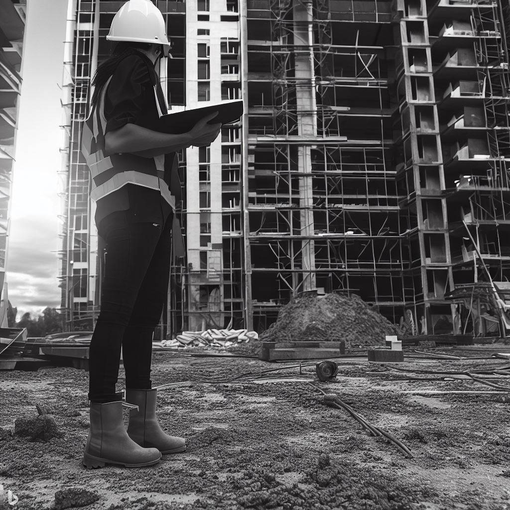

# Career in BIM

* BIM Project Manager;
* BIM Coordinator;
* BIM Modeler;
* BIM Specialist;
* BIM Analyst;
* BIM Consultant;
* BIM Applications Support Engineer\.

---

* **BIM Project Manager:** It is the professional responsible for leading the implementation of BIM in a specific project. He coordinates and oversees BIM-related activities, including setting goals and standards, allocating resources, managing workflows, and supervising the project team.

* **BIM Coordinator:** Is the professional responsible for coordinating and integrating BIM models from various disciplines such as architecture, engineering, structures and MEP (Mechanical, Electrical and Hydraulic) to ensure that all information is accurate and correctly integrated. He works closely with the design team and consultants from different disciplines to identify and resolve any design conflicts.

* **BIM Modeler:** It is the professional responsible for creating and developing the detailed BIM models of the project using specific 3D modeling software. The BIM modeler is responsible for inserting detailed information into the models, such as geometry, materials, properties and attributes of the design elements.

* **BIM Specialist:** Is the professional who has advanced knowledge in BIM and is responsible for providing technical support and training to the project team regarding BIM implementation, use of BIM software, standards and workflows.

* **BIM Analyst:** Is the professional who uses analysis and simulation tools based on BIM to evaluate the performance of the project in terms of sustainability, energy efficiency, cost analysis, construction simulations, among other aspects.

* **BIM Consultant:** It is the professional who provides specialized BIM consulting services to clients, helping to define objectives, strategies and project requirements, as well as to implement BIM in their work processes.

* **BIM Applications Support Engineer:** It is the professional provides technical support to users of BIM software. They help users troubleshoot technical issues, provide training and guidance on the correct use of BIM applications.

As the field of BIM continues to evolve, new roles and responsibilities can emerge as technology and work practices evolve.

Further reading: This paper gives an overview of the traditional BIM roles : https://www.itcon.org/paper/2016/8

Further thinking: how do you think these roles link to the BIM concepts described earlier? Are all roles relevant to all concepts?

# BIM Trends

* Automatic licensing / Building Permits;
* Augmented Reality;
* Renovation and As\-Built Projects\,
* Integration with GIS\.
* The OpenBIM Transition

---

## Automatic licensing / Building Permits
BIM makes it possible to verify the parameters of a project. This automation has become a tendency for the approval of projects and obtaining licenses by the government, based on the automatic reading and verification of parameters according to applicable codes and dedicated laws.

## Augmented Reality
The application of augmented reality (AR) and virtual reality (VR) technologies in the use of BIM has been a growing trend. These technologies allow the immersive visualization of BIM models in virtual environments, facilitating the revision of projects, the detection of conflicts, and the identification of potential problems before the physical construction.

## Renovation and As-Built Projects 
Photogrammetry enables automated BIM modeling of the actual geometric conditions of a building, allowing for accurate representations of existing structures.

## Integration with GIS 
The integration of GIS and BIM offers numerous advantages in terms of geographic analysis, and real-time monitoring of building operations and maintenance.

## The OpenBIM Transition

# BIM Roles

* BIM Manager
* BIM Coordinator
* BIM Modeler
* The VDC Expert
* Sustainability Specialist
* Digital fabricator
* BIM Trainer

---

In this chapter, we will cover the different BIM applications used in various AEC fields. We will start by discussing how BIM is used in the architectural domain, exploring the ways in which architects use BIM to enhance their design processes. We will then dive into BIM uses for Civil and Structural Engineering, examining the tools that these professionals use to design and analyze building structures. We will also discuss the role of BIM in Mechanical, Electrical, and Plumbing (MEP) Engineering and how it is used to design building systems.

In addition, we will explore how BIM is used in construction, specifically discussing how BIM can improve construction planning, scheduling, and communication. We will also look at the role of BIM in facility management, and how it is used to support maintenance, repairs, and facility operations. Lastly, we will examine the various roles involved in BIM implementation, and the importance of understanding the different roles to ensure successful BIM implementation.
This chapter will showcase the versatility and power of BIM technology in supporting the design, construction, and management of buildings and infrastructure.

# BIM for stakeholders

BIM allows all disciplines involved in a project \(i\.e\. architects\, engineers\, constructors\, facility managers and owners\) to create and manage virtual building models \(visualize\, simulate\, and analyze the design and construction process\)\.

---

BIM enables improved collaboration in the design and construction phases leading to fewer errors and limits delays. BIM enables stakeholders to share information and data in a single, integrated platform reducing the risk of errors, eliminating double effort, and improving communication between project team members. It also allows stakeholders to access project information in real-time, ensuring that everyone is working with the latest data. It also reduces the risk of miscommunication and errors, helping to keep the project on track. BIM enables stakeholders to generate accurate and comprehensive documentation, which helps to reduce the risk of errors and delays during construction. It can enable contractors to generate detailed construction schedules and cost estimates, which helps to keep the project on track and within budget.

BIM also allows for Enhanced visualization enabling architects to create 3D models of their designs, to visualize and communicate their ideas more effectively to clients for better design understanding and supporting more informed decisions. BIM capable software allows the creation of 3D models to be used to visualize the design of a building, with its different systems, and components. The models can be easily updated, shared, and manipulated by different stakeholders in real-time. Working in a BIM process, stakeholders ca identify potential clashes and conflicts between different elements of the building, such as structural systems, mechanical, electrical, and plumbing systems (MEP), and architectural components. By identifying these conflicts early, costly rework during construction is avoided. By simulating the construction process over time (4D modelling) and to estimate the cost of different building elements and systems (5D modeling) enables stakeholders to visualize the construction process and the building's operation and maintenance throughout its life cycle. For complex systems, like HVAC and lighting systems, 3D visualization and 4D and 5D modeling, help stakeholders to optimize the design, improve energy efficiency, and reduce operational costs. BIM software can also allow users to generate realistic renderings of the building, which helps stakeholders to visualize the final product and communicate design intent more effectively. This is especially useful for marketing and presenting the building to clients and investors. In addition, AR models can be overlaid on top of the real-world environment, enabling stakeholders to visualize the building's design and systems in real-time, and in the context of the surrounding environment.

Using BIM workflows lead to increased efficiency and accuracy by allowing the project teams to perform faster design iterations and reduce the time required to complete projects by helping them to automate repetitive tasks. By enabling a streamlined design, architects and engineers to create easily editable 3D models. This means that design changes can be made quickly and efficiently, reducing the need for time-consuming and costly revisions. BIM software can also automatically generate quantity takeoffs for materials, saving time and reducing errors in cost estimating allowing for better cost and materials tracking throughout the construction process. By construction sequence planning (4D modeling), the project team can optimize the construction process by identifying potential conflicts and dependencies before construction begins. This also minimize delays and leads to improved efficiency.

BIM is also supporting sustainability by analyzing and optimizing building performance, reducing waste, making more sustainable material choices, performing LCAs, conserving water, and improving indoor environmental quality. By incorporating sustainability (sometimes referred to as 6D modeling) into the design and construction process, BIM is helping to create more environmentally responsible buildings. By analyzing building's energy performance, the project team can provide valuable information about its energy consumption and environmental impact, information that can be further used to optimize energy efficiency and reduce the building's carbon footprint. This analysis can enable architects and engineers to evaluate the environmental impact of different building materials, such as embodied carbon and embodied energy leading to more sustainable material choices and reduced the environmental impact. By performing a life cycle assessments (LCA) to analyze a building's environmental impact over its entire life cycle, from construction to demolition the project team can identify improvement opportunities and optimize the building's sustainability performance, by optimizing the use of building materials, reducing waste generated during construction, and minimizing construction waste that goes to landfills. By adopting an integrated approach, the project team can analyze a building's water use and identify opportunities for water conservation, such as low-flow fixtures, rainwater harvesting, and graywater reuse. 

* BIM for Architects
* BIM for Civil and Structural Engineering
* BIM for MEP Engineering
* BIM for construction
* BIM for facility management

---
## BIM for Architects

There are several BIM software tools available for architects (Autodesk Revit, ArchiCAD, and SketchUp). These tools provide architects with a user-friendly interface for creating and managing BIM models, as well as tools for collaboration, analysis, and visualization. As mentioned on many occasions before, BIM models are more than just 3D representations; they also include details on building systems, materials, and other crucial pieces of information. 

## BIM for Civil and Structural Engineering
Engineers utilize BIM software to develop and manage comprehensive models that can be shared with other parties involved in the construction process. Engineers can use BIM capable software to study and test many design possibilities allowing engineers to simulate how a structure would behave under various design loads and load combinations. To maximize the building's safety, robustness, and structural integrity engineers can use the BIM model to develop in-depth studies for various circumstances, such as fire after earthquake, high winds and storms, or exceptional snow loads.

## BIM for MEP Engineering
BIM enables the design team to collaborate with experts from other fields, such as mechanical, electrical, and plumbing engineers, in order to coordinate building systems and enhance the overall performance of the structure. BIM also allows engineers to provide precise and thorough construction documentation, drawings, schedules, and requirements. This helps to ensure that the structure is constructed in accordance with the original concept and limits errors and omissions during the construction phase.

## BIM for construction
During the construction process, various stakeholders can work together and better coordinate using the tools that BIM software offers. For instance, collaboration between architects, engineers, contractors, and project managers on a single model enhances communication and lowers the possibility of mistakes and rework making the construction process more cost-effective and efficient. By automatically detecting clashes between different building systems, such as mechanical, electrical, and plumbing (MEP), structural, and architectural systems BIM software allow for easy conflict resolution before the construction begins, reducing the risk of rework and schedule delays.

## BIM for facility management
BIM provides facility managers with a powerful tool for managing buildings more effectively, reducing costs, improving energy efficiency, and enhancing safety and security. By keeping the BIM model up-to-date with accurate information about the building, BIM enables better decision-making and helps to ensure that the building is maintained and operated in the most effective and efficient way possible. Centralized and accurate information about the building, including details about its components, systems, and materials. Is used by facility managers to make informed decisions about maintenance, repairs, upgrades, and costs. A comprehensive maintenance and operations plan for the building, based on accurate and up-to-date information about its components and systems can ensure that maintenance is performed on schedule, reducing the risk of breakdowns and extending the lifespan of building systems and components. By simulating the building's energy performance, facility managers can identify opportunities for energy savings and optimization of building systems and equipment. BIM can also facility managers to streamline workflows by providing a digital platform for tracking work orders, scheduling maintenance, and managing assets. By modeling the building's safety and security systems and by providing a virtual environment for testing and optimizing emergency procedures and security measures, BIM can improve safety and security within the facility. Furthermore, facility managers can view the information about the building in real-time, allowing them to make informed decisions about maintenance, repairs, and upgrades.

# BIM roles

---

* **BIM Manager**: The BIM Manager is responsible for managing the BIM process and ensuring that the BIM model is accurate and up-to-date. The BIM Manager coordinates with different stakeholders and disciplines to ensure that the BIM model is consistent and follows industry standards.
* **BIM Coordinator**: The BIM Coordinator works closely with the BIM Manager and other stakeholders to ensure that the BIM model is coordinated and clash-free. The BIM Coordinator is responsible for resolving any conflicts that arise in the BIM model and ensuring that the final product is optimized for efficiency and performance.
* **BIM Modeler**: The person who builds and maintains the BIM model is known as a BIM Modeler. The BIM modeler needs to be skilled with BIM software and knowledgeable about various building systems and components. To guarantee the accuracy and consistency of the BIM model, they must also collaborate closely with experts from various fields.
* **The Virtual Design and Construction (VDC) Expert** is in charge of utilizing BIM technology to streamline the building process. The VDC Expert optimizes the building schedule by simulating and analyzing the construction process using a BIM model.
* **Sustainability Specialist**: The Sustainability Specialist optimizes building performance and lessens environmental impact using BIM technologies. To guarantee that the building is designed and built with sustainability in mind, the sustainability specialist closely collaborates with other disciplines.
* **Digital fabricator**: A digital fabricator employs BIM technology to produce digital designs that can be manufactured. The architect or engineer and the digital fabrication specialist collaborate closely to make sure the design is suitable for digital fabrication techniques like 3D printing and CNC machining.
* **BIM Trainer**: The BIM Trainer is in charge of educating employees and stakeholders about BIM software and best practices. The BIM Trainer needs to be an expert with BIM software and knowledgeable about various building systems and parts.

# BIM Manager

---

Within the AEC sector, a critical position known as a BIM manager is in charge of overseeing the Building Information Modeling (BIM) process over the course of a project. 
The duties of a BIM manager can change based on the needs of the project, but in general, they are in charge of making sure that BIM is used properly and efficiently.
The BIM manager is in charge of developing, carrying out, and keeping up the BIM Execution Plan (BEP). 
The BEP describes the project's BIM specifications, including modeling guidelines, software specifications, and information sharing procedures. 
Additionally, the BIM manager is in charge of informing the project team of these requirements and seeing to it that they are followed during the course of the project.

In order to make sure that the BIM process satisfies their expectations, the BIM manager must also coordinate with other project stakeholders, such as architects, engineers, contractors, and facilities managers. This entails spotting possible collisions or problems and working with the team to swiftly address them.

In addition, the BIM manager is in charge of directing the development and administration of the BIM models. This includes managing the model version control, making sure the models are correct and current, and making sure all the data is appropriately categorized and arranged to allow for efficient data analysis.

The function of a BIM manager is expanding as BIM technology is increasingly being used in the AEC sector. BIM managers must effectively manage and coordinate project teams in addition to possessing a thorough understanding of BIM technology, tools, and workflows. They are essential in making sure that projects are completed on schedule, within budget, and to the highest possible levels of quality.

# BIM Coordinator

A BIM coordinator in the AEC sector is tasked with managing the BIM process among various project teams and specialties. 
A BIM coordinator's main duty is to make sure the project team collaborates in order to create a thorough BIM model that complies with all project standards.
The coordination of the information exchange between the various project teams, such as the architects, engineers, contractors, and subcontractors, is vital. 
They collaborate closely with each team to guarantee that the BIM models are developed to a high standard and contain all relevant data. 
This includes controlling the model's geometry, data, and cross-disciplinary information flow.

The identification and resolution of any problems or conflicts that can develop throughout the BIM process fall under the purview of a BIM coordinator. This calls for a thorough comprehension of the project's design and construction specifications as well as the capacity for effective communication across various project teams.

A BIM coordinator may be in charge of developing and maintaining the BIM Execution Plan in addition to their coordinating duties (BEP). The BEP describes the project's BIM specifications, including modeling guidelines, software specifications, and information sharing procedures.

A BIM coordinator needs to be well-versed in BIM technology, software, and workflows to be effective in this position. Effective project management, team coordination, and stakeholder communication should be among their strengths. They must also have a thorough knowledge of the procedures involved in building and the ability to spot problems and find rapid, effective solutions. Ultimately, a BIM coordinator's function is crucial to the accomplishment of BIM projects in the AEC sector.

# BIM Modeler

The role of the BIM modeler involves utilizing BIM software to create and manage 3D models. To create precise and comprehensive 3D models that accurately reflect the project's design and construction needs, BIM modelers collaborate closely with architects, engineers, and other project team members.

A BIM modeler's main duty is to produce, update, and maintain 3D models with data on dimensions, materials, structural specifics, and MEP (Mechanical, Electrical, and Plumbing) systems. Using BIM software, they also produce schedules, quantity take-offs, and other project-related documents.

A BIM modeler needs a thorough understanding of BIM technology, software, and workflows in order to succeed in this position. They must also have a thorough knowledge of the procedures involved in building and the ability to spot problems and find rapid, effective solutions. Since BIM modelers must effectively coordinate and communicate with architects, engineers, and other project team members, strong communication skills are also crucial.

A BIM modeler is in charge of producing 3D models as well as making sure they are correct, comprehensive, and current. To analyze and validate the models and make sure that all project criteria and specifications are met, they could collaborate with the BIM coordinator.

Overall, the role of a BIM modeler is critical to the success of BIM projects in the AEC industry. They are responsible for creating the models that form the basis for project design, construction, and management, and they play a crucial role in ensuring that the project is delivered on time, within budget, and to the required quality standards.

# VDC Expert

In the AEC sector, a BIM Virtual Design and Construction (VDC) Manager plays a crucial role. BIM technological proficiency at a high level is necessary for this position, as are effective management and communication abilities. A BIM VDC Manager's main duty is to supervise the BIM process at all stages of a project's life cycle, from design and construction to facility management.

The BIM VDC Manager is in charge of overseeing the BIM team and making sure that everyone involved in the project is on board with the BIM's aims and objectives. They supervise the BIM modeling procedure and make sure the models are precise, comprehensive, and current. To guarantee that the BIM models are used successfully and efficiently throughout the project, they also collaborate with other project stakeholders, such as architects, engineers, contractors, and owners.

Creating and implementing BIM standards and procedures is one of a BIM VDC Manager's main duties. They collaborate closely with project stakeholders to determine and set BIM goals and objectives as well as to specify the BIM team's work scope. Additionally, they create BIM execution plans and manage their execution throughout the project.

Detecting and fixing problems with BIM modeling and coordination are under the purview of the BIM VDC Manager. They collaborate closely with the project's stakeholders to foresee potential problems in advance and to create workable fixes. Additionally, they carry out routine quality control checks to make sure the BIM models are correct, comprehensive, and adhere to the project's design and construction specifications.

Ultimately, a BIM VDC Manager's function is essential to the accomplishment of BIM projects in the AEC sector. In addition to ensuring that BIM models are used successfully and efficiently, they are in charge of identifying and resolving any problems that may arise with BIM modeling and coordination. They are also responsible for managing the BIM process throughout the project life cycle.

# Sustainability Specialist

The AEC sector is placing more and more emphasis on the position of a BIM Sustainability Specialist. This position entails incorporating sustainable design methods and ideas into the BIM process to help ensure that buildings are created in an environmentally conscious, energy-efficient, and sustainable manner.

The job of the BIM Sustainability Expert is to find ways to enhance a building's environmental performance throughout the design and construction phase. They collaborate closely with designers, engineers, and other project participants to incorporate sustainability issues into the planning and building phases. In order to generate and analyze models of the structure, they employ BIM tools and software. They do this in an effort to find ways to increase the building's sustainability overall and to improve its energy efficiency.

Making sure that sustainable design concepts are incorporated into the BIM process from the start of the project is one of the main duties of a BIM Sustainability Specialist. This include creating standards for sustainable design, establishing sustainability goals, and finding ways to save energy and resources. Additionally, they collaborate closely with the project team to create viable, affordable solutions for sustainable design that also match the project's aims and objectives.

The project team needs advice and support from the BIM Sustainability Specialist throughout the design and construction phases. In order to ensure that sustainable design concepts are effectively used and the building is created in the most ecologically responsible manner possible, they collaborate closely with architects, engineers, and builders. After construction is finished, they continue to assess the building's performance, seeking for ways to increase its sustainability and lessen its environmental effect.

Overall, the role of a BIM Sustainability Specialist is critical to the success of sustainable design in the AEC industry. By integrating sustainability principles into the BIM process, they help ensure that buildings are designed and constructed to be environmentally responsible, energy efficient, and sustainable.

# Digital fabricator

The BIM Digital Fabrication Specialist is a key role in the AEC industry, responsible for leveraging the power of BIM to enhance the fabrication and construction process. This role involves using BIM tools and software to create detailed models of building components and systems, which can then be used to drive automated fabrication processes and streamline construction workflows.

Working together with architects, engineers, and contractors to find possibilities to streamline the fabrication and construction process is one of the main duties of a BIM Digital Fabrication Specialist. They produce thorough 3D models of building systems and components using their expertise with BIM tools and software, which may be used to streamline the fabrication and assembly process. Additionally, they make use of their understanding of manufacturing processes and materials to make sure that components can be produced and installed on location in an effective manner.

Working with fabricators and contractors to establish automated fabrication processes is another duty of the BIM Digital Fabrication Specialist. They aid in making sure that the manufacturing process is effective and economical and that the end product satisfies the building's design and performance criteria.

The BIM Digital Fabrication Specialist's contribution to streamlining the construction process by producing accurate and thorough models of building systems and components is another key duty. Contractors can utilize these models to streamline the building process, cutting waste and eliminating errors. Since contractors may use the models to better plan and coordinate their work, they can also be used to increase site safety.

All things considered, the BIM Digital Fabrication Specialist is essential to maximizing the potential of BIM to improve the fabrication and construction process. They contribute to the more effective, safe, and high-quality construction of structures by using BIM tools and software to develop precise models of building systems and components and by collaborating closely with fabricators and contractors to execute automated fabrication processes.

# BIM Trainer

A vital position in the AEC sector is that of the BIM Trainer, who instructs and informs professionals on how to use BIM tools and software. In order to help architects, engineers, contractors, and other professionals understand and utilize BIM tools and software, this function involves creating and providing training programs to them.

A BIM trainer's primary duties include determining the organization's training needs and creating specialized training programs to meet those needs. The need for training in particular areas, such as using BIM software to produce complex 3D models or communicating with others in a BIM environment, may be identified through working with teams or individuals.

Also, the BIM Trainer is in charge of creating and presenting training materials, such as textual materials, video tutorials, and in-person training sessions. They might generate case studies that show the best ways to use BIM tools in particular circumstances or instructional movies that show how to use particular BIM software capabilities.

The BIM Trainer's obligation to stay current with BIM technology's newest trends and advancements is another crucial duty. To stay up to date with the most recent BIM tools and software, they might take part in research, join in online forums and communities, and attend industry conferences and workshops.

The BIM Trainer is also in charge of evaluating the success of training initiatives and making adjustments as necessary. They may carry out assessments to gauge the effect of training on the company or use trainee feedback to pinpoint areas that need improvement.

Overall, the BIM Trainer is vital to encouraging the AEC sector to use BIM tools and software effectively. They contribute to ensuring that professionals have the knowledge and skills they need to utilize BIM technologies successfully and efficiently by creating and delivering tailored training programs, maintaining current with the most recent trends and advancements, and monitoring the effectiveness of training.

# Construction Manager

The Construction Manager is responsible for overseeing the construction process from start to finish and ensuring that the project is completed on time and within budget.

The Construction Manager works with the BIM team to ensure that the BIM model contains all the necessary data and information related to the construction process. This includes data on materials, equipment, labor, and schedules. The Construction Manager uses this information to plan and coordinate the construction process, ensuring that all activities are completed in the right sequence and according to the project timeline.

The Construction Manager is also responsible for managing construction risks and ensuring that safety protocols are followed. This includes identifying potential safety hazards and implementing strategies to mitigate those risks. The Construction Manager also oversees quality control, ensuring that all work meets the required quality standards.

One of the key advantages of BIM for Construction Managers is that it enables them to plan and coordinate construction activities more efficiently and effectively. The BIM model provides a visual representation of the building's design, allowing Construction Managers to identify potential issues and plan for improvements.

The Construction Manager also uses the BIM model to track and record construction activities, including work completed, resources used, and any issues encountered. This information is then used to update the BIM model and inform future construction activities.

# Quality Control Manager

The Quality Control Manager is responsible for developing and implementing quality control policies and procedures to ensure that all work is completed to the required standard.

The Quality Control Manager works with the BIM team to ensure that the BIM model contains all the necessary data and information related to the quality control process. This includes data on quality standards, quality control checklists, and inspection procedures. The Quality Control Manager uses this information to develop and implement quality control policies and procedures and to monitor and track quality control activities.

The Quality Control Manager is also responsible for identifying potential quality issues and implementing strategies to mitigate those risks. This includes conducting regular quality control audits and inspections, identifying areas for improvement, and developing action plans to address any issues.

One of the key advantages of BIM for Quality Control Managers is that it enables them to identify potential quality issues more efficiently and effectively. The BIM model provides a visual representation of the building's design, allowing Quality Control Managers to identify potential issues and plan for improvements.

The Quality Control Manager also uses the BIM model to track and record quality control activities, including work completed, resources used, and any issues encountered. This information is then used to update the BIM model and inform future quality control activities.

# Client Representative

The Client Representative is one of the key roles of facility managers in BIM. The client representative acts as the bridge between the facility owner or operator and the BIM team, ensuring that the project meets the client's requirements and expectations. The client representative is responsible for providing input and feedback to the BIM team at all stages of the project, from the design phase to construction and operation. They are also responsible for ensuring that the project stays within the client's budget and schedule constraints.

The client representative works with the BIM team to ensure that the BIM model reflects the client's needs and requirements. This includes providing input on the building's systems and equipment, as well as ensuring that the building is designed in a way that is functional, efficient, and cost-effective. The client representative may also provide input on sustainability and energy efficiency, ensuring that the building meets the client's environmental goals.

Throughout the project, the client representative ensures that the BIM model is updated and accurate. This involves reviewing the BIM model at each stage of the project, verifying that it reflects the client's needs and requirements, and providing feedback to the BIM team. The client representative may also work with the BIM team to identify potential issues or conflicts and find solutions to these problems.
The client representative is also responsible for ensuring that the building is delivered on time and within budget. This involves monitoring the project schedule and budget, ensuring that any delays or cost overruns are addressed promptly. The client representative may also work with the BIM team to identify areas where cost savings can be achieved without compromising on the building's quality or functionality.

# Information Manager

The role of Information Manager in BIM is essential for facility managers to manage and maintain accurate and up-to-date information throughout the lifecycle of a building. The Information Manager is responsible for ensuring that the BIM model contains relevant and accurate data, which is necessary for facilities management.

The Information Manager is responsible for collecting and organizing all the information related to the building, including data on systems, equipment, and assets, and making it available within the BIM model. They work with the BIM team to ensure that the information is accurate and up-to-date, and that it is structured in a way that is easy to use and understand.

The Information Manager ensures that the BIM model contains all the necessary information for facilities management, including data on maintenance schedules, asset management, energy consumption, and safety and security systems. This information is critical for facility managers to make informed decisions on maintenance, upgrades, and replacement of systems and equipment.

The Information Manager is also responsible for ensuring that the BIM model is updated regularly, with any changes to the building reflected accurately within the model. This includes any modifications or upgrades to systems or equipment, changes in occupancy or usage, or modifications to the building's layout or design.

One of the key advantages of BIM is that it allows facility managers to access and use data in real-time, enabling them to make quick and informed decisions. The Information Manager is responsible for ensuring that the BIM model contains the necessary data and information to support these decisions.

# Maintenance Planner

The role of Maintenance Planner in BIM is crucial for facility managers to ensure that the building's systems and equipment are properly maintained throughout their lifecycle. The Maintenance Planner is responsible for creating and managing maintenance schedules for all the assets and equipment within the building.

The Maintenance Planner works closely with the BIM team to ensure that the BIM model contains all the necessary data and information required for maintenance planning. This includes data on the equipment's specifications, maintenance history, and expected lifespan. The Maintenance Planner uses this information to create a maintenance plan that outlines the specific tasks required to maintain each asset or system.

The Maintenance Planner is also responsible for scheduling maintenance activities and coordinating with the maintenance team to ensure that work is completed on time and within budget. This involves identifying maintenance priorities, assigning work orders to the maintenance team, and ensuring that resources are available to complete the work.

One of the key advantages of BIM for Maintenance Planners is that it enables them to plan maintenance activities more efficiently and effectively. The BIM model provides a visual representation of the building's systems and equipment, allowing Maintenance Planners to identify potential maintenance issues and plan preventive maintenance activities.

The Maintenance Planner also uses the BIM model to track and record maintenance activities, including work completed, resources used, and any issues encountered. This information is then used to update the BIM model and inform future maintenance planning activities.

# Asset Manager

The Asset Manager is responsible for identifying, tracking, and maintaining all the assets within the building, including equipment, systems, and furniture.

The Asset Manager works with the BIM team to ensure that the BIM model contains all the necessary data and information related to the building's assets. This includes data on asset specifications, maintenance history, warranty information, and expected lifespan. The Asset Manager uses this information to track the assets' condition, identify any issues, and plan for maintenance and replacement activities.

The Asset Manager is also responsible for creating and managing an asset register, which lists all the assets within the building, including their location, condition, and maintenance history. This information is critical for facility managers to make informed decisions on maintenance, upgrades, and replacement of assets.

One of the key advantages of BIM for Asset Managers is that it enables them to track assets more efficiently and effectively. The BIM model provides a visual representation of the building's assets, allowing Asset Managers to identify the location of each asset and track its movement throughout the building. This information is critical for managing the asset's lifecycle, ensuring that it is properly maintained and eventually replaced when necessary.

The Asset Manager also uses the BIM model to track and record asset maintenance activities, including work completed, resources used, and any issues encountered. This information is then used to update the BIM model and inform future maintenance and replacement activities.

# Safety and Security Manager

The Safety and Security Manager is responsible for identifying potential safety and security risks within the building and developing strategies to mitigate those risks.

The Safety and Security Manager works with the BIM team to ensure that the BIM model contains all the necessary data and information related to the building's safety and security systems. This includes data on fire protection systems, emergency lighting, access control systems, CCTV systems, and other safety and security systems. The Safety and Security Manager uses this information to identify potential safety and security risks and develop strategies to mitigate those risks.

The Safety and Security Manager is also responsible for developing and implementing safety and security policies and procedures, ensuring that they are communicated to all occupants of the building. This includes conducting regular safety and security audits, training staff on safety and security procedures, and coordinating emergency response activities.

One of the key advantages of BIM for Safety and Security Managers is that it enables them to identify potential safety and security risks more efficiently and effectively. The BIM model provides a visual representation of the building's safety and security systems, allowing Safety and Security Managers to identify potential issues and plan for improvements.

The Safety and Security Manager also uses the BIM model to track and record safety and security activities, including work completed, resources used, and any issues encountered. This information is then used to update the BIM model and inform future safety and security planning activities.