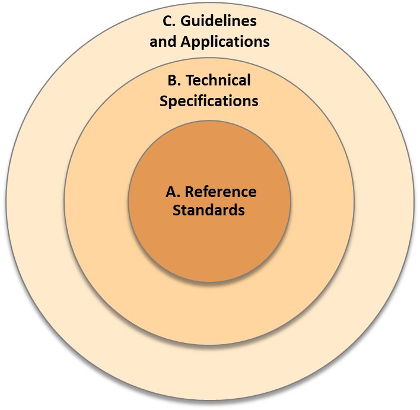

# Standards, Technical Specifications and Guides

__Reference Standards__

A\.1\. ISO Standards

A\.2\. Normative Standards

A\.3\. Conformance Specifications

A\.4\. Terminology Definition

__B\.   Technical Specifications__

B\.1\. Benchmark Specifications

B\.2\. Reference Process

B\.3\. Information Exchanges

B\.4\. Reference Examples

__Guidelines and Applications__

C\.1\. Goal and Strategy Definition

C\.2\. Delivery Specifications

C\.3\. Templates and Tools

C\.4\. Best Practice Guides

__Standards\, Technical Specifications and Guides__

Source: NBIMS\-US\, 2021

---

The NBIMS-US Project Committee (National BIM Standard-United States Project Committee), is a project committee of the Building Information Management (BIM) Council.
The diagram shows the hierarchy and the levels of importance of the Standards by NBIMS.

Reference Standards: are mandatory and need global approval.
Technical specifications: are used as a basis for the development or implementation.
Guidelines and Applications: are recommendations or instructions.

__ISO/TC 59/SC 13 __

__Standards\, Technical Specifications and Guides__

Source: NBIMS\-US\, 2021

---

International Level
ISO/TC 59/SC 13 

EU Level
CEN/TC 442 

Initiatives to help the implementation of the standards and technical specifications
EUBIM Task Group, BuildingSmart, etc

EU BIM Standards research platform: 
BIM Standards Landscape Explorer (ec-3.org)

# EN ISO 19650

EN ISO 19650 standard provides a comprehensive framework for the management of information within BIM processes\.

It helps to ensure consistency and quality throughout the project lifecycle\, from conception through to decommissioning\.

By following the guidance set out in the standard\, stakeholders can better manage information\, reduce risk\, and improve project outcomes\.

As the use of BIM has become more widespread, the need for standardized processes and protocols has become increasingly important. This is where the EN ISO 19650 BIM standard comes in. In this blog entry, we will explore the different parts of the EN ISO 19650 standard and how they help to ensure consistency and quality in BIM processes.

---
## EN ISO 19650: Part 1

__Concepts and principles__

Part 1 of the EN ISO 19650 standard provides an overview of BIM concepts and principles\, including definitions of key terms\, and outlines the benefits of BIM processes\. It also sets out the roles and responsibilities of different stakeholders involved in BIM processes\.\.

---
## EN ISO 19650: Part 2

__Delivery phase of assets__

Part 2 of the standard focuses on the delivery phase of assets\, from conception through to handover\. It provides guidance on the management of information throughout the project lifecycle\, including the development of BIM Execution Plans \(BEPs\)\, the use of common data environments \(CDEs\)\, and the exchange of data between different software platforms\.

---
## EN ISO 19650: Part 3

__Operational phase of assets__

Part 3 of the standard deals with the operational phase of assets\, from handover through to decommissioning\. It outlines the information requirements for the operation and maintenance of assets\, including the use of asset information models \(AIMs\)\, and the need for ongoing data management and validation\.

---

## EN ISO 19650: Part 4

__Information management during the operational phase of assets using building information modelling__

Part 4 of the standard provides further guidance on information management during the operational phase of assets\, with a particular focus on the use of BIM\. It sets out requirements for the exchange of information between different stakeholders and the ongoing management of data\.

## EN ISO 19650: Part 5

__Security\-minded approach to information management__

Part 5 of the standard focuses on the security of information within BIM processes\. It outlines the importance of a security\-minded approach to information management\, including the identification of risks and the implementation of appropriate controls\.

## EN ISO 19650: Part 6-1

__Part 6\-1: Concepts and principles__

__Organization and digitization of information about buildings and civil engineering works\, including building information modelling \(BIM\)__

Part 6\-1 of the standard provides further guidance on BIM concepts and principles\, with a particular focus on the organization and digitization of information about buildings and civil engineering works\. It provides definitions of key terms and outlines the benefits of BIM processes\.

## EN ISO 19650: Part 6-2

__Organization and digitization of information about buildings and civil engineering works\, including building information modelling \(BIM\)__

__Part 6\-2: Delivery phase of assets__

Part 6\-2 of the standard focuses on the delivery phase of assets\, providing guidance on the management of information throughout the project lifecycle\. It sets out requirements for the development of BIM Execution Plans \(BEPs\)\, the use of common data environments \(CDEs\)\, and the exchange of data between different software platforms\.

# EN 12006

ISO 12006 standard provides a comprehensive framework for the classification of information within construction projects\. It helps to ensure consistency and quality throughout the project lifecycle\, from conception through to decommissioning\.

By following the guidance set out in the standard\, stakeholders can better manage information\, reduce risk\, and improve project outcomes\.

The ISO 12006 standard is an essential tool for the development of a structured approach to BIM processes\, providing a foundation for successful implementation and delivery\.

The ISO 12006 series provides a framework for the classification of information within construction projects. In this blog entry, we will explore the different parts of the ISO 12006 standard and how they help to ensure consistency and quality in BIM processes.

## EN 12006 Part 2

__Framework for classification__

This part of ISO 12006 defines a framework for the development of built environment classification systems\. It identifies a set of recommended classification table titles for a range of information object classes according to particular views\, e\.g\. by form or function\, supported by definitions\.

## EN 12006 Part 2

__Framework for object\-oriented information__

This document defines a specification for an extensible taxonomy model\, which provides the ability to add concepts like subjects and properties\, describe subject by means of properties\, and to define relationships between concepts\. The set of properties associated with a subject provide the formal definition of the subject as well as its typical behaviour\.

# EN 16739

__Data schema__

ISO 16739\-1:2018 specifies a conceptual data schema and an exchange file format for Building Information Model \(BIM\) data1\. The data schema is represented as an EXPRESS schema and an XML schema\, and reference data is represented as definitions of property and quantity names\, and formal and informative descriptions1\. A subset of the data schema and referenced data is referred to as a Model View Definition \(MVD\)

<https://www.iso.org/standard/70303.html>

The Building Information Modelling (BIM) standard ISO 16739, also known as Industry Foundation Classes (IFC), is a key standard for the exchange of digital information between different BIM software applications. In this blog entry, we will explore the different parts of the ISO 16739 standard and how they help to ensure interoperability and efficiency in BIM processes.

The ISO 16739 standard provides a framework for the exchange of digital information between different BIM software applications. It helps to ensure interoperability and efficiency throughout the project lifecycle, from design through to construction and operation. By following the guidance set out in the standard, stakeholders can better manage information, reduce risk, and improve project outcomes. The ISO 16739 standard is an essential tool for the development of a structured approach to BIM processes, providing a foundation for successful implementation and delivery.

# ISO 29481

BIM technology can benefit the processes associated with managing the use of space within buildings\, urban neighborhoods and cities at the broader scale\, as well as infrastructure networks and facilities\.

An IDM provides help in getting the full benefit from a BIM\. If the required information is available in the BIM to support a construction process or use case\, and the quality of information is satisfactory\, then the process itself will be greatly improved\.

The ISO 29481 standard provides a framework for the exchange of digital information between different BIM software applications using open data formats. It helps to ensure interoperability and efficiency throughout the project lifecycle, from design through to construction and operation. By following the guidance set out in the standard, stakeholders can better manage information, reduce risk, and improve project outcomes. The ISO 29481 standard is an essential tool for the development of a structured approach to BIM processes, providing a foundation for successful implementation and delivery.

## ISO 29481: Part 1

__Methodology and format__

ISO 29481\-1:2016 is intended to facilitate interoperability between software applications used during all stages of the life cycle of construction works\, including briefing\, design\, documentation\, construction\, operation and maintenance\, and demolition\. It promotes digital collaboration between actors in the construction process and provides a basis for accurate\, reliable\, repeatable and high\-quality information exchange\.

## ISO 29481: Part 2

__Interaction framework__

<https://cdn.standards.iteh.ai/samples/45501/711b5ec126304ceea49b2bb246a5a41f/ISO-29481-1-2010.pdf>
<https://www.iso.org/standard/45501.html>
<https://www.iso.org/obp/ui/>

ISO 29481 specifies a methodology and format for describing ‘coordination acts' between actors in a construction project during all life cycle stages\.

It is intended to facilitate interoperability between software applications used in the construction process\, to promote digital collaboration between actors in the building construction process\, and to provide a basis for accurate\, reliable\, repeatable\, and high\-quality information exchange\.

## ISO 29481: Part 3

__Data schema__

This document is the technical addition to the methodology set out in ISO 29481\-1\. It defines a specification to store\, exchange and read information delivery manual \(IDM\) specifications in a standardized and machine\-readable way\.

# ISO 21597

This document defines an open and stable container format to exchange files of a heterogeneous nature to deliver\, store and archive documents that describe an asset throughout its entire lifecycle\.

The ISO 21597 standard provides a framework for the organization and management of digital information related to the operation and maintenance of built assets. It helps to ensure efficient and effective asset management, providing a foundation for the effective use of BIM in asset management processes. By following the guidance set out in the standard, stakeholders can better manage information, reduce risk, and improve asset performance and lifecycle outcomes. The ISO 21597 standard is an essential tool for the development of a structured approach to BIM in asset management, providing a foundation for successful implementation and delivery.
Regenerate response

## ISO 21597: Part 1

__Container__

It is suitable for all parties dealing with information concerning the built environment\, where there is a need to exchange multiple documents and their interrelationships\, either as part of the process or as contracted deliverables\. The format is intended to use resources either included in the container \(such as documents\) or referenced remotely \(such as web resources\)\.

## ISO 29481: Part 2

__Link types__

This document provides the opportunity to add information about the contents of a container by further specializing the generic types of links specified in ISO 21597\-1\. The defined link types have been chosen to enhance the use of the container by allowing the addition of semantic relationships that are human interpretable to provide greater clarity about those links\.

# ISO/TS 12911:2023

This document establishes a framework for providing specifications for the internal commissioning and implementation of building information modelling \(BIM\) during both delivery and operational phases\. It identifies a structured approach so as to encourage clarity during development\, management and checking processes for use by organizations that develop and apply these specifications\.

The ISO 12911 standard provides a framework for the use of BIM in sustainability assessment and performance evaluation of buildings. It helps to ensure sustainable and energy-efficient building design, providing a foundation for the effective use of BIM in sustainable building design processes. By following the guidance set out in the standard, stakeholders can better manage information, reduce risk, and improve building performance and lifecycle outcomes. The ISO 12911 standard is an essential tool for the development of a structured approach to BIM in sustainable building design, providing a foundation for successful implementation and delivery.

ISO 12911 Establishes a framework for providing specifications for the internal commissioning and implementation of building information modelling \(BIM\) during both  __delivery __ and  __operational __ phases\. It identifies a structured approach to encourage clarity during development\, management and checking processes for use by organizations that develop and apply these specifications\.

It is applicable to buildings, infrastructure, facilities and managed landscapes, of any size or complexity.

# ISO 1781

__Level of information need__

Refers to EN 17412\-1 which became ISO\. Provides concepts for establishing and specifying the level of detail and extent of information needed to be exchanged and delivered in modelling\.
